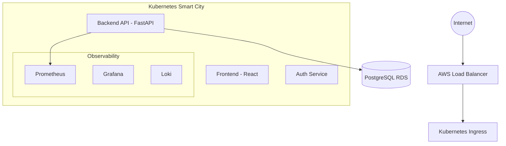

  

<h3 align="center">🏛️ Phase 2: System Design & Architecture</h3>

<strong>"Designing Cloud Sentinel Platform Like Real Engineers"</strong>

<strong>Microservices • Kubernetes • Fault Isolation • Scalability</strong>

  
  
  

---

## 🏗️ 2.0 Why System Design Matters

**System Design** is the blueprint for how services talk to each other.
*   **Bad Architecture:** Leads to "Spaghetti Code," outages, and expensive AWS bills.
*   **Good Architecture:** Provides scalability (growth), fault tolerance (staying alive when things break), and maintainability.

**Analogy:** Building a city without a map leads to traffic chaos. Architecture is our city map.

---

## 🏙️ 2.1 Monolith vs. Microservices

We are moving away from the "One Big App" (Monolith) approach toward **Microservices**.

| Monolith (One Mall) | Microservices (City of Buildings) |
| :--- | :--- |
| Everything runs in one process. | Independent services (Auth, Metrics, UI). |
| If one part fails, the whole app dies. | If the Auth service fails, Monitoring still works. |
| Hard to scale specific parts. | We can scale *only* the Backend API if traffic is high. |

**Industry Choice:** Companies like Netflix and Amazon use Microservices for **Fault Isolation**.

---

## 🗺️ 2.3 High-Level Architecture Overview

---

## 🔄 2.4 The Complete Request Lifecycle

When a user opens `https://cloudsentinel.com/dashboard`, the following production-grade flow is triggered:

1.  **DNS (Route53):** The browser asks AWS Route53 to resolve the domain name into a reachable IP address.
2.  **Load Balancer (ALB):** The entry point at the city gates. It receives the traffic and distributes it across the available nodes in our cluster.
3.  **Ingress (Traffic Police 🚦):** Acts as the internal router. It reads the URL path and decides:
    *   Requests to `/api` go to the **Backend Service**.
    *   Requests to `/` go to the **Frontend Service**.
4.  **Backend (FastAPI):** Validates the user's identity (Auth) and fetches the requested data from either the PostgreSQL database or the Prometheus metrics engine.
5.  **Response:** The backend sends back a JSON payload. The React UI receives this data and renders beautiful, real-time graphs.

---

## 🧠 2.6 Kubernetes: The Warehouse Manager

Kubernetes acts as the "Operating System" for our cloud-native containers, ensuring the "Warehouse" runs at peak efficiency.

*   **Control Plane (Master):** The brain of the operation. It makes high-level decisions, such as where to start new pods and how to handle scaling.
*   **Worker Nodes:** The muscles of the cluster. These are the actual servers (EC2 instances) where our application containers live and work.
*   **Self-Healing:** If a container crashes or "dies," the Warehouse Manager (K8s) detects it immediately and restarts a fresh version to maintain system health without human intervention.

---

## 🚦 2.8 Ingress & Load Balancing

To manage high-volume traffic, we separate external entry from internal routing:

*   **Load Balancer:** The traffic police stationed at the city gates, ensuring no single road gets overwhelmed.
*   **Ingress:** The reception desk inside the building that directs you to the specific floor or office (Service) you are looking for.
*   **Service Discovery:** How our services communicate. Instead of hardcoding fragile IP addresses, services find each other using stable names (e.g., `http://backend-service`).

---

## 💾 2.11 Storage & Data Flow

Not all data is created equal. Our architecture uses specialized storage for different needs:

*   **Relational (PostgreSQL):** Used for "Structured Data" like User profiles, Incident logs, and System settings.
*   **Time-Series (Prometheus):** A specialized engine for "Performance Metrics"—tracking how CPU and Memory usage change over seconds, minutes, and days.
*   **Logs (Loki):** A centralized vault for text records (Logs), allowing us to search exactly what the code was doing during a failure.

---

## 🚀 2.15 Beginner vs. Industry Architecture

We are moving beyond simple academic setups to build a resume-defining platform.

*   **Beginner Approach:** `Frontend -> Backend -> Database` (Simple, but fragile and unscalable).
*   **Industry Approach:** `Load Balancer -> Ingress -> Microservices -> Observability Stack -> IaC`.

**We are building the Industry version.** This ensures the project is not just a "homework assignment," but a production-grade engineering feat.

---

  

