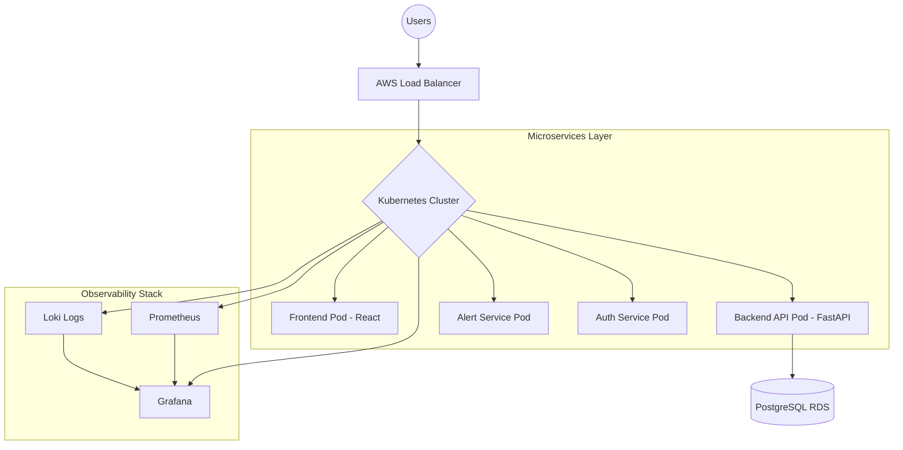

# 🛡️ AI-Powered Cloud DevOps Incident Management Platform

> **Industry-Graded SRE & Observability Solution**
> A production-ready platform designed to monitor, detect, and automatically recover from cloud infrastructure anomalies. Think of it as a **Mini-Datadog** tailored for modern DevOps workflows.

---

## 🚀 Overview
Modern distributed systems fail. Whether it's a CPU spike, a pod crash, or a memory leak, downtime costs money. This platform provides an end-to-end Site Reliability Engineering (SRE) dashboard that doesn't just watch your system—it fixes it.

### Core Capabilities:
* **Real-time Monitoring:** Tracking pod health and API latency.
* **Anomaly Detection:** Identifying CPU/Memory spikes before they cause outages.
* **Automated Recovery:** Self-healing workflows for Kubernetes workloads.
* **Centralized Observability:** Unified logs and metrics visualization.

---

## 🏗️ System Architecture

---

---

## 🛠️ Tech Stack & Tooling

| Category | Tools |
| :--- | :--- |
| **Cloud Provider** | AWS (EKS, RDS, ECR, IAM, S3, VPC) |
| **Containerization** | Docker, Kubernetes (EKS/k3s), Helm |
| **Infrastructure as Code** | Terraform |
| **CI/CD Pipeline** | Jenkins, GitHub Webhooks |
| **Backend** | Python FastAPI / Node.js |
| **Frontend** | React + Tailwind CSS |
| **Monitoring/Logs** | Prometheus, Grafana, Loki |

---

## 🔄 CI/CD Workflow
*High-velocity deployment pipeline ensuring code quality and infrastructure stability:*

1.  **Developer Push:** Triggered via **GitHub Webhook**.
2.  **Jenkins Pipeline:** Automates testing, linting, and security audits.
3.  **Artifact Creation:** Builds Docker image and pushes to **AWS ECR**.
4.  **IaC Validation:** Terraform plan/apply to sync infrastructure.
5.  **K8s Deployment:** Rolling update to the cluster via Helm/Kubectl.
6.  **Health Check:** **Prometheus** verifies the deployment success and service availability.

---

## ☸️ Kubernetes Implementation Details
This project leverages advanced K8s features to mimic a production environment:

* **HPA (Horizontal Pod Autoscaler):** Automatically scales pods based on CPU/RAM metrics.
* **Self-Healing:** Custom Liveness and Readiness probes for automated container restarts.
* **ConfigMaps & Secrets:** Secure, decoupled environment and credential management.
* **Ingress Controller:** Advanced traffic routing, load balancing, and SSL termination.

---

## 📊 Monitoring & Observability
* **Prometheus:** Scrapes pod metrics, API latency, and cluster health.
* **Loki:** Aggregates logs from all microservices into a single, searchable pane.
* **Grafana Dashboards:**
    * **Cluster Health:** Real-time node status and pod distribution.
    * **SRE Metrics:** Deployment tracking, error rates, and alert statistics.

---

## 🔐 Security (DevSecOps)
* **Least Privilege:** IAM roles strictly tailored for specific service needs.
* **Secrets Management:** Sensitive data handled securely via Kubernetes Secrets.
* **Authentication:** Secure JWT-based user authentication for the dashboard.
* **Scanning:** Automated container vulnerability scanning within the CI/CD pipeline.

---

## 📈 Project Value
* **Estimated Complexity:** 9/10
* **Resume Impact:** 10/10 (Screams Cloud/DevOps Engineer)
* **Uniqueness:** Moves beyond basic CRUD into real-world distributed systems reliability.

---

  <b>Built for the Cloud. Optimized for Reliability.</b> 
  Designed by [Your Name] - 2026 DevOps Initiative

---