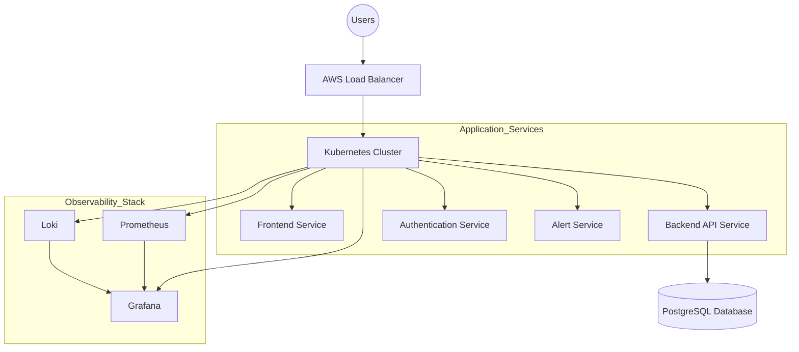

<p align="center">
  
</p>

<h3 align="center">🛡️ Your Cloud-Native Sentinel</h3>
<p align="center"><strong>Production-Grade SRE & Observability Platform</strong></p>
<p align="center"><strong>Monitor • Detect • Recover • Scale</strong></p>

<p align="center">
  <a href="https://aws.amazon.com/"></a>
  <a href="https://kubernetes.io/"></a>
  <a href="https://www.terraform.io/"></a>
  <a href="https://www.jenkins.io/"></a>
</p>
<p align="center">
  <a href="https://prometheus.io/"></a>
  <a href="https://grafana.com/"></a>
  <a href="https://github.com/charan21042005/cloud-sentinel-platform"></a>
</p>

---

## 📌 Overview

**Cloud Sentinel Platform** is an industry-inspired cloud-native observability and incident management system designed to simulate real-world **DevOps** and **Site Reliability Engineering (SRE)** workflows.

In today's distributed systems, downtime is not an option. Cloud Sentinel doesn't just watch your infrastructure—it understands it. By leveraging a full-stack observability suite and automated recovery workflows, it ensures your services remain resilient under pressure.

### Why It Matters?
- **Proactive Reliability:** Detect anomalies before they become outages.
- **Automated Recovery:** Self-healing Kubernetes workloads reduce MTTR (Mean Time To Recovery).
- **Production Simulation:** Experience the full lifecycle of a cloud-native app, from Terraform provisioning to Jenkins-driven deployments.

---

## 🎯 Project Goals

- [x] **Build** a production-grade cloud-native platform.
- [x] **Demonstrate** complete DevOps lifecycle implementation.
- [x] **Showcase** Kubernetes orchestration concepts (HPA, Self-healing).
- [x] **Implement** CI/CD automation pipelines with Jenkins.
- [x] **Deploy** scalable microservices on AWS.
- [x] **Integrate** a unified Monitoring & Observability stack.
- [x] **Practice** Infrastructure as Code (IaC) using Terraform.

---

## 🚀 Core Features

| Feature | Description |
| :--- | :--- |
| 🔍 **Observability** | Real-time infrastructure monitoring, API performance tracking, and pod health. |
| ⚙️ **DevOps Automation** | Full CI/CD pipelines, automated Docker builds, and rolling deployments. |
| ☸️ **K8s Self-Healing** | Liveness/Readiness probes and HPA for autonomous workload management. |
| 📊 **Monitoring Stack** | Prometheus metrics, Grafana dashboards, and Loki log aggregation. |
| 🔐 **DevSecOps** | IAM least privilege, JWT auth, and K8s secrets management. |
| 💥 **Chaos Engineering** | Injecting synthetic faults to test system resilience. |

---

## 🏗️ High-Level Architecture



---

## 🛠️ Tech Stack

<p align="center">
  
  
  
  
  
  
  
  
  
</p>

---

## 📂 Repository Structure

```text
cloud-sentinel-platform/
│
├── frontend/             # React + Tailwind Source
├── backend/              # FastAPI Source
├── monitoring/           # Prometheus/Grafana/Loki Configs
├── kubernetes/           # K8s Manifests (Deployments, HPA, Ingress)
├── terraform/            # IaC (VPC, EKS, RDS Modules)
├── jenkins/              # Jenkinsfile & Pipeline Scripts
├── docker/               # Master Dockerfiles & Build Scripts
├── docs/                 # Architecture, Diagrams, Screenshots
└── assets/               # Branding & Static Assets
```

---

## 🔄 CI/CD Workflow

1.  **Developer Push:** Triggered via GitHub Webhook.
2.  **Jenkins Pipeline:** Automates testing, linting, and security audits.
3.  **Artifact Creation:** Builds Docker image and pushes to **AWS ECR**.
4.  **IaC Validation:** Terraform plan/apply to sync infrastructure.
5.  **K8s Deployment:** Rolling update to the cluster via Helm/Kubectl.
6.  **Health Check:** Prometheus verifies service availability.

---

## ☁️ AWS Services

- **Amazon EC2/EKS:** Scalable compute and orchestration.
- **Amazon ECR:** Private container registry.
- **Amazon RDS:** Managed PostgreSQL database.
- **AWS IAM:** Granular security and identity management.
- **Amazon S3:** Scalable object storage for logs/artifacts.
- **AWS VPC:** Isolated network infrastructure.

---

## 📊 Monitoring & Observability

- **Prometheus:** High-dimensional data model for metrics (CPU, RAM, Latency).
- **Grafana:** Beautifully visualized dashboards for real-time insights.
- **Loki:** Like Prometheus, but for logs. Optimized for cloud-native workflows.

---

## 🔐 Security Objectives

- **Least Privilege:** Tailored IAM roles.
- **Secrets Management:** K8s Secrets for sensitive data.
- **Auth:** Secure JWT-based user authentication.
- **Scanning:** Automated vulnerability scanning in CI/CD.

---

## 📅 Project Roadmap

| Phase | Milestone | Status |
| :--- | :--- | :--- |
| **Phase 1** | Project Planning & Architecture | ✅ Completed |
| **Phase 2** | Backend Development (FastAPI) | 🚧 In Progress |
| **Phase 3** | Frontend Dashboard (React) | ⏳ Upcoming |
| **Phase 4** | Infrastructure as Code (Terraform) | ⏳ Upcoming |
| **Phase 5** | Kubernetes & Observability | ⏳ Upcoming |

---

## 👨‍💻 Author

**Patty**
*B.Tech Student — Cloud Computing & DevOps Engineering*

<p align="center">
  <a href="https://linkedin.com/in/yourprofile"></a>
  <a href="https://github.com/charan21042005"></a>
</p>

---

## 📜 License

This project is licensed under the MIT License.

---

<p align="center">
  
</p>