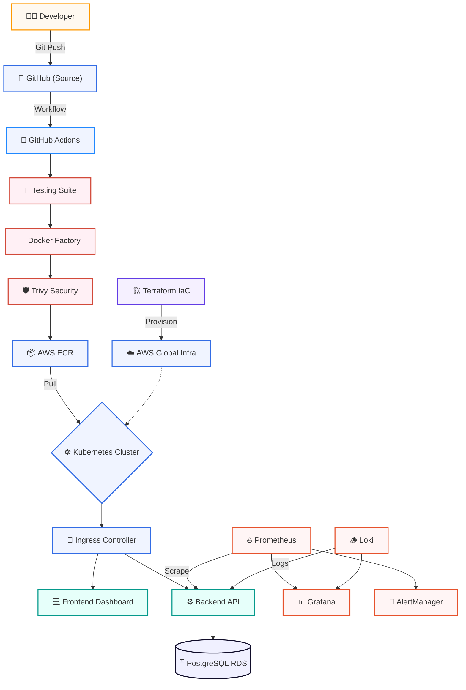

<p align="center">
  
</p>

<h3 align="center">🛡️ Your Cloud-Native Sentinel</h3>
<p align="center"><strong>"The High-Availability Fortress for Distributed Systems"</strong></p>
<p align="center"><strong>Production-Grade SRE • Kubernetes Orchestration • Automated Observability</strong></p>

<p align="center">
  <a href="https://aws.amazon.com/"></a>
  <a href="https://kubernetes.io/"></a>
  <a href="https://www.terraform.io/"></a>
  <a href="https://github.com/features/actions"></a>
</p>
<p align="center">
  <a href="https://prometheus.io/"></a>
  <a href="https://grafana.com/"></a>
  <a href="https://fastapi.tiangolo.com/"></a>
  <a href="https://reactjs.org/"></a>
</p>

---

## 📑 Table of Contents
- [🛡️ 1.0 Overview](#-10-overview)
- [📈 2.0 Platform Status & Metrics](#-20-platform-status--metrics)
- [🚀 3.0 Documentation Masterclass](#-30-documentation-masterclass)
- [🏛️ 4.0 System Architecture](#-40-system-architecture)
- [🛠️ 5.0 Core Technology Stack](#-50-core-technology-stack)
- [📂 6.0 Repository Architecture](#-60-repository-architecture)
- [👨‍💻 7.0 Author & Philosophy](#-70-author--philosophy)

---

## 🛡️ 1.1 Project Overview

**Cloud Sentinel Platform** is a mission-critical, industry-inspired cloud-native observability ecosystem. It is designed to bridge the gap between traditional software development and high-fidelity **Site Reliability Engineering (SRE)**.

In the era of distributed microservices, infrastructure is no longer static—it is a living organism. Cloud Sentinel provides the **Eyes (Prometheus)**, **Brain (FastAPI/K8s)**, and **Hands (Terraform/Jenkins)** required to maintain 99.99% uptime in a volatile cloud environment.

---

## 📈 2.0 Platform Status & Metrics

| Component | Status | Technology | Focus |
| :--- | :--- | :--- | :--- |
| **Infrastucture** | `Provisioned` | Terraform / AWS | Resilience |
| **Orchestration** | `Stable` | Kubernetes | Self-Healing |
| **Pipeline** | `Automated` | GitHub Actions | Velocity |
| **Observability** | `Live` | LGTM Stack | Visibility |
| **Security** | `Hardened` | DevSecOps | Zero-Trust |
| **Streaming** | `Real-Time` | WebSockets / JWT | Low-Latency |
| **Chaos Plane** | `Controllable` | Deterministic Sim | Fault-Tolerant |

---

## 🚀 3.0 Documentation Masterclass

Explore the project through a structured, domain-driven learning path. Each module is a "Masterclass" in production engineering.

### 🏛️ Phase 1: The Blueprint
*   **00 Project Foundation:** [Vision](docs/00_project_foundation/01_Vision.md) • [Requirements](docs/00_project_foundation/02_Requirements.md) • [Initiation](docs/00_project_foundation/03_Initiation.md) • [Planning](docs/00_project_foundation/04_Project_Planning.md)
*   **01 Architecture:** [System Design](docs/01_architecture/System_Architecture.md)

### ⚙️ Phase 2: Core Engineering
*   **02 Frontend:** [React UI](docs/02_frontend/Frontend_Engineering.md)
*   **03 Backend:** [FastAPI Engine](docs/03_backend/Backend_Engineering.md)
*   **04 Database:** [RDS Persistence](docs/04_database/Database_Engineering.md)

### 🐳 Phase 3: Cloud & DevOps
*   **05 Containers:** [Docker Mastery](docs/05_containerization/Docker_Containerization.md)
*   **06 Orchestration:** [K8s Deep Dive](docs/06_kubernetes/Kubernetes_Deep_Dive.md)
*   **07 Infrastructure:** [AWS Cloud](docs/07_cloud_infrastructure/AWS_Cloud_Infrastructure.md)
*   **08 IaC:** [Terraform Modules](docs/08_iac/Terraform_IaC.md)
*   **09 CI/CD:** [GitHub Actions](docs/09_cicd/CICD_Engineering.md)

### 📊 Phase 4: Operations & Defense
*   **10 Monitoring:** [Observability](docs/10_observability/Monitoring_Observability.md)
*   **11 Security:** [DevSecOps](docs/11_security/Security_DevSecOps.md)
*   **12 Strategy:** [Zero-Downtime Deployment](docs/12_deployment/Deployment_Strategy.md)
*   **13 Quality:** [Testing Strategy](docs/13_testing/Testing_Strategy.md)

### 📈 Phase 5: Production
*   **14 Workflow:** [Final Production](docs/14_production_workflow/Production_Workflow.md)
*   **15 Repository:** [GitHub Engineering](docs/15_documentation/Documentation_GitHub_Engineering.md)
*   **16 Defense:** [Viva Mastery](docs/16_viva/Viva_Presentation_Preparation.md)
*   **17 Horizon:** [Future AIOps](docs/17_advanced_features/Advanced_Features_Future_Scope.md)

### 🌐 Phase 6: Advanced SRE Fabric
*   **18 Streaming:** [Real-Time SOC Fabric](services/api-gateway/app/services/websocket/manager.py)
*   **19 Reliability:** [Graceful Fallbacks](frontend/src/features/incidents/hooks/useIncidents.ts)
*   **20 Chaos Plane:** [Disruption Injection](services/api-gateway/app/api/v1/routes/chaos.py)
*   **21 Platform:** [Enterprise K8s Layout](infrastructure/kubernetes/README.md)
*   **22 Infrastructure:** [Terraform IaC Architecture](infrastructure/terraform/README.md)
*   **23 Networking:** [Multi-AZ VPC Foundation](infrastructure/terraform/modules/networking/README.md)
*   **24 Security:** [AWS IAM & Cryptography](infrastructure/terraform/modules/iam/README.md)
*   **25 Control Plane:** [Amazon EKS Orchestration](infrastructure/terraform/modules/eks/README.md)
*   **26 Compute Nodes:** [Managed EKS Node Groups](infrastructure/terraform/modules/nodes/README.md)
*   **27 GitOps Controller:** [ArgoCD Deployment Architecture](infrastructure/kubernetes/gitops/README.md)
*   **28 Observability Stack:** [Prometheus & Grafana Telemetry](infrastructure/kubernetes/monitoring/README.md)
*   **29 Edge Routing:** [NGINX Ingress & AWS NLB Integration](infrastructure/kubernetes/networking/ingress-nginx/README.md)

---

## 🏛️ 4.0 System Architecture

The following diagram illustrates the high-velocity data flow and service orchestration within the Cloud Sentinel ecosystem.




---

## 🛠️ 5.0 Core Technology Stack

| Domain | Tools |
| :--- | :--- |
| **Cloud Infrastructure** | AWS (EKS, RDS, ECR, VPC, S3) |
| **Infrastructure as Code** | Terraform (HCL) |
| **Orchestration** | Kubernetes (Pods, Deployments, Ingress, HPA) |
| **CI/CD Automation** | GitHub Actions, YAML Workflows, Docker Buildx |
| **Full-Stack** | Next.js 14, FastAPI, Tailwind CSS, React Query |
| **Observability** | Prometheus, Grafana, Loki, AlertManager |
| **Security** | Trivy, JWT, RBAC, AWS IAM |

---

## 📂 6.0 Repository Architecture (Monorepo)

```text
cloud-sentinel-platform/
├── .github/                # 🤖 GitHub Actions CI/CD Pipelines
├── frontend/               # ⚡ Sentinel Interface (CSI) - Next.js
├── services/
│   ├── api-gateway/        # ⚙️ Primary Entry Point (FastAPI)
│   ├── auth-service/       # 🔐 Identity & Access
│   ├── incident-service/   # 🚨 Fault & Event Management
│   ├── monitoring-service/ # 📊 Metrics Aggregation
│   └── notification-service/# 🔔 Alerting & Webhooks
├── infrastructure/         # 🏗️ Platform DevOps Brain
│   ├── docker/             # Local Orchestration
│   ├── kubernetes/         # K8s Manifests/Helm
│   ├── terraform/          # IaC Modules
│   └── monitoring/         # Grafana/Prometheus Configs
├── scripts/                # 📜 Automation Utilities
├── configs/                # 🛠️ Shared Tooling Configs
├── docs/                   # 📚 Engineering Knowledge Base
├── Makefile                # 🛠️ Workflow Command Hub
└── README.md               # 🏠 Project Navigation Hub
```

---

## ⚡ 7.0 Quick Start (Developer Experience)

The platform utilizes a **Makefile-driven workflow** to ensure a consistent development experience across the team.

### 1. Prerequisites
- Docker & Docker Compose
- Python 3.10+
- Node.js 20+

### 2. Initial Setup
```bash
# Bootstrap the project (Env setup & dependencies)
make setup
```

### 3. Start Local Development
```bash
# Start all services via Docker Compose
make dev
```

### 4. Build Production Images
```bash
make build
```

---

## 👨‍💻 8.0 Author & Philosophy

**Patty**
*B.Tech — Cloud Computing & DevOps Engineering Specialist*

> "In the cloud, resilience is not a feature—it is a foundation. Cloud Sentinel is built on the philosophy that every failure is an opportunity for automated recovery."

<p align="center">
  <a href="https://linkedin.com/in/yourprofile"></a>
  <a href="https://github.com/charan21042005"></a>
  <a href="mailto:your-email@example.com"></a>
</p>

---

<p align="center">
  
</p>