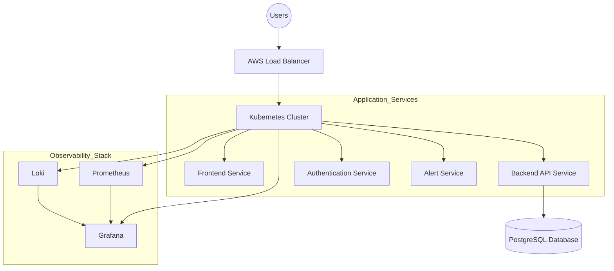

<p align="center">
  
</p>

<h3 align="center">🛡️ Your Cloud-Native Sentinel</h3>
<p align="center"><strong>Production-Grade SRE & Observability Platform</strong></p>
<p align="center"><strong>Monitor • Detect • Recover • Scale</strong></p>

<p align="center">
  <a href="https://aws.amazon.com/"></a>
  <a href="https://kubernetes.io/"></a>
  <a href="https://www.terraform.io/"></a>
  <a href="https://www.jenkins.io/"></a>
</p>
<p align="center">
  <a href="https://prometheus.io/"></a>
  <a href="https://grafana.com/"></a>
  <a href="https://github.com/charan21042005/cloud-sentinel-platform"></a>
</p>

---

## 📑 Table of Contents
* [1.0 Overview](#-10-overview)
* [2.0 Documentation Roadmap](#-20-documentation-roadmap-learning-flow)
* [3.0 High-Level Architecture](#-30-high-level-architecture)
* [4.0 Repository Structure](#-40-repository-structure)
* [5.0 Author & License](#-50-author--license)

---

## 📌 1.0 Overview

**Cloud Sentinel Platform** is an industry-inspired cloud-native observability and incident management system designed to simulate real-world **DevOps** and **Site Reliability Engineering (SRE)** workflows.

In today's distributed systems, downtime is not an option. Cloud Sentinel doesn't just watch your infrastructure—it understands it. By leveraging a full-stack observability suite and automated recovery workflows, it ensures your services remain resilient under pressure.

---

## 🚀 2.0 Documentation Roadmap (Learning Flow)

Explore the project through our high-fidelity documentation architecture. Follow the numbered phases for a complete masterclass experience.

### 🏛️ Phase 1: Foundation & Architecture
*   **00 Project Foundation:** [Vision](docs/00_project_foundation/01_Vision.md) • [Requirements](docs/00_project_foundation/02_Requirements.md) • [Initiation](docs/00_project_foundation/03_Initiation.md) • [Planning](docs/00_project_foundation/04_Project_Planning.md)
*   **01 Architecture:** [System Architecture](docs/01_architecture/System_Architecture.md)

### ⚙️ Phase 2: Core Engineering
*   **02 Frontend:** [Frontend Engineering](docs/02_frontend/Frontend_Engineering.md)
*   **03 Backend:** [Backend Engineering](docs/03_backend/Backend_Engineering.md)
*   **04 Database:** [Database Engineering](docs/04_database/Database_Engineering.md)

### 🐳 Phase 3: Cloud & DevOps
*   **05 Containerization:** [Docker Containerization](docs/05_containerization/Docker_Containerization.md)
*   **06 Kubernetes:** [Kubernetes Deep Dive](docs/06_kubernetes/Kubernetes_Deep_Dive.md)
*   **07 Cloud Infra:** [AWS Cloud Infrastructure](docs/07_cloud_infrastructure/AWS_Cloud_Infrastructure.md)
*   **08 IaC:** [Terraform IaC](docs/08_iac/Terraform_IaC.md)
*   **09 CI/CD:** [Jenkins CI/CD Engineering](docs/09_cicd/CICD_Engineering.md)

### 📊 Phase 4: Operations & Security
*   **10 Observability:** [Monitoring & Observability](docs/10_observability/Monitoring_Observability.md)
*   **11 Security:** [Security & DevSecOps](docs/11_security/Security_DevSecOps.md)
*   **12 Deployment:** [Deployment Strategy](docs/12_deployment/Deployment_Strategy.md)
*   **13 Testing:** [Testing Strategy](docs/13_testing/Testing_Strategy.md)

### 📈 Phase 5: Production & Defense
*   **14 Workflow:** [Production Workflow](docs/14_production_workflow/Production_Workflow.md)
*   **15 Documentation:** [GitHub Engineering](docs/15_documentation/Documentation_GitHub_Engineering.md)
*   **16 Viva Prep:** [Presentation Mastery](docs/16_viva/Viva_Presentation_Preparation.md)
*   **17 Future Scope:** [Advanced Features](docs/17_advanced_features/Advanced_Features_Future_Scope.md)

---

## 🏗️ 3.0 High-Level Architecture



---

## 📂 4.0 Repository Structure

```text
cloud-sentinel-platform/
│
├── frontend/             # React + Tailwind Source
├── backend/              # FastAPI Source
├── infrastructure/       # Terraform Modules (IaC)
├── kubernetes/           # K8s Manifests (Deployments, HPA, Ingress)
├── monitoring/           # Prometheus/Grafana/Loki Configs
├── scripts/              # Automation & Helper Scripts
├── docs/                 # Professional Documentation Hierarchy (Masterclass)
│   ├── 00_project_foundation/
│   ├── 01_architecture/
│   ├── ... (02-17 Modules)
│   └── README.md         # Documentation Hub
├── .github/              # GitHub Actions & Workflows
└── README.md             # Project Landing Page
```

---

## 👨‍💻 5.0 Author & License

**Patty**
*B.Tech Student — Cloud Computing & DevOps Engineering*

<p align="center">
  <a href="https://linkedin.com/in/yourprofile"></a>
  <a href="https://github.com/charan21042005"></a>
</p>

This project is licensed under the MIT License.

---

## Cloud Sentinel Platform — Production-Grade Cloud-Native DevOps & Observability Engineering Documentation

<p align="center">
  
</p>