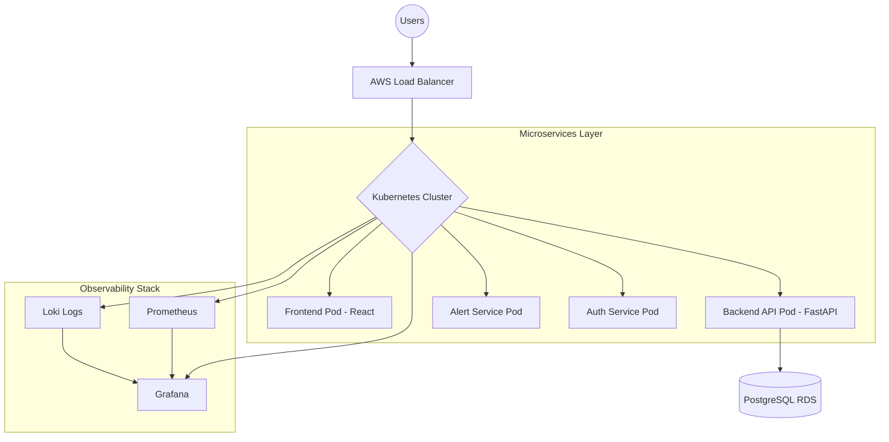

  

<h3 align="center">🚀 Phase 3: Project Initiation</h3>

<strong>"The blueprint for an industry-grade SRE platform."</strong>

<strong>Strategy • Ecosystem • Tech Stack • Pipeline Flow</strong>

  
  
  

---

## 📑 Table of Contents
* [3.1 Project Overview](#-31-project-overview)
* [3.2 System Architecture](#-32-system-architecture)
* [3.3 Tech Stack & Tooling](#-33-tech-stack--tooling)
* [3.4 CI/CD Workflow](#-34-cicd-workflow)
* [3.5 Kubernetes Implementation](#-35-kubernetes-implementation)
* [3.6 Security (DevSecOps)](#-36-security-devsecops)
* [3.7 Project Value](#-37-project-value)

---

## 🛡️ 3.1 Project Overview

Modern distributed systems fail. Whether it's a CPU spike, a pod crash, or a memory leak, downtime costs money. **Cloud Sentinel** is a production-ready Site Reliability Engineering (SRE) platform designed to monitor, detect, and automatically recover from cloud infrastructure anomalies. Think of it as a **Mini-Datadog** tailored for modern DevOps workflows.

### Core Capabilities:
*   **Real-time Monitoring:** Tracking pod health and API latency.
*   **Anomaly Detection:** Identifying CPU/Memory spikes before they cause outages.
*   **Automated Recovery:** Self-healing workflows for Kubernetes workloads.
*   **Centralized Observability:** Unified logs and metrics visualization.

---

## 🏗️ 3.2 System Architecture

---

## 🛠️ 3.3 Tech Stack & Tooling

| Category | Tools |
| :--- | :--- |
| **Cloud Provider** | AWS (EKS, RDS, ECR, IAM, S3, VPC) |
| **Containerization** | Docker, Kubernetes (EKS/k3s), Helm |
| **Infrastructure as Code** | Terraform |
| **CI/CD Pipeline** | Jenkins, GitHub Webhooks |
| **Backend** | Python FastAPI / Node.js |
| **Frontend** | React + Tailwind CSS |
| **Monitoring/Logs** | Prometheus, Grafana, Loki |

---

## 🔄 3.4 CI/CD Workflow
*High-velocity deployment pipeline ensuring code quality and infrastructure stability:*

1.  **Developer Push:** Triggered via **GitHub Webhook**.
2.  **Jenkins Pipeline:** Automates testing, linting, and security audits.
3.  **Artifact Creation:** Builds Docker image and pushes to **AWS ECR**.
4.  **IaC Validation:** Terraform plan/apply to sync infrastructure.
5.  **K8s Deployment:** Rolling update to the cluster via Helm/Kubectl.
6.  **Health Check:** **Prometheus** verifies the deployment success and service availability.

---

## ☸️ 3.5 Kubernetes Implementation
This project leverages advanced K8s features to mimic a production environment:

*   **HPA (Horizontal Pod Autoscaler):** Automatically scales pods based on CPU/RAM metrics.
*   **Self-Healing:** Custom Liveness and Readiness probes for automated container restarts.
*   **ConfigMaps & Secrets:** Secure, decoupled environment and credential management.
*   **Ingress Controller:** Advanced traffic routing, load balancing, and SSL termination.

---

## 🔐 3.6 Security (DevSecOps)
*   **Least Privilege:** IAM roles strictly tailored for specific service needs.
*   **Secrets Management:** Sensitive data handled securely via Kubernetes Secrets.
*   **Authentication:** Secure JWT-based user authentication for the dashboard.
*   **Scanning:** Automated container vulnerability scanning within the CI/CD pipeline.

---

## 📈 3.7 Project Value
*   **Estimated Complexity:** 9/10
*   **Resume Impact:** 10/10 (Screams Cloud/DevOps Engineer)
*   **Uniqueness:** Moves beyond basic CRUD into real-world distributed systems reliability.

---

## Continue the Cloud-Native Journey 🚀

> "The project is now officially initiated. With the vision and requirements set, we move into the critical planning phase."

**Previous Module:**
← [Requirement Analysis](02_Requirements.md)

**Next Module:**
→ [Project Planning](04_Project_Planning.md)

  

