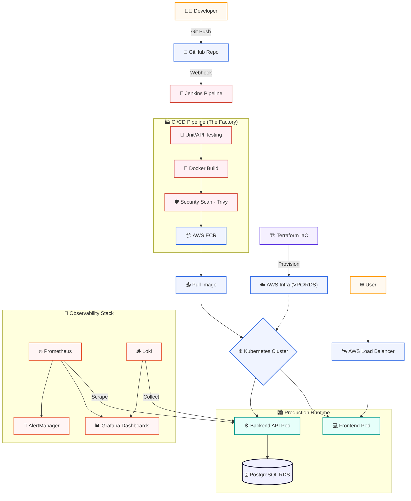

  

<h3 align="center">⚙️ Phase 18: Final Production Workflow</h3>

<strong>"The Complete Cloud-Native Assembly Line"</strong>

<strong>CI/CD Factory • Infrastructure as Code • Orchestration • Continuous Observability</strong>

  
  
  

---

## 📑 Table of Contents
* [18.1 The COMPLETE Big Picture](#-181-the-complete-big-picture)
* [18.2 The Continuous Lifecycle](#-182-the-continuous-lifecycle)
* [18.3 Internal Component Communication](#-183-internal-component-communication)
* [18.4 Beginner vs. Industry System Thinking](#-184-beginner-vs-industry-system-thinking)

---

## 🏗️ 18.1 The COMPLETE Big Picture

This diagram represents the "Nervous System" of the Cloud Sentinel Platform. It shows how **CI/CD**, **Infrastructure as Code**, **Orchestration**, and **Observability** communicate.

---

## 🔄 18.2 The Continuous Lifecycle

Unlike traditional academic projects, **Cloud Sentinel** follows a **Circular Lifecycle**. In the world of SRE, there is no "End"—only a cycle of continuous improvement and feedback.

*   **Develop:** New features are written in VS Code and validated locally using **Docker Compose**.
*   **Integrate:** **Jenkins** validates the code automatically using the shared `Jenkinsfile` logic.
*   **Deliver:** Optimized Docker images are versioned and stored securely in **AWS ECR**.
*   **Orchestrate:** **Kubernetes** performs a **Rolling Update** to replace pods without a single second of downtime.
*   **Observe:** **Prometheus** & **Loki** monitor the live release for performance spikes or errors.
*   **React:** If a bug is detected, **AlertManager** notifies the team, and we trigger an automated **Rollback** to the last stable version.

---

## 🛰️ 18.3 Internal Component Communication

To understand the "Nervous System" of our platform, we must look at how our services communicate within the cluster:

| Communication Path | Protocol | Purpose |
| :--- | :--- | :--- |
| **Frontend ➔ Backend** | HTTPS / JSON | API Data requests & User Auth |
| **Backend ➔ Database** | TCP (Port 5432) | Persistent data storage and retrieval |
| **Prometheus ➔ Apps** | HTTP GET /metrics | Real-time performance scraping |
| **Jenkins ➔ K8s** | Kube-API | Automated deployment orchestration |
| **Terraform ➔ AWS** | AWS API | Cloud infrastructure provisioning |

---

## ⚖️ 18.4 Beginner vs. Industry System Thinking

| Feature | Beginner | Industry (Our Project) |
| :--- | :--- | :--- |
| **Perspective** | "I built a website." | "I built an **automated ecosystem**." |
| **Deployment** | Manual Drag-and-Drop | **GitOps / Pipeline-driven** automation. |
| **Failure** | "I hope it doesn't break." | **Design for Failure** (Self-Healing clusters). |
| **Complexity** | Linear (Start to Finish) | **Cyclic** (Continuous Observability). |

---

## Continue the Cloud-Native Journey 🚀

> "The production ecosystem is now fully interconnected and operational. Now, let's explore how we document this masterpiece for the world."

**Previous Module:**
← [Testing Strategy](../13_testing/Testing_Strategy.md)

**Next Module:**
→ [Documentation & Engineering Standards](../15_documentation/Documentation_GitHub_Engineering.md)

  

