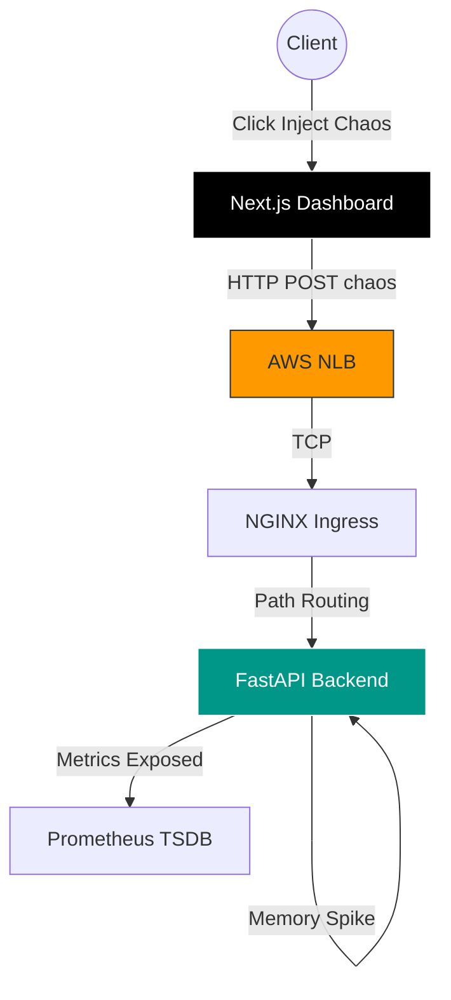

<!-- slide -->
<p align="center">
  
</p>

<h2 align="center">🚀 Full-Stack Enterprise SRE & Cloud Architecture</h2>
<p align="center"><strong>Bridging Application Code to Production-Grade Infrastructure</strong></p>

<p align="center">
  
  
  
  
</p>

<p align="center"><em>A Complete Masterclass Documentation Output designed for both Technical Teams and Stakeholders</em></p>

---

<!-- slide -->
# 🎯 1. The Core Vision: Why Did We Build This?

> "Modern cloud infrastructure is useless if the business cannot actually see what is happening when things break."

**The Business Problem (For Non-Technical Audiences):**
Imagine running a massive digital bank. If a server goes down, customers panic. Traditionally, engineers find out about crashes via angry tweets. We built **Cloud Sentinel** to act as a central "Nerve Center"—a dashboard that automatically monitors system health and allows us to safely "break" our systems in testing to ensure they can heal themselves.

**The Engineering Roadmap (10 Phases):**
We built this from the ground up: Application → Pipelines → AWS Infrastructure → Edge Routing.

---

<!-- slide -->
# 🐍 2. Phase 1: Backend Engineering (FastAPI)

<span class="analogy">💡 Non-Tech Translation: This is the brain of our operation that handles all incoming requests and purposely causes "controlled chaos" for testing.</span>

**Tool Used:** `Python & FastAPI`
**Why We Chose It:** It is incredibly fast at handling multiple simultaneous connections compared to older frameworks like Flask or Django.

**Technical Deep-Dive:**
- **Chaos Engine (`/api/v1/chaos`):** We built specialized endpoints to inject artificial latency and memory spikes. This proves our Kubernetes auto-scaling actually works under pressure.
- **WebSocket Manager:** Bi-directional streams pipe cluster CPU/RAM directly to the frontend instantly without refreshing the page.

```bash
uvicorn main:app --host 0.0.0.0 --port 8000 --reload
```

---

<!-- slide -->
# ⚛️ 3. Phase 2: Frontend Dashboard (Next.js)

<span class="analogy">💡 Non-Tech Translation: This is the visual control room (like a pilot's cockpit) where human operators monitor the system's heartbeat.</span>

**Tool Used:** `React & Next.js`
**Why We Chose It:** It provides blazing-fast user interfaces and handles real-time data graphing beautifully.

**Technical Deep-Dive:**
- **SRE Operations Console:** A beautiful dark-mode interface built with TailwindCSS.
- **Real-Time Telemetry:** Integrated `recharts` to plot the live WebSocket data (CPU/RAM).
- **Chaos Control Panel:** UI buttons bridging directly to backend Chaos routes, allowing operators to trigger "Red Team" attacks with a single click.

```bash
npx create-next-app@latest web-dashboard
```

---

<!-- slide -->
# ⚙️ 4. Phase 3: Local Orchestration (Makefile)

<span class="analogy">💡 Non-Tech Translation: A magic wand for developers that turns 20 complex terminal commands into 1 simple word, preventing human error.</span>

**Tool Used:** `GNU Make`
**Why We Chose It:** To eliminate the "Works on my machine" syndrome. It acts as the Developer Experience (DevEx) layer.

**Technical Deep-Dive:**
Instead of expecting engineers to memorize massive Docker build flags or Terraform initialization scripts, we mapped them:
- `make build-backend`: Compiles Python Docker images.
- `make build-frontend`: Compiles Next.js Docker images.
- `make tf-apply`: Wraps the Terraform deployment lifecycle securely.

---

<!-- slide -->
# 🤖 5. Phase 4: CI/CD Pipelines (GitHub Actions)

<span class="analogy">💡 Non-Tech Translation: The automated factory assembly line. When an engineer finishes writing code, this factory tests it, boxes it, and ships it.</span>

**Tool Used:** `GitHub Actions & AWS OIDC`
**Why We Chose It:** Built directly into GitHub, meaning we don't need to maintain separate Jenkins servers.

**Technical Deep-Dive:**
- **`backend-ci.yml`**: Runs PyTest, checks code styling (Flake8), and builds the Docker artifact on every single Pull Request.
- **AWS OIDC Security:** Traditional pipelines store static AWS passwords (which get hacked). We configured OpenID Connect so our pipeline dynamically *assumes* a temporary 1-hour AWS identity. **Zero hardcoded secrets.**

---

<!-- slide -->
# 🌍 6. Phase 5: AWS Network Backbone

<span class="analogy">💡 Non-Tech Translation: Building the digital land, roads, and walls on AWS before we build the actual application houses.</span>

**Tool Used:** `HashiCorp Terraform & AWS VPC`
**Why We Chose It:** Infrastructure as Code (IaC) means our entire AWS network is defined in code. If our data center burns down, we can recreate it in 3 minutes.

**Technical Deep-Dive:**
- A highly available, Multi-AZ VPC (`10.0.0.0/16`) spanning 3 isolated data centers.
- **FinOps Optimization:** AWS NAT Gateways are highly expensive ($32/month each). We engineered a **Single NAT Gateway** instead of the standard 3, slashing AWS costs for our startup budget while maintaining security.

```bash
terraform plan -out=tfplan && terraform apply "tfplan"
```

---

<!-- slide -->
# 🔐 7. Phase 6: Zero-Trust Security (IAM)

<span class="analogy">💡 Non-Tech Translation: The digital bouncers of our system. No server, app, or database is allowed to talk to another without strict permission IDs.</span>

**Tool Used:** `AWS IAM (Identity & Access Management) & AWS KMS`
**Why We Chose It:** If a hacker breaches our application, they cannot access the rest of our AWS account because the app's "ID badge" is heavily restricted.

**Technical Deep-Dive:**
- **Strict Role Boundaries:** We created heavily scoped IAM roles for the Kubernetes Control Plane and Worker Nodes.
- **Envelope Encryption:** Provisioned AWS KMS Customer keys to encrypt Kubernetes Secrets (passwords/API keys) natively inside the AWS `etcd` database at rest.

---

<!-- slide -->
# ☸️ 8. Phase 7: EKS Control Plane

<span class="analogy">💡 Non-Tech Translation: The "Manager" of our application. Kubernetes decides when to hire new workers (servers) and when to fire them based on traffic.</span>

**Tool Used:** `Amazon EKS (Elastic Kubernetes Service)`
**Why We Chose It:** Abstracting the master nodes to AWS ensures we never have to worry about backing up the cluster database or managing master-node failovers.

**Technical Deep-Dive:**
- **Version Pinning:** Enforced `v1.30` for enterprise stability.
- Mapped our custom IAM roles to the cluster using `aws-auth`.
- Placed the Control Plane endpoints inside private subnets for military-grade perimeter defense.

---

<!-- slide -->
# 💻 9. Phase 8: Compute Nodes (FinOps)

<span class="analogy">💡 Non-Tech Translation: The "Workers". These are the actual computers processing user clicks, generating data, and running our FastAPI/Next.js code.</span>

**Tool Used:** `AWS EC2 Auto Scaling Groups`
**Why We Chose It:** To ensure servers automatically replace themselves if one hardware machine catches fire at AWS.

**Technical Deep-Dive & Challenges:**
- Hardcoded `t3.small` managed node groups to maintain a near-zero AWS bill.
- **The Scheduling Challenge:** We hit an AWS VPC CNI limitation (`Too many pods`) because a single `t3.small` only supports exactly 11 IP allocations.
- **The Fix:** We updated Terraform's `desired_size` to 2, safely injecting fresh IP capacity without cluster downtime.

---

<!-- slide -->
# 🐙 10. Phase 9: GitOps Automation (ArgoCD)

<span class="analogy">💡 Non-Tech Translation: A robot guard that constantly looks at our code and our live servers. If someone manually changes a server, the robot immediately deletes the change and restores it to match the code.</span>

**Tool Used:** `ArgoCD`
**Why We Chose It:** Traditional CI/CD "pushes" code and requires giving external tools AWS admin keys. ArgoCD uses a "Pull" model from *inside* the secure cluster.

**Technical Deep-Dive:**
- Configured an **"App of Apps"** structure where a single root YAML file commands the deployment of the entire infrastructure.
- If a junior developer accidentally deletes the production database pod, ArgoCD detects the "Drift" and recreates it in 3 seconds.

---

<!-- slide -->
# 🚦 11. Phase 10: Edge Routing (Ingress)

<span class="analogy">💡 Non-Tech Translation: The front door to our digital building. It looks at a user's ticket (URL) and points them to the correct room (Frontend vs Backend).</span>

**Tool Used:** `NGINX Ingress & AWS Network Load Balancer (NLB)`
**Why We Chose It:** NGINX is the industry standard for high-performance traffic routing.

**Technical Deep-Dive:**
- Pulled the official Helm chart via Kustomize to trigger AWS to provision a Layer 4 NLB.
- **FinOps Patching (`patch-resources.yaml`):** Used Kustomize patches to hard-limit NGINX memory to `250Mi`, saving our tiny `t3.small` nodes from crashing under controller weight.

---

<!-- slide -->
# 🏗️ 12. Full System Data Flow


*Note: This flow shows how a single click on our Dashboard traverses the AWS Edge, through NGINX, hits Python, and triggers a metric event.*

---

<!-- slide -->
# 🏁 13. Conclusion
We did not just write code, and we did not just provision servers. 

We built a **Full-Lifecycle Platform**.
From writing the Python endpoints, to designing the React UI, to scripting the Terraform IaC, to orchestrating the GitOps rollout on AWS EKS—this is the exact blueprint of a modern Cloud Reliability Engineering team.

<p align="center">
  
  
</p>

<p align="center">
  
</p>
