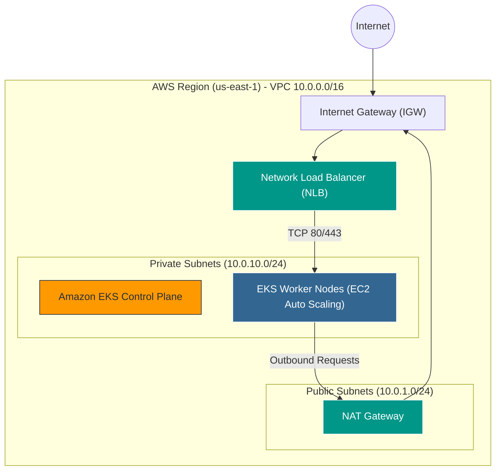
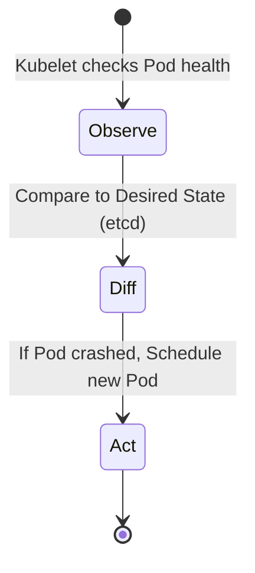
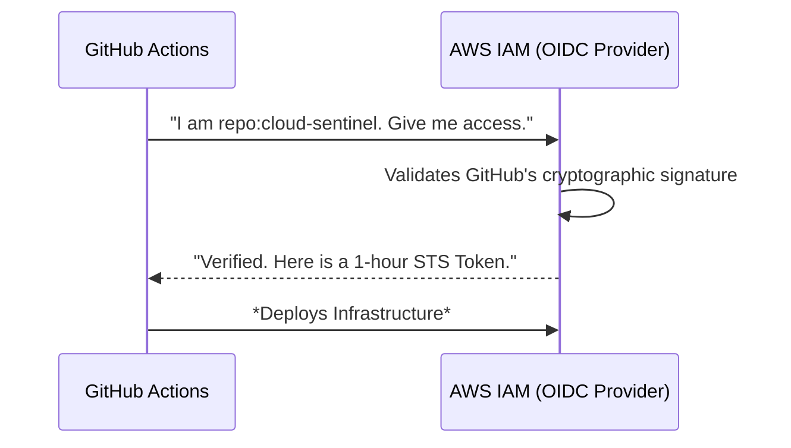
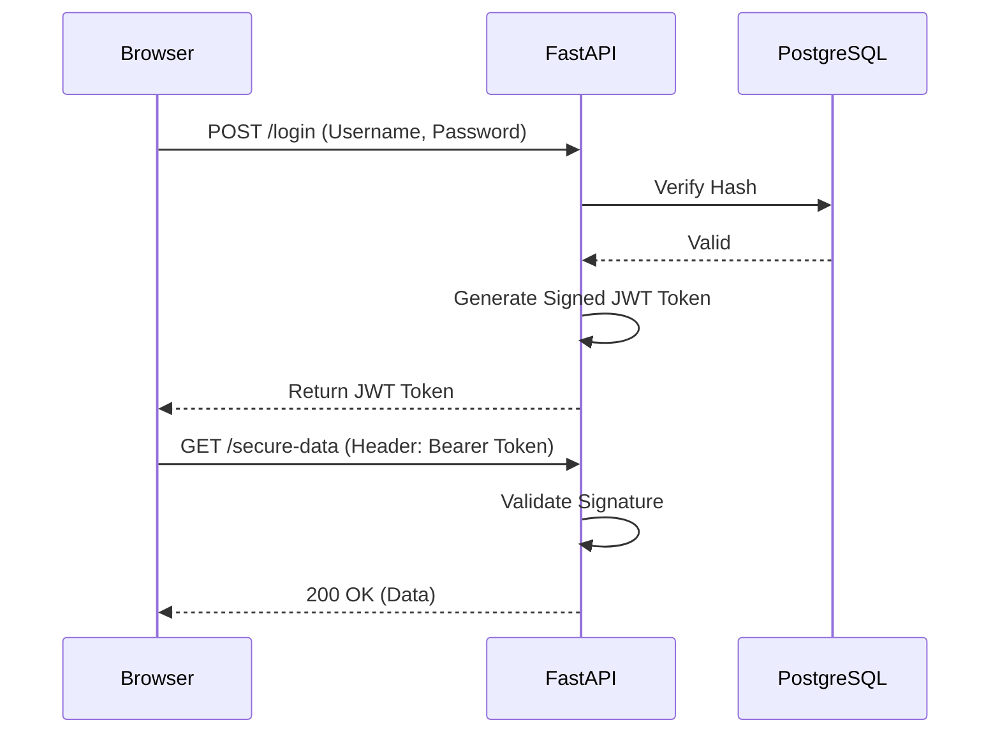

<p align="center">
  
</p>

<p align="center">
  <a href="#aws-architecture"></a>
  <a href="#kubernetes-masterclass"></a>
  <a href="#gitops--argocd-masterclass"></a>
  <a href="#cicd-section"></a>
  <a href="#backend-architecture"></a>
  <a href="#frontend-architecture"></a>
</p>

> **🎯 The Mission:** This document is not just a ReadMe; it is a full-scale **Enterprise Cloud Engineering Documentary**. It will take you from zero cloud knowledge to deeply understanding the architecture, scaling decisions, and SRE philosophies behind a production-grade cloud-native platform.

---

# 1. 🌐 Executive Overview & Problem Statement

### What is Cloud Sentinel?
**Cloud Sentinel** is a production-grade, distributed cloud platform designed to demonstrate modern Site Reliability Engineering (SRE), GitOps, and Cloud-Native architecture. It acts as an advanced telemetry and chaos engineering dashboard, allowing engineers to monitor microservices, inject faults, and watch the system self-heal in real-time.

### The Traditional Infrastructure Problem
Historically, infrastructure was managed via SSH, manual scripts, and "ClickOps" (clicking through cloud consoles). This led to:
1.  **Snowflake Servers:** No two servers were identical.
2.  **Configuration Drift:** Live environments drifted away from source code.
3.  **Silent Failures (Lack of Observability):** Systems crashed without emitting actionable telemetry.
4.  **Dangerous Deployments:** Push-based CI/CD (like Jenkins) held "God-mode" AWS credentials, meaning a compromised Jenkins server meant a compromised company.

### The Platform Vision (The Solution)
Cloud Sentinel solves this by adopting strict **GitOps** and **SRE** philosophies:
*   **Immutable Infrastructure:** Servers are never patched; they are destroyed and replaced.
*   **Git as the Single Source of Truth:** Desired state lives in Git. Actual state lives in Kubernetes. ArgoCD constantly forces the actual state to match the desired state.
*   **Zero-Trust CI/CD:** We use AWS OIDC (OpenID Connect). GitHub Actions never stores AWS passwords.
*   **Real-time Observability:** Built-in Prometheus scraping and WebSocket streaming ensure incidents are visualized instantly.

---

# 2. ☁️ AWS Architecture Masterclass

<p align="center">
  
</p>

To run a production Kubernetes cluster, we first need a rock-solid cloud foundation.



### 🔹 Virtual Private Cloud (VPC) & Networking
*   **What it is:** A logically isolated section of the AWS cloud.
*   **Why we used it:** To completely seal off our backend databases and worker nodes from the public internet.
*   **Public vs Private Subnets:** 
    *   **Public Subnets** route directly to the Internet Gateway (IGW). We put our Network Load Balancer (NLB) and NAT Gateways here.
    *   **Private Subnets** have no direct internet access. All our EKS Worker Nodes live here.
*   **NAT Gateway:** Private nodes still need to download Docker images and talk to external APIs. The NAT Gateway allows outbound (North-South) traffic while blocking inbound traffic.

### 🔹 Amazon EKS & EC2 (Compute)
*   **What it is:** Elastic Kubernetes Service manages the Kubernetes Control Plane automatically.
*   **Why we chose it over Self-Hosted:** Managing `etcd` backups and control plane upgrades manually is an operational nightmare. EKS abstracts this away.
*   **Worker Nodes (EC2):** We use AWS Auto Scaling Groups (ASG) to manage EC2 instances.

### 💰 FinOps & Cost Engineering (The Node Density Problem)
*   **The Problem:** To keep startup costs low, we initially selected `t3.small` EC2 instances.
*   **The AWS Limitation:** AWS enforces a maximum number of Elastic Network Interfaces (ENIs) per instance type. A `t3.small` can only host a maximum of **11 Pods**.
*   **The Fix:** We scaled the `desired_size` to 2 nodes to bypass this pod exhaustion limit and enabled VPC CNI prefix delegation to attach more IPs per ENI. This represents a classic production tradeoff: balancing compute costs vs IP address limits.

### 🔹 Security: IAM & KMS
*   **IAM (Identity and Access Management):** We enforce Least Privilege. Instead of giving AWS keys to Pods, we use **IRSA** (IAM Roles for Service Accounts). A pod assumes a role dynamically to talk to AWS services.
*   **KMS (Key Management Service):** All Kubernetes Secrets are envelope-encrypted at rest using a dedicated KMS key.

---

# 3. ☸️ Kubernetes Masterclass

<p align="center">
  
</p>

Kubernetes (K8s) is a container orchestration engine. Why do we need it? Because managing 100 raw Docker containers across 10 servers manually is impossible.

### Core Components Explained
1.  **Pods:** The smallest deployable unit. Usually contains one container (e.g., FastAPI). If a Pod dies, K8s creates a new one.
2.  **Deployments:** Manages a set of identical Pods (ReplicaSet). It ensures X number of pods are always running.
3.  **Services (ClusterIP):** Pod IPs change constantly. A Service provides a stable, internal IP address that load-balances traffic to the underlying Pods.
4.  **Ingress:** A smart router. It reads the HTTP host/path and forwards traffic to the correct Service.

### The Self-Healing Reconciliation Loop

*   **What happens when a pod crashes?** The `kube-controller-manager` realizes the actual state (1 pod) doesn't match the desired state (2 pods) in `etcd`. It tells the `kube-scheduler` to find a node with enough RAM/CPU to spin up a new Pod.

---

# 4. ⚙️ CI/CD Section — GitHub Actions vs Jenkins

<p align="center">
  
</p>

### What is CI/CD and Why does it matter?
Continuous Integration (CI) and Continuous Deployment (CD) automate the testing and delivery of code. Without it, engineers must manually build code and upload it to servers, risking human error and downtime.

### Why GitHub Actions? (And why NOT Jenkins?)
*   **Jenkins Overhead:** Jenkins requires standing up dedicated EC2 instances, managing Java updates, patching plugins, and securing access. It's an operational burden.
*   **GitHub Actions:** SaaS-based. It scales infinitely, requires zero server maintenance, and integrates natively with our Git repository. Workflow-as-Code means our pipelines live inside the repo (`.github/workflows/`).

### The AWS OIDC Authentication Flow

*   **Why this matters:** We do **not** store static AWS access keys in GitHub. If GitHub is breached, hackers get nothing because the tokens expire in 60 minutes.

---

# 5. 🐙 GitOps & ArgoCD Masterclass

<p align="center">
  
</p>

### What is GitOps? (Push vs Pull)
*   **The Old Way (Push):** CI Server (Jenkins) finishes building and runs `kubectl apply` against production. Jenkins needs production admin credentials. Very dangerous.
*   **The GitOps Way (Pull):** An operator (ArgoCD) lives *inside* the secure Kubernetes cluster. It reaches out to GitHub, pulls the YAMLs, and applies them internally.

### How ArgoCD Works Internally
ArgoCD runs a continuous **Reconciliation Loop**.
1.  **Drift Detection:** It compares the YAMLs in GitHub (Desired State) to what is actually running in EKS (Live State).
2.  **Sync:** If an engineer manually deletes a deployment via the terminal (Drift), ArgoCD immediately detects the mismatch and recreates the deployment automatically (Self-Healing).

### The "App of Apps" Pattern
Instead of telling ArgoCD to deploy 10 different applications, we point ArgoCD to a single `root-app-of-apps.yaml`. This root app contains pointers to all other apps (Ingress, Monitoring, Backend). This allows us to bootstrap an entire cluster from scratch in seconds.

### The ArgoCD Debugging Story
*   **The Issue:** During Phase 7, ArgoCD showed an `OutOfSync` status for the monitoring platform.
*   **The Root Cause:** The `infrastructure/kubernetes/monitoring` folder lacked a root `kustomization.yaml`, meaning ArgoCD couldn't resolve the directory structure.
*   **The Fix:** We injected the missing `kustomization.yaml`, committed it to Git, and executed a manual patch operation (`argocd.argoproj.io/refresh`). ArgoCD instantly synced Prometheus, Grafana, and Loki into the cluster.

---

# 6. 💻 Full-Stack Engineering Architecture

<p align="center">
  
</p>

### 🔹 Backend Architecture (FastAPI & Python)
*   **Why FastAPI?** Traditional web frameworks (like Django) use synchronous blocking threads. FastAPI uses Python's native `asyncio`. This is critical because our application streams thousands of WebSocket messages per second. Async allows one thread to handle thousands of waiting connections without locking up the CPU.
*   **Database (Postgres) & ORM:** We use SQLAlchemy to interact with the database.
*   **Cache (Redis):** Acts as a Pub/Sub message broker for WebSocket broadcasting.
*   **Chaos Engineering:** We built custom routes (`/api/v1/chaos/latency`) that intentionally block the event loop or spike memory. This allows us to test Kubernetes HPA (Horizontal Pod Autoscaling) and self-healing.

### 🔹 Frontend Architecture (Next.js & React)
*   **Why Next.js?** Provides Server-Side Rendering (SSR) for speed and SEO, combined with React for dynamic UI building.
*   **Real-time Graphs:** We use `Recharts`.
*   **WebSocket Subscription Flow:** When a user opens the dashboard, the frontend opens a `ws://` connection to the backend. The backend pushes JSON payload telemetry every 1 second. React state updates trigger Recharts to re-render the SVG graph instantly.

### 🔹 Authentication Architecture (JWT Flow)


---

# 7. 📊 Monitoring & Observability (SRE)

<p align="center">
  
</p>

If a system isn't observable, it's a black box. The 3 Pillars of Observability are **Metrics, Logs, and Traces**.

1.  **Prometheus (Metrics):** A Time-Series Database (TSDB). It "scrapes" (HTTP GET) the `/metrics` endpoint of our FastAPI app every 15 seconds, storing CPU, RAM, and request counts.
2.  **Grafana (Visualization):** Connects to Prometheus and allows us to write PromQL queries to build visual dashboards.
3.  **Loki & Promtail (Logs):** Instead of logging into 10 servers to read files, `Promtail` runs on every K8s node as a DaemonSet. It scrapes the stdout logs of every container and ships them to Loki.

---

# 8. 🔄 Complete End-to-End Execution Flows

### 🛣️ The Ingress Traffic Flow
*How does a user in the browser reach the backend?*
1.  **DNS (Route53):** User types `cloudsentinel.com`. DNS resolves to the AWS NLB IP.
2.  **NLB (TCP Layer 4):** The NLB forwards the raw TCP packets to the NGINX Ingress Controller pods running inside the private EKS cluster.
3.  **Ingress (HTTP Layer 7):** NGINX terminates SSL and reads the URL path.
    *   If path is `/api/*` -> Forward to FastAPI Service.
    *   If path is `/*` -> Forward to Next.js Service.
4.  **Kube-Proxy:** Uses iptables to route the traffic from the Service virtual IP to the actual physical Pod IP.

### 🛣️ GitHub Push → Production Deployment Flow
1.  **Developer** commits to `main` and pushes to GitHub.
2.  **GitHub Actions** triggers. Authenticates to AWS via OIDC.
3.  **CI Pipeline** runs PyTest, builds a new Docker image, tags it with the Git SHA, and pushes to AWS ECR.
4.  **ArgoCD** (polling GitHub every 3 mins) detects the YAML manifest update.
5.  **ArgoCD** instructs Kubernetes to perform a **Rolling Update**, spinning up the new Pods and terminating the old ones with zero downtime.

---

# 9. 🚀 Phase-Wise Engineering Roadmap & Commands

> *This documents the exact chronological journey of building this platform.*

### Phase 1-3: Local Full-Stack & Docker
*   **Objective:** Build the app and containerize it.
*   **Tools:** FastAPI, Next.js, Docker, Make.
*   **Commands:**
    ```bash
    # Start local telemetry backend
    cd services/api-gateway
    uvicorn app.main:app --host 0.0.0.0 --port 8000
    
    # Start local Next.js dashboard
    cd frontend
    npm run dev -- -p 3001
    
    # Docker orchestration
    make dev
    ```

### Phase 4-5: CI/CD & Terraform (AWS Provisioning)
*   **Objective:** Automate infrastructure.
*   **Tools:** GitHub Actions, Terraform, AWS.
*   **Commands:**
    ```bash
    cd infrastructure/terraform/environments/prod
    terraform init
    terraform plan -out=tfplan
    terraform apply "tfplan"
    ```
*   **Learnings:** Mastered VPC networking and IAM Least Privilege.

### Phase 6-7: EKS Authentication & ArgoCD (GitOps)
*   **Objective:** Connect to EKS and bootstrap GitOps.
*   **Commands:**
    ```bash
    # Inject AWS tokens into local kubectl
    aws eks update-kubeconfig --region us-east-1 --name cloud-sentinel-prod
    
    # Deploy ArgoCD
    kubectl apply -f infrastructure/kubernetes/gitops/apps/root-app-of-apps.yaml
    
    # Access ArgoCD safely (Bypass SSL conflicts)
    kubectl port-forward svc/argocd-server -n argocd 8899:80
    ```

### Phase 8-10: Ingress, Telemetry, and Debugging
*   **Objective:** Expose the apps and monitor them.
*   **Commands:**
    ```bash
    # View active containers in local Prometheus
    # Open: http://localhost:9090/targets
    
    # View Grafana in EKS
    kubectl port-forward svc/grafana -n sentinel-monitoring 3002:80
    ```
*   **Learnings:** Solved the EBS CSI Driver IAM detachment bug causing Grafana PVCs to hang in pending state.

---

# 10. 🔮 Future Platform Roadmap

An enterprise platform is never truly "finished." Here is the roadmap for Phase 2:

1.  **Service Mesh (Istio):**
    *   *Why:* To enable strict mTLS (mutual TLS) between all internal pods. If a hacker breaches the frontend pod, they cannot send requests to the backend pod without a valid certificate.
2.  **Horizontal Pod Autoscaling (HPA) & Karpenter:**
    *   *Why:* Transitioning from standard Cluster Autoscaler to Karpenter for "just-in-time" node provisioning. Karpenter can analyze pending pods and spin up exact-fit EC2 Spot Instances in milliseconds, reducing compute costs by up to 70%.
3.  **Distributed Tracing (OpenTelemetry):**
    *   *Why:* Metrics tell us *if* a system is slow. Traces tell us *where* it is slow. OpenTelemetry will inject trace IDs into every request header.
4.  **Argo Rollouts (Canary Deployments):**
    *   *Why:* Currently, we use standard Kubernetes Rolling Updates. Argo Rollouts will allow us to shift 10% of live traffic to a new version, run automated PromQL tests against it, and automatically rollback if error rates spike.

---
<p align="center">
  
</p>
