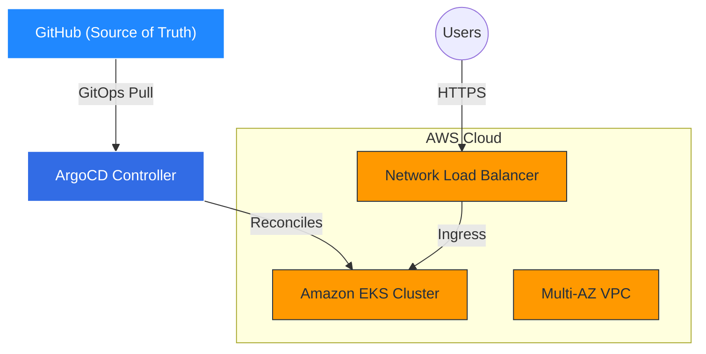
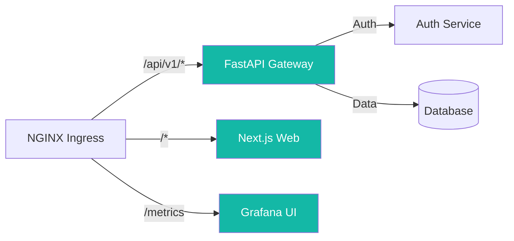
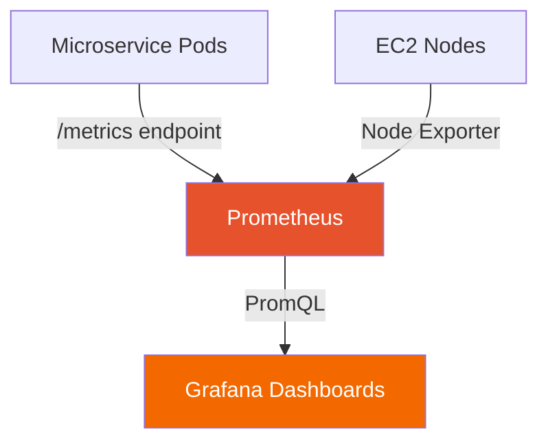

<!-- slide -->
<p align="center">
  
</p>

<h2 align="center">🚀 Enterprise Cloud-Native Engineering & SRE Architecture</h2>
<p align="center"><strong>A Production-Grade Kubernetes, GitOps, and Observability Fabric</strong></p>

<p align="center">
  
  
  
  
</p>

<p align="center"><strong>Prepared by:</strong> Platform Engineering Team<br><strong>Context:</strong> Final Architecture Review / Startup Pitch</p>

---

<!-- slide -->
# 🎯 1. Vision & Objective
<p align="center">
  
  
</p>

**Vision:** To democratize enterprise-grade cloud reliability by providing a self-healing, observable, and fully automated deployment platform.

**Objective:** Architect an end-to-end cloud-native system that bridges the gap between raw application code and resilient, scalable AWS infrastructure using strict GitOps methodologies.

**Key Goals:**
- 🛡️ 100% Infrastructure as Code (IaC)
- ⚡ Zero-Downtime Deployments
- 📊 Millisecond-Level Observability

---

<!-- slide -->
# ⚠️ 2. Problem Statement
**The Industry Crisis:**
Modern development teams struggle with:
- ❌ **Configuration Drift:** Manual changes to servers causing catastrophic outages.
- ❌ **"Works on my machine" Syndrome:** Lack of parity between Dev and Prod.
- ❌ **Deployment Anxiety:** Monolithic, risky weekend releases.
- ❌ **Blind Spots:** Finding out about production failures via angry customer tweets.

---

<!-- slide -->
# 🦕 3. Why Traditional Systems Fail
- ❄️ **Snowflake Servers:** Hand-configured VMs that cannot be replicated.
- 🖱️ **Click-Ops Provisioning:** AWS consoles used manually, leading to untraceable security holes.
- 🧱 **Monolithic State:** A single failure brings down the entire application.
- 🐢 **Reactive Scaling:** Manual intervention required to handle traffic spikes.

---

<!-- slide -->
# ☁️ 4. Why Cloud Native
<p align="center">
  
</p>

**The Paradigm Shift:**
- 🧊 **Immutable Infrastructure:** Servers are replaced, never patched.
- 📜 **Declarative State:** You declare *what* you want, Kubernetes figures out *how*.
- 🧩 **Decoupled Architecture:** Microservices scale independently.
- 🤖 **Automation First:** CI/CD and GitOps ensure humans don't break production.

---

<!-- slide -->
# 🚀 5. Project Overview
**Cloud Sentinel Platform** is a full-stack, cloud-native ecosystem comprising:

1. 🌍 **Terraform Infrastructure Plane:** Automated AWS EKS and VPC provisioning.
2. ☸️ **Kubernetes Orchestration Plane:** Resilient container scheduling.
3. 🐙 **ArgoCD GitOps Plane:** Continuous, drift-free deployment.
4. 📊 **Prometheus/Grafana Observability Plane:** Deep telemetry.
5. ⚛️ **Next.js/FastAPI Workloads:** High-performance application layer.

---

<!-- slide -->
# 📁 6. Repository Structure Breakdown

```text
├── .github/workflows/   # CI pipelines (Tests, Lint, Build, Push)
├── apps/web-dashboard/  # React/Next.js frontend applications
├── docs/                # Architectural Decision Records (ADRs)
├── infrastructure/
│   ├── kubernetes/      # GitOps manifests, Kustomize bases
│   └── terraform/       # AWS VPC, EKS, IAM, Nodes modules
├── services/            # Backend microservices (FastAPI/Python)
└── argocd-cm.yaml       # Core GitOps controller configuration
```
*Note:* Infrastructure and application code live together, enabling atomic, trackable system changes.

---

<!-- slide -->
# 🏗️ 7. System Architecture Diagram



---

<!-- slide -->
# 🔄 8. End-to-End Workflow

1. 💻 **Commit:** Developer pushes code to `main`.
2. 🏗️ **CI Pipeline:** GitHub Actions builds Docker image and pushes to ECR.
3. 📝 **Manifest Update:** CI pipeline updates the image tag in the `infrastructure/kubernetes` folder.
4. 📡 **GitOps Sync:** ArgoCD detects the manifest change.
5. ♻️ **Reconciliation:** ArgoCD pulls the new image and performs a rolling update on the pods.
6. 📈 **Telemetry:** Prometheus detects the new pod and begins scraping metrics.

---

<!-- slide -->
# ⚛️ 9. Frontend Architecture
<p align="center">
  
  
</p>

- **Tech Stack:** Next.js, React, TailwindCSS.
- **Why:** Server-Side Rendering (SSR) for SEO and performance; component-based architecture for rapid UI scaling.
- **Integration:** Containerized via Docker, deployed as a stateless Deployment in Kubernetes.
- **Edge Routing:** Served via NGINX Ingress controller for efficient SSL termination and routing.

---

<!-- slide -->
# 🐍 10. Backend Architecture
<p align="center">
  
  
</p>

- **Tech Stack:** Python, FastAPI.
- **Why:** Asynchronous event loops natively handle high-throughput, IO-bound microservices.
- **Design:** Stateless REST API, decoupled from the database layer to allow horizontal pod autoscaling (HPA).
- **Features:** Built-in Swagger docs, JWT Auth validation, and WebSocket support for real-time telemetry.

---

<!-- slide -->
# 🚦 11. API Gateway / Service Flow


*Note:* The Ingress controller acts as the traffic cop, routing requests based on URL paths without exposing internal cluster IPs.

---

<!-- slide -->
# 🚢 12. Kubernetes Cluster Architecture
<p align="center">
  
</p>

- **Control Plane:** AWS Managed EKS (Highly Available, multi-AZ).
- **Compute:** Managed Node Groups (`t3.small` for FinOps optimization).
- **Networking:** AWS VPC CNI (native ENI integration for pod IP assignment).
- **Scaling:** Cluster Autoscaler / Karpenter ready.

---

<!-- slide -->
# 🐳 13. Containerization Strategy
- **Base Images:** Alpine or Distroless images to reduce attack surface and pull times.
- **Multi-Stage Builds:** Compile in stage 1, copy only binaries/artifacts to stage 2.
- **Immutability:** Images are tagged with Git SHA (e.g., `v1.0.0-abc1234`). No `latest` tags allowed in production.

---

<!-- slide -->
# 🏗️ 14. Docker Workflow
1. `Dockerfile` defines dependencies and runtime.
2. `make build` tests the build locally.
3. GitHub Actions runs `docker buildx` for multi-architecture compatibility (if needed).
4. Image is scanned for vulnerabilities (Trivy).
5. Pushed to Container Registry.

---

<!-- slide -->
# ⚙️ 15. CI/CD Pipeline Deep Dive
<p align="center">
  
</p>

- **Continuous Integration (CI):** 
  - Linting (Flake8/ESLint).
  - Unit Testing (PyTest/Jest).
  - Image Building & Scanning.
- **Continuous Deployment (CD):**
  - **WE DO NOT PUSH TO PRODUCTION.**
  - CD pipeline only commits a new tag to the Git repository. ArgoCD handles the actual deployment (Pull-based CD).

---

<!-- slide -->
# 🔐 16. GitHub Actions Workflow Analysis
- **Trigger:** On Pull Request to `main`.
- **Jobs:** Parallel execution of backend-tests and frontend-tests.
- **Secrets:** Uses OIDC (OpenID Connect) to assume AWS IAM roles—**no long-lived AWS Access Keys are stored in GitHub.**

*Note:* OIDC is a massive security win. Storing static AWS keys in GitHub is a major industry anti-pattern.

---

<!-- slide -->
# 🐙 17. GitOps Workflow using ArgoCD
<p align="center">
  
</p>

**The Pull Model:**
Rather than a CI server having `admin` access to the Kubernetes cluster (Push model), ArgoCD lives *inside* the cluster and pulls configuration from Git.

**Benefits:**
- Git is the single source of truth.
- If someone manually deletes a pod, ArgoCD instantly recreates it.
- Audit trails are native (Git commits).

---

<!-- slide -->
# 🌍 18. Infrastructure as Code Strategy
<p align="center">
  
</p>

**Architecture:**
- `bootstrap/`: S3 State Bucket and DynamoDB Lock Table.
- `modules/`: Reusable components (VPC, IAM, EKS, Nodes).
- `environments/prod/`: The composition layer where modules are instantiated.

*Note:* This modular structure is exactly how large enterprises manage 100+ AWS accounts safely.

---

<!-- slide -->
# 🧱 19. Terraform / Provisioning Architecture
- **State Management:** Remote S3 backend with AES256 encryption.
- **State Locking:** DynamoDB prevents concurrent applies from corrupting the infrastructure state.
- **Blast Radius:** Modules restrict dependencies so changing a Node Group doesn't accidentally destroy the VPC.

---

<!-- slide -->
# 🛠️ 20. Kubernetes Manifests Strategy
<p align="center">
  
</p>

- **Base:** Defines the core resources (Deployments, Services).
- **Overlays:** Patches specific to environments (e.g., `overlays/prod` scales replicas to 3, `overlays/dev` scales to 1).
- **Why:** Avoids copy-pasting YAML (DRY principle). ArgoCD natively understands Kustomize.

---

<!-- slide -->
# 🔑 21. Secrets & Environment Management
- **Problem:** You cannot commit passwords to Git.
- **Solution:** AWS Secrets Manager / Parameter Store mapped into Kubernetes via `ExternalSecrets` Operator, OR `SealedSecrets` using asymmetric cryptography.
- **Result:** Developers only see encrypted strings in GitHub, but pods receive raw passwords in memory.

---

<!-- slide -->
# 👁️ 22. Observability Stack
<p align="center">
  
  
  
</p>

**The Three Pillars:**
1. **Metrics:** Prometheus (TSDB).
2. **Logs:** Loki (Log Aggregation).
3. **Dashboards:** Grafana (Visualization).

*Note:* Monitoring tells you if a system is broken. Observability lets you ask *why* it is broken.

---

<!-- slide -->
# 📝 23. Logging Architecture
- **DaemonSet:** Promtail runs on every worker node.
- **Workflow:** Reads container `stdout`/`stderr` from the Docker daemon.
- **Storage:** Ships streams to Loki. Loki indexes only metadata (labels), keeping storage costs incredibly low compared to Elasticsearch.

---

<!-- slide -->
# 📊 24. Metrics Pipeline
- **Scraping:** Prometheus uses `ServiceMonitors` to dynamically discover new pods.
- **Exporters:** `node-exporter` for CPU/RAM, `kube-state-metrics` for cluster health.
- **Storage:** Stored in Prometheus Time Series Database backed by AWS EBS GP3 volumes.

---

<!-- slide -->
# 🔬 25. Monitoring Architecture


---

<!-- slide -->
# 🚨 26. Alerting Strategy
- **Tool:** Alertmanager.
- **Rules:** Trigger if Pod crash-loops, if CPU > 85%, or if API latency > 500ms.
- **Routing:** Routes critical alerts to PagerDuty/Slack, and warnings to email.

---

<!-- slide -->
# 🛡️ 27. Security Architecture
<p align="center">
  
</p>

- **Network Level:** Private subnets for nodes, Public subnets only for NAT and Load Balancers.
- **Compute Level:** IMDSv2 enforced on EC2 to prevent SSRF metadata attacks. EBS root volumes encrypted via KMS.
- **Cluster Level:** API server endpoint restricted. RBAC mapped to AWS IAM roles.

---

<!-- slide -->
# 🚦 28. RBAC & Access Control
- AWS IAM OIDC Provider links AWS Roles to Kubernetes Service Accounts (IRSA).
- Allows a specific Pod (e.g., S3 Uploader) to access an AWS S3 bucket without giving the entire Node access. Principle of Least Privilege.

---

<!-- slide -->
# 🚥 29. Deployment Lifecycle
1. **Feature Branch:** Local testing.
2. **Pull Request:** Automated CI checks.
3. **Merge to Main:** CI builds and tags image.
4. **GitOps Sync:** ArgoCD deploys to Staging.
5. **Validation:** Integration tests pass.
6. **Promote:** Image tag advanced to Production overlay.

---

<!-- slide -->
# 🌱 30. Dev → Staging → Production Flow
- **Dev:** Ephemeral namespaces. Minikube/Docker Desktop.
- **Staging:** Exact replica of Prod, scaled down. Connected to masked/dummy data.
- **Production:** High availability, strict network policies, locked down access.

---

<!-- slide -->
# 📈 31. Auto Scaling Strategy
- **HPA (Horizontal Pod Autoscaler):** Scales Pods based on CPU/RAM utilization.
- **Cluster Autoscaler (or Karpenter):** When HPA requests more pods but nodes are full, ASG provisions new AWS EC2 instances dynamically.

---

<!-- slide -->
# 🌐 32. High Availability Design
- EKS Control plane spread across 3 Availability Zones.
- Worker Nodes deployed across `us-east-1a`, `us-east-1b`, `us-east-1c`.
- Pod Anti-Affinity rules ensure two instances of the API never run on the same physical server.

---

<!-- slide -->
# 🚑 33. Fault Tolerance
- If a Node dies, the AWS Auto Scaling Group replaces it.
- If a Pod dies, the Kubernetes ReplicaSet restarts it.
- If the infrastructure is deleted, Terraform recreates it.
- If the Kubernetes state is deleted, ArgoCD restores it from Git in seconds.

---

<!-- slide -->
# 💸 34. Cost Optimization Ideas
- **Spot Instances:** Utilize AWS Spot instances for stateless worker nodes (up to 70% savings).
- **Single NAT Gateway:** Routed all private traffic through one NAT instead of one per AZ for dev environments.
- **Right-sizing:** Utilizing `t3.small` nodes with strict resource limits via Kustomize patches.

---

<!-- slide -->
# 🏆 35. Industry Best Practices Applied
1. 🧊 Immutable Infrastructure.
2. 📜 Everything as Code (IaC, Config, Pipelines).
3. 🕵️ Shift-Left Security (Scanning in CI).
4. 📥 Pull-based CD (GitOps).
5. 📊 Metric-driven scaling.

---

<!-- slide -->
# ✅ 36. Current Progress Analysis
**Completed:**
- AWS VPC & IAM Foundation.
- EKS Control Plane & Worker Nodes.
- Terraform Modular Architecture.
- ArgoCD Installation & Bootstrapping.
- Ingress-NGINX Foundation (L4/L7).

---

<!-- slide -->
# 🏁 37. What is Already Completed
- Successfully provisioned `cloud-sentinel-prod` cluster.
- Established secure state locking (S3/DynamoDB).
- Deployed ArgoCD `argocd-server`.
- Resolved AWS VPC CNI IP density limitations by scaling node limits.

---

<!-- slide -->
# 🚧 38. Technical Challenges Faced
- **ENI Density Limits:** Hit Kubernetes scheduling limits on `t3.small` nodes due to AWS CNI IP constraints. Resolved by adjusting Terraform desired capacity.
- **Terraform Version Drifts:** Handled EKS minor version mismatches (1.28 vs 1.30) to prevent downgrade errors.
- **GitOps Bootstrapping:** Solving the "chicken-or-egg" problem of deploying ArgoCD so ArgoCD can manage the cluster.

---

<!-- slide -->
# 🧠 39. Engineering Learnings
- Cloud infrastructure is highly stateful; remote state locking is non-negotiable.
- Compute scaling is limited by networking (IPs per ENI), not just CPU/RAM.
- Declarative management drastically reduces operational anxiety.

---

<!-- slide -->
# 🚀 40. Remaining Work
- **Cert-Manager:** Automated Let's Encrypt TLS generation.
- **External-DNS:** Automated Route53 A-record injection.
- **Workload Onboarding:** Syncing the FastAPI and Next.js apps into ArgoCD.
- **Load Testing:** Verifying HPA scaling triggers.

---

<!-- slide -->
# ✨ 41. Future Enhancements
- **Service Mesh:** Implement Istio/Linkerd for mTLS between microservices.
- **Chaos Engineering:** Inject faults (e.g., killing nodes randomly) to prove system resilience.
- **Karpenter:** Replace Cluster Autoscaler for faster, more efficient node provisioning.

---

<!-- slide -->
# 🎓 42. Resume Value of the Project
- Demonstrates deep understanding of the **entire software lifecycle**.
- Proves ability to handle complex distributed systems, not just writing local code.
- Uses the exact same toolchain used by Netflix, Uber, and Google.

---

<!-- slide -->
# 🏢 43. Real Industry Relevance
Startups and Enterprises alike are migrating to this exact stack. The ability to guarantee that "what is in Git is exactly what is running in AWS" is the holy grail of modern compliance and reliability engineering.

---

<!-- slide -->
# 🛠️ 44. Tech Stack Deep Dive
- **Kubernetes:** The kernel of the cloud.
- **Terraform:** Infrastructure declarative language.
- **ArgoCD:** The continuous reconciliation loop.
- **Prometheus/Grafana:** The eyes and ears of the cluster.

---

<!-- slide -->
# 💡 45. Tools Used and Why
- **GitHub Actions:** Native integration, no separate Jenkins server to maintain.
- **Kustomize:** Built into `kubectl`, no complex Helm templates required for simple overrides.
- **AWS NLB:** Layer 4 load balancing for ultra-fast, passthrough traffic to NGINX.

---

<!-- slide -->
# ⚖️ 46. Architecture Decisions
*Why not serverless (Lambda)?*
- Kubernetes provides zero vendor lock-in. This exact platform can be lifted and shifted to GCP or Azure by only changing the Terraform modules.

---

<!-- slide -->
# ⚙️ 47. DevOps + SRE Practices
- **DevOps:** CI pipelines bridging dev and ops.
- **SRE:** Error budgets, SLIs/SLOs, monitoring, and automated incident response (self-healing pods).

---

<!-- slide -->
# 🎬 48. Final Demo Workflow
1. Push code change to GitHub.
2. Watch GitHub Actions build image.
3. Open ArgoCD UI, watch it detect `OutOfSync`.
4. Watch ArgoCD deploy the new pod and terminate the old one.
5. Open Grafana and observe the traffic shift without a single dropped packet.

---

<!-- slide -->
<p align="center">
  
</p>

# 49. Conclusion
**Cloud Sentinel Platform** is not a theoretical project. It is a live, breathing, production-grade cloud ecosystem. It enforces security through automation, reliability through orchestration, and speed through GitOps.

<p align="center">
  
</p>

<p align="center">
  
</p>
