<p align="center">
  
</p>

<h2 align="center">🛡️ Your Cloud-Native Sentinel</h2>
<h4 align="center">"The High-Availability Fortress for Distributed Systems"</h4>
<p align="center"><b>Production-Grade SRE • Kubernetes Orchestration • Automated Observability</b></p>

<p align="center">
  
  
  
  
</p>
<p align="center">
  
  
  
</p>
<br>
<p align="center">
  
  
  
</p>

---

# 1. 🚀 Vision & Problem Statement

### Why Cloud Sentinel?

Writing code is only part of the journey. The real challenge is keeping that code running reliably in production.
Historically, engineering teams suffered from silent failures, manual deployments, and brittle infrastructure. **Cloud Sentinel was born out of a need for genuine visibility and resilience.** We needed a platform that doesn't just host microservices, but actively monitors them, visualizes their health, and self-heals when things break.

Before we dive into the chronological journey of how this platform evolved from an empty folder into an enterprise-grade cloud system, let's look at the **Final Complete System Architecture**:

### 🗺️ The Final Cloud System Architecture

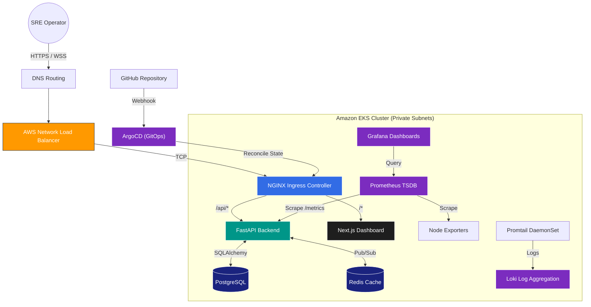

# 🌍 Understanding the Cloud Sentinel Architecture

Before diving into the phases, let us first understand the complete bird's-eye view of the platform. Think of this system as a living organism where every layer serves a specific purpose to keep the application fast, secure, and resilient.

### 
**The Gateway to the System**
When an SRE operator types the dashboard URL into their browser, an HTTPS request is securely routed through **AWS Route53**. This traffic immediately hits the **AWS Network Load Balancer (NLB)**, which sits at the edge of our cloud infrastructure. The NLB seamlessly forwards these raw TCP packets into our private Kubernetes cluster, handing them off to the **NGINX Ingress Controller**. The Ingress acts as the smart traffic cop—reading the URL path and deciding exactly which internal service should handle the request.

*Once the request passes the edge, it flows directly into the visual interface...*

### 
**The Operator's Command Center**
The Ingress routes the user to our **Next.js Dashboard**. This is what the operator actually sees: a sleek, dark-themed UI built with React. It provides real-time visualization of cluster health using Recharts. But this isn't just a static webpage; it actively subscribes to live telemetry and incident monitoring feeds, giving operators the power to interact with the system, visualize anomalies, and even inject controlled chaos to test resilience.

*To get that live data, the frontend opens a secure connection to the backend...*

### 
**The Brain of the Platform**
The frontend communicates directly with the **FastAPI Backend**. This async Python layer acts as the intelligence of the platform. It handles JWT authentication to ensure only authorized operators can access data. More importantly, it maintains open WebSocket connections to push high-frequency telemetry back to the dashboard. It also exposes custom Chaos Engineering APIs that allow operators to simulate CPU spikes or memory leaks.

*To maintain state and broadcast these updates globally, the backend relies on data storage...*

### 
**The Memory and Nervous System**
Behind the scenes, FastAPI relies on **PostgreSQL** for persistent relational storage—keeping track of user accounts and historical system states. Simultaneously, it uses **Redis** as a blazing-fast in-memory cache and Pub/Sub messaging broker. When one node generates new telemetry, it publishes it to Redis, which instantly broadcasts it to every active WebSocket, ensuring all operators see the update in milliseconds.

*All of these applications are kept alive by the orchestrator...*

### 
**The Automated Caretaker**
Everything mentioned above runs as containerized Pods inside an **Amazon EKS (Elastic Kubernetes Service)** cluster. Kubernetes is the engine that keeps everything alive automatically. If a FastAPI pod crashes due to a chaos experiment, Kubernetes detects it via readiness probes and instantly spins up a replacement (self-healing). It abstracts the underlying servers, managing Deployments, Services, and scaling dynamically based on traffic.

*But how does new code actually get into Kubernetes?*

### 
**The Delivery Pipeline**
We never deploy manually. When an engineer merges code to GitHub, **GitHub Actions** runs tests and builds Docker images. Then, **ArgoCD** (our GitOps agent) takes over. ArgoCD lives inside the cluster, constantly watching our GitHub repository. The moment it detects a change in our YAML manifests, it executes a reconciliation loop, automatically syncing the cluster to match the exact desired state defined in Git. This ensures zero configuration drift.

*With automated deployments running, we need to know if the system is healthy...*

### 
**The Eyes and Ears**
While the dashboard shows high-level telemetry, our SRE observability stack goes deeper. **Prometheus** actively scrapes metrics from all our services every 15 seconds. **Grafana** queries this data to provide deeply technical system dashboards. Simultaneously, **Promtail** aggregates raw container logs and ships them to **Loki**, allowing engineers to search through millions of log lines instantly without ever SSH-ing into a server.

*Finally, everything must rest on physical cloud hardware...*

### 
**The Cloud Foundation**
AWS provides the bedrock. We utilize a custom **Virtual Private Cloud (VPC)** with strict security boundaries. All EKS worker nodes (EC2 instances) are locked inside private subnets, completely shielded from the internet. The only way in or out is through the **NAT Gateway** (for outbound updates) or the **Network Load Balancer** (for inbound user traffic). AWS handles the physical networking, compute, and encryption (KMS) that makes the entire platform possible.

---

# 🧰 Final Technology Stack Summary

| Layer                            | Technologies Used                     |
| :------------------------------- | :------------------------------------ |
| **Frontend**               | Next.js, React, TailwindCSS, Recharts |
| **Backend**                | FastAPI, Python, WebSockets           |
| **Database**               | PostgreSQL                            |
| **Messaging**              | Redis Pub/Sub                         |
| **Containerization**       | Docker, Docker Compose                |
| **Orchestration**          | Kubernetes, Amazon EKS                |
| **GitOps**                 | ArgoCD, Kustomize                     |
| **Infrastructure as Code** | Terraform                             |
| **CI/CD**                  | GitHub Actions                        |
| **Monitoring**             | Prometheus, Grafana, Loki             |
| **Cloud Platform**         | AWS                                   |

---

# 🌟 Why This Architecture is Production-Grade

This platform is designed entirely around reliability and SRE best practices:

* **Automated Self-Healing:** If a backend pod crashes due to a memory leak, Kubernetes detects the failure and spins up a healthy replacement instantly without human intervention.
* **GitOps Reconciliation:** No manual tweaks in production. ArgoCD ensures that the live cluster state always matches the desired state stored in our GitHub repository.
* **Real-Time Telemetry:** The WebSocket-driven dashboard provides sub-second latency for performance metrics, empowering operators to spot anomalies immediately.
* **Declarative Infrastructure:** From the AWS VPC down to the Kubernetes namespaces, everything is version-controlled via Terraform and YAML.

---

### 🔄 The Quick Request Flow

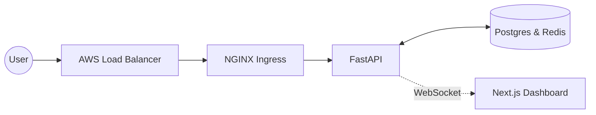

### 🔄 How Data Flows Through the System (The Detailed Lifecycle)

Here is a simple breakdown of the complete end-to-end request lifecycle:

1. **The Request Arrives:** The operator opens the dashboard; the request hits the **AWS Load Balancer**.
2. **Traffic is Routed:** The **NGINX Ingress** inspects the request and routes it to the Next.js UI or FastAPI Backend.
3. **Authentication & Logic:** The **FastAPI** backend authenticates the user via JWT and queries **PostgreSQL**.
4. **Live Data Streaming:** The backend generates telemetry and pushes it through **Redis** via WebSockets back to the UI.
5. **Continuous Observation:** In the background, **Prometheus** scrapes system metrics, and **Loki** gathers logs for the SRE team.
6. **Self-Healing Automation:** If any part of this chain breaks, **Kubernetes** restarts it. If the configuration drifts, **ArgoCD** instantly re-syncs it from Git.

<br>

> *"With this complete architecture in mind, let's explore how it was built phase by phase from an empty folder."*

---

# 2. 📁 Phase 1 — Repository & Foundation Setup

**The Problem:** Unstructured codebases lead to "spaghetti code." As projects grow, finding where infrastructure configs end and frontend code begins becomes impossible.

**The Solution:** We started with a strict **Monorepo** philosophy. We separated concerns instantly:

* `frontend/` — Where the UI lives.
* `services/` — Where the backend brains live.
* `infrastructure/` — Where cloud configurations live.
* `docs/` — Docs-first engineering ensures knowledge isn't trapped in an engineer's head.

**Engineering Insight:** A modular monorepo allowed our frontend engineers and cloud architects to work in parallel without stepping on each other's toes.

<br>

> *"With a rock-solid codebase foundation established, we shifted our focus to building the intelligence of the platform: the backend."*

<br>
<p align="center">
  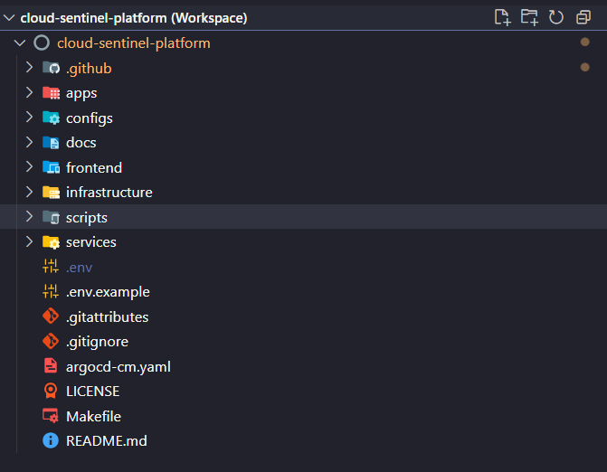
</p>

> *Figure: The foundational monorepo structure of Cloud Sentinel, separating frontend, backend services, infrastructure, automation scripts, and documentation into modular engineering domains.*

This modular architecture enabled our frontend, backend, and infrastructure deployments to evolve independently while remaining tightly integrated inside a single, version-controlled cloud-native platform.

---

# 3. 🧠 Phase 2 — Backend Engineering Begins

**The Problem:** We needed a "brain" to process data, handle authentication, and most importantly, stream real-time telemetry.

**Why FastAPI? (And not Flask/Django)**
Traditional frameworks like Django are *synchronous*. If 1,000 users open a WebSocket, Django requires 1,000 server threads. This crushes CPU. **FastAPI** uses `asyncio` (an asynchronous event loop). One single thread can handle thousands of concurrent WebSocket connections, switching tasks while waiting for network I/O.

### How the Backend Works Internally

1. **Request Lifecycle:** A request hits the FastAPI router. Middlewares intercept it (CORS, Auth). Dependency Injection fetches the DB session.
2. **JWT Authentication:** User sends username/password -> Backend hashes password -> verifies with DB -> issues a cryptographically signed JSON Web Token (JWT).
3. **Telemetry Generation:** The backend measures its own CPU/Memory usage and packages it into JSON.
4. **WebSocket Broadcasting:** Redis acts as a Pub/Sub broker. When telemetry is generated, Redis broadcasts it to all connected WebSocket clients instantly.

### 🔄 The WebSocket Lifecycle Flow

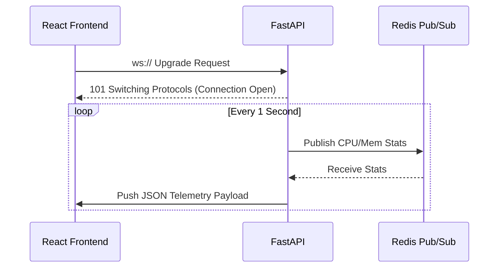

<br>
<p align="center">
  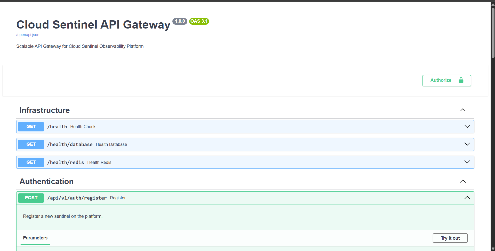
</p>

> *Figure: Auto-generated OpenAPI/Swagger interface produced by FastAPI, exposing infrastructure health checks, authentication endpoints, and backend observability APIs.*

Because FastAPI automatically generates standardized OpenAPI documentation, it drastically improved our frontend-backend integration. This interface enables easier testing and debugging, supports enterprise API discoverability, and demonstrates true production-grade API engineering.

<br>
<p align="center">
  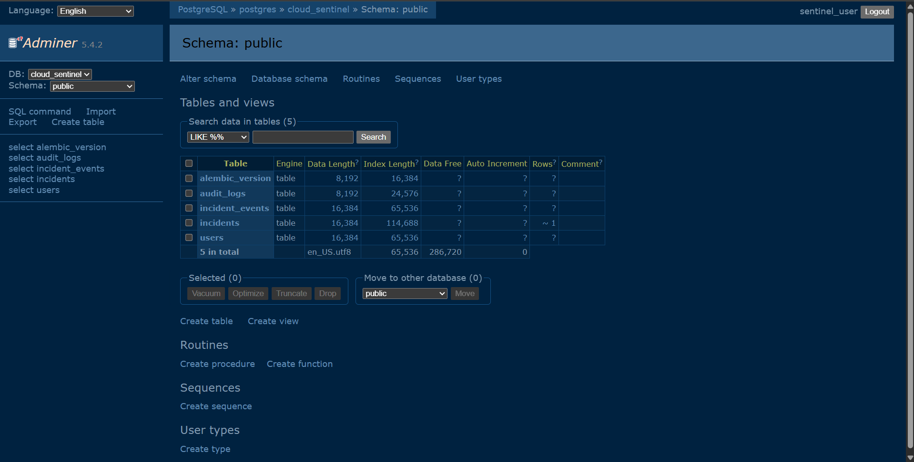
</p>

> *Figure: PostgreSQL relational schema visualized through Adminer, containing user authentication records, audit logs, incident tracking tables, and telemetry event persistence.*

While Redis handles high-speed telemetry, a persistent relational layer is critical for backend state management. This database securely stores accounts in `users`, tracks operator actions via `audit_logs`, and preserves SRE workflows inside `incidents` and `incident_events`, establishing a reliable source of truth for the platform.

---

# 4. 🖥️ Phase 3 — Frontend Dashboard System

**The Problem:** A backend streaming data into the void is useless. SREs need a visual dashboard to instantly spot anomalies.

**Why Next.js & React?**
React is built for state-driven UI. As WebSocket data streams in, React updates its internal state and re-renders only the changed components. Next.js provides Server-Side Rendering (SSR) for initial load speed and SEO.

### How Metrics Appear on the Dashboard

1. User opens browser. React mounts.
2. `useEffect` hook opens a `ws://` connection to FastAPI.
3. As JSON payloads arrive, React updates state (`setMetrics`).
4. **Recharts** (a charting library) detects the state change and dynamically redraws the SVG graphs on the screen at 60fps.

### 🔬 Deep Dive: The Telemetry Engine (How Dashboard Values are Generated)

A common question is: *“Where exactly do those moving lines on the dashboard come from?”*

The metrics on the dashboard are not random; they are real-time, hardware-level measurements of the physical server (or Kubernetes Pod) executing the backend code. Here is exactly how they are generated:

#### 1. Hardware Polling (The Python `psutil` Layer)

Inside the FastAPI backend, we run an asynchronous background task. Every 1 second, this task uses the Python `psutil` (Process and System Utilities) library to interrogate the Linux kernel.

* **CPU Usage:** It reads the OS-level `/proc/stat` to calculate the percentage of time the CPU spent actively processing vs idling over the last second.
* **Memory Usage:** It reads `/proc/meminfo` to calculate total RAM minus available RAM.

#### 2. JSON Packaging & Pub/Sub

The backend takes these raw float values (e.g., `CPU: 45.2%`) and packages them into a structured JSON payload. Instead of sending this directly to users, the backend publishes this JSON to a **Redis Channel** (e.g., `channel:telemetry`).

#### 3. WebSocket Fan-Out

When 100 SRE operators open the dashboard, they don't query the hardware directly (which would crash the server). Instead, their browsers open 100 WebSocket connections. The FastAPI WebSocket manager subscribes to the Redis channel. When Redis broadcasts the single JSON payload, FastAPI acts as a high-speed router, instantly fanning out that exact same JSON payload to all 100 open WebSocket connections.

#### 4. React & Recharts Rendering

The JSON payload arrives at the Next.js frontend via the browser's native WebSocket API.

* React intercepts the JSON and calls a state updater hook (e.g., `setMetrics([...oldData, newData])`).
* Because React is reactive, this state change triggers an immediate re-render of the specific Dashboard components.
* The **Recharts** graphing library accepts the new array of data points and mathematically redraws the SVG path (the line on the graph) to include the new spike, creating a smooth, real-time animation.

*This entire 4-step process happens in less than 50 milliseconds!*

<br>
<p align="center">
  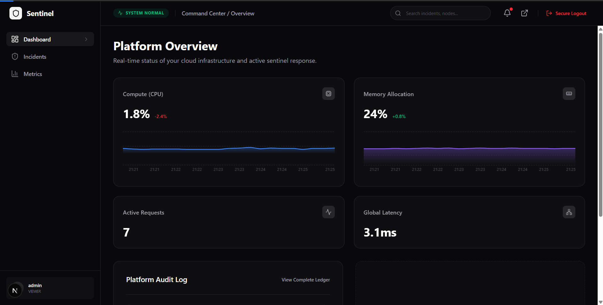
</p>

> *Figure: The Cloud Sentinel real-time observability dashboard displaying live telemetry streams, infrastructure health metrics, latency monitoring, and active request analytics powered through WebSocket-driven updates.*

Once telemetry metrics reach the frontend via the WebSocket live stream, React triggers immediate state updates. This enables Recharts to execute real-time chart rendering with zero-refresh latency, giving operators instant visibility into CPU metrics, memory tracking, latency monitoring, and active request visualization.

<br>
<p align="center">
  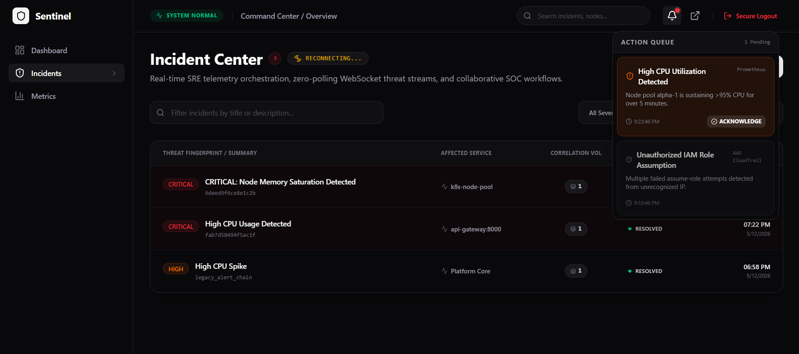
</p>

> *Figure: Incident Center interface visualizing live SRE telemetry alerts, infrastructure incidents, severity classification, and operational action queues powered through real-time event streaming.*

Beyond basic metrics, the frontend architecture handles live incident ingestion. Through WebSocket event propagation, infrastructure anomaly detection triggers real-time alert rendering on the dashboard. This operational visibility includes automated severity prioritization and action queue orchestration, allowing engineers to execute rapid operational response workflows.

<br>

> *"The dashboard looked amazing on our laptops, but the classic 'It works on my machine' dilemma emerged. It was time to containerize."*

---

# 5. 🐳 Phase 4 — Dockerization & Local Orchestration

**The Problem:** The classic *"It works on my machine!"* dilemma. A developer installs Python 3.11, another uses 3.9. The frontend dev uses Node 18, another Node 20. Code breaks locally.

**The Solution:** Docker containerization. We wrapped the backend, frontend, Postgres, and Redis into isolated Linux containers.

**Docker Compose Architecture:**
Instead of starting 4 different terminals, we introduced `docker-compose.yml` and a `Makefile`. Now, all services boot up and communicate over an isolated Docker Bridge Network using DNS resolution (e.g., the backend connects to `postgres:5432` instead of `localhost`).

**Command Used:**

```bash
make dev  # Wraps 'docker-compose up --build'
```

<br>
<p align="center">
  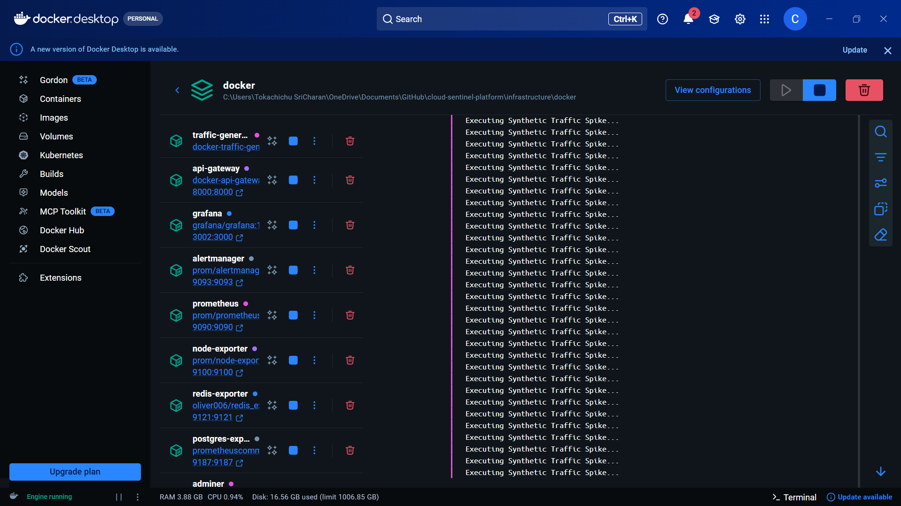
</p>

> *Figure: Docker Desktop orchestrating the complete Cloud Sentinel local observability ecosystem, including the API gateway, Prometheus monitoring stack, Grafana dashboards, exporters, Redis telemetry services, and synthetic traffic generators.*

This multi-container orchestration creates isolated runtime environments with seamless service networking. By executing the Prometheus and Grafana monitoring stack alongside the API Gateway, Redis services, Alertmanager, and synthetic telemetry generators locally, we enabled complete end-to-end local observability testing before cloud deployment.

<br>
<p align="center">
  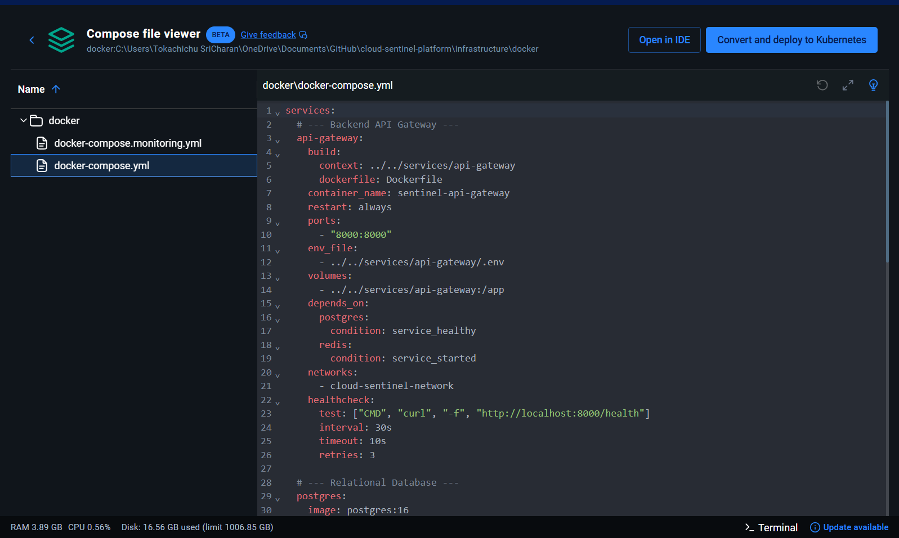
</p>

> *Figure: Docker Compose declarative orchestration configuration defining service dependencies, health checks, networking policies, volume mappings, and automated backend infrastructure initialization.*

This declarative service orchestration enforces infrastructure reproducibility. Through health-check driven startup sequencing and shared Docker container networking, the Compose file actively coordinates all backend service dependencies, volume persistence, and environment configuration automatically.

<br>

> *"Once our local environments became consistent via Docker, manual deployments became the next bottleneck. We needed CI/CD automation."*

---

# 6. ⚙️ Phase 5 — CI/CD & GitHub Actions

**The Problem:** Manual deployment became unsustainable. An engineer ssh-ing into a server, pulling code, and restarting services causes human error, downtime, and massive security risks.

**Why GitHub Actions over Jenkins?**

* **Jenkins Overhead:** Jenkins requires self-hosting. You must manage EC2 servers, JVM memory, and plugin updates. It's an operational nightmare.
* **GitHub Actions:** SaaS-based. Zero infrastructure overhead. Workflows are defined as code (`.github/workflows/`) and live inside the repository.

<br>
<p align="center">
  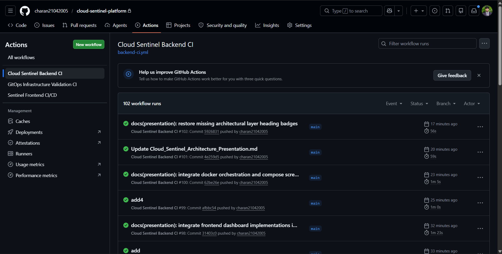
</p>

> *Figure: GitHub Actions executing automated CI/CD workflows for backend validation, frontend verification, and GitOps infrastructure orchestration inside the Cloud Sentinel engineering pipeline.*

This automated workflow execution ensures continuous integration validation across the entire platform. By triggering Git-driven automation on every push, we enforce strict build verification and deployment orchestration across our backend CI, frontend CI/CD, and GitOps infrastructure validation stages before any code reaches production.

<br>
<p align="center">
  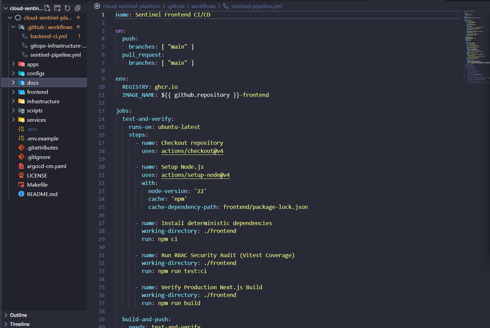
</p>

> *Figure: GitHub Actions workflow-as-code configuration defining automated verification stages, dependency installation, build orchestration, container workflows, and deployment validation pipelines.*

By leveraging declarative automation pipelines, we treat our CI/CD logic as version-controlled code. This guarantees reproducible CI/CD execution across environments, automatically orchestrating checkout actions, dependency installation, build verification, security validation, and container orchestration preparation with zero manual intervention.

### Deep Dive: OIDC (OpenID Connect) Security

We needed GitHub to push Docker images to AWS. Traditionally, you put an AWS Secret Key into GitHub Secrets. **This is dangerous.** If GitHub is breached, your AWS account is compromised indefinitely.
Instead, we used OIDC. GitHub mathematically proves its identity to AWS. AWS issues a temporary (1-hour) STS token. The pipeline deploys and the token evaporates.

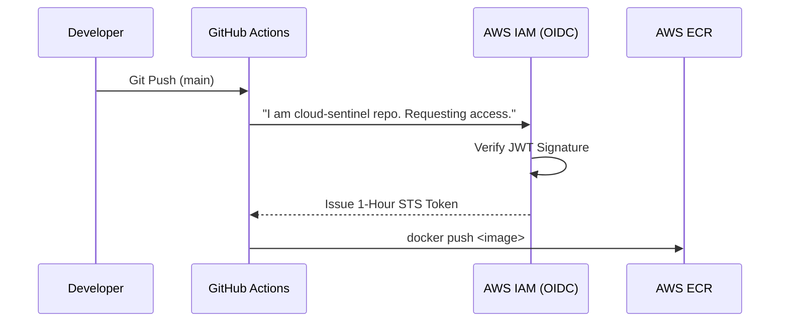

<br>

> *"With our code building and pushing automatically, we needed a robust, reproducible cloud environment to host it. We turned to Infrastructure as Code."*

---

# 7. ☁️ Phase 6 — Infrastructure as Code & AWS

**The Problem:** Manually clicking through the AWS Console to create servers is not reproducible. If a server dies, nobody remembers the exact settings used to build it.

**The Solution:** Terraform (Infrastructure as Code). We wrote declarative HCL code to build the AWS foundation.

### AWS Networking Architecture Flow

* **VPC (Virtual Private Cloud):** An isolated network chunk (10.0.0.0/16).
* **Public Subnets:** Connected to an Internet Gateway (IGW). Home to our NAT Gateways and Load Balancers.
* **Private Subnets:** No direct internet access. Our EKS Worker Nodes live here.
* **The Routing Flow:** If a Pod needs to download a package, the request goes from the Private Subnet -> NAT Gateway -> Internet Gateway -> Out. Hackers on the outside cannot reverse this route to reach the pods.

### FinOps: The Node Density Problem

To save startup budget, we chose `t3.small` EC2 instances.

* *The Crisis:* AWS limits Elastic Network Interfaces (ENIs). A `t3.small` maxes out at 11 pods. The cluster stalled.
* *The Fix:* We enabled VPC CNI Prefix Delegation in Terraform and scaled node counts to ensure adequate pod density without overspending on massive EC2 instances.

### 🏗️ Terraform Resource Mapping

By analyzing the `infrastructure/terraform/modules/` directory in our repository, here is the exact mapping of AWS resources provisioned entirely via Infrastructure as Code:

| AWS Resource Category          | Terraform Resource (`.tf`)         | Project Usage / Purpose                                                                                 |
| :----------------------------- | :----------------------------------- | :------------------------------------------------------------------------------------------------------ |
| **VPC & Networking**     | `aws_vpc`, `aws_subnet`          | Creates the isolated `10.0.0.0/16` network and divides it into Public/Private tiers.                  |
| **Routing & Egress**     | `aws_nat_gateway`, `aws_eip`     | Allows private worker nodes to download Docker images securely from the internet without being exposed. |
| **EKS Control Plane**    | `aws_eks_cluster`                  | Provisions the highly-available Kubernetes control plane managed automatically by AWS.                  |
| **Compute Nodes**        | `aws_eks_node_group`               | Deploys the actual `t3.small` EC2 worker nodes where our application Pods live.                       |
| **Security & Firewalls** | `aws_security_group`               | Controls strict ingress/egress rules for the nodes and cluster communications.                          |
| **Identity & Access**    | `aws_iam_role`, `aws_iam_policy` | Enforces Least Privilege (IRSA) for Pods and handles GitHub Actions CI/CD via OIDC.                     |
| **Encryption**           | `aws_kms_key`                      | Provides envelope encryption for all Kubernetes Secrets stored in the cluster's `etcd` database.      |

### 💰 Cost Analysis & AWS Billing Breakdown

Based on our real-world AWS billing cycle (Cost Breakdown analysis), deploying this enterprise architecture incurs specific structural costs. Here is the breakdown:

1. **Amazon EKS (Control Plane):** The largest baseline cost (approx. $73/month) to run the Kubernetes API and `etcd` reliably.
2. **Amazon EC2 (Compute):** The cost of the underlying worker nodes executing our backend and frontend containers.
3. **Amazon VPC (NAT Gateway & EIPs):** NAT Gateways charge an hourly rate plus data processing fees, representing the necessary "hidden cost" of keeping subnets private.
4. **AWS KMS & Storage (Others):** Micro-charges for encrypting Kubernetes secrets and running Elastic Block Store (EBS) volumes attached to the nodes for persistent storage.

<br>

> *"With the AWS servers provisioned, managing individual containers manually would be impossible. Orchestration and self-healing became our next priority."*

---

# 8. ☸️ Phase 7 — Kubernetes Transformation

**The Problem:** Running Docker containers on raw EC2 instances means if an instance crashes in the middle of the night, the app is down until an engineer wakes up. We needed self-healing orchestration.

### Kubernetes Internals: How it actually works

1. **kube-scheduler:** Analyzes CPU/RAM requirements and assigns Pods to the best EC2 node.
2. **kubelet:** The agent on the EC2 node that actually tells Docker/containerd to start the container.
3. **etcd:** The brain database. It stores the "Desired State."
4. **Reconciliation Loop:** The `kube-controller-manager` constantly compares the Live State against etcd. If a pod crashes, the live state is 1, desired is 2. K8s automatically spawns a new pod.

**Command Used:**

```bash
# Connect local terminal to AWS EKS
aws eks update-kubeconfig --region us-east-1 --name cloud-sentinel-prod
```

<br>

> *"Kubernetes was running, but applying YAMLs manually via kubectl was dangerous. We needed an automated, declarative deployment model."*

---

# 9. 🐙 Phase 8 — GitOps & ArgoCD

**The Problem:** Traditional CI/CD (Push Model) gives GitHub admin access to our Kubernetes cluster. If GitHub is compromised, the cluster is compromised.

**The Solution:** GitOps (Pull Model). We installed ArgoCD *inside* the EKS cluster. ArgoCD reaches out to GitHub, reads the YAMLs, and applies them locally.

### ArgoCD Internals & The App of Apps

ArgoCD uses a "Reconciliation Loop." We point it to a single `root-app-of-apps.yaml`. ArgoCD reads this, discovers pointers to 4 other apps (Ingress, Monitoring, Web, API), and deploys the entire platform automatically.

### 🐛 The Debugging Journey: The Revision Issue

During deployment, ArgoCD was failing to sync the monitoring platform.

* *The Issue:* The `infrastructure/kubernetes/monitoring` folder was missing a root `kustomization.yaml`. ArgoCD didn't know how to compile the directory.
* *The Fix:* We created the `kustomization.yaml` referencing prometheus, grafana, and loki, pushed to Git, and forced ArgoCD to refresh. The drift was resolved, and monitoring pods booted up!

<br>

> *"With GitOps automating deployments, the platform was essentially running itself. Our final requirement was deep visibility into its internal health."*

---

# 10. 📊 Phase 9 — Monitoring & Observability

**The Problem:** Now we had self-healing infrastructure, but it was a black box. We needed the 3 Pillars of Observability: Metrics, Logs, and Traces.

### How Metrics Travel Through the System

1. **FastAPI** exposes a `/metrics` HTTP endpoint.
2. **Prometheus (TSDB)** scrapes this endpoint every 15 seconds, storing data as time-series.
3. **Grafana** sends PromQL queries to Prometheus and draws visual dashboards.
4. **Promtail (DaemonSet)** runs on every node, capturing terminal logs and shipping them to **Loki**.

---

# 11. 🔄 Phase 10 — Complete System Design (End-to-End)

Now, let's trace a **Complete User Request Flow** through the mature system:

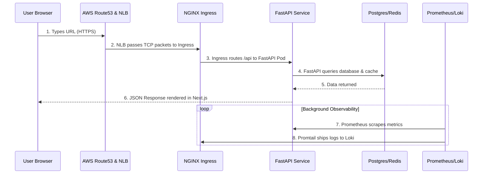

### The Engineering Conclusion

We transformed from a raw Python/React folder into an enterprise-grade, GitOps-driven AWS Kubernetes platform capable of self-healing, scaling, and deep observability.

---

# 12. 🔮 Future Roadmap

An enterprise platform is never truly "finished." Here is the roadmap for the next evolution:

1. **Service Mesh (Istio):**
   * *Why:* To enable strict mTLS (mutual TLS) between all internal pods. If a hacker breaches a frontend pod, they cannot reach the database without a valid certificate.
2. **Karpenter (Just-in-Time Auto Scaling):**
   * *Why:* Replacing Cluster Autoscaler. Karpenter analyzes pending pods and provisions exact-fit EC2 Spot instances in milliseconds, slashing AWS bills by up to 70%.
3. **Distributed Tracing (OpenTelemetry):**
   * *Why:* Metrics tell us *if* it's slow. Traces tell us *where* it's slow. Tracing injects a unique ID across microservices to map bottlenecks.
4. **Argo Rollouts (Canary Deployments):**
   * *Why:* Instead of swapping all pods at once, Canary deployments shift 5% of traffic to a new version, measure PromQL error rates, and rollback automatically if the new code is failing.

<p align="center">
  
</p>
