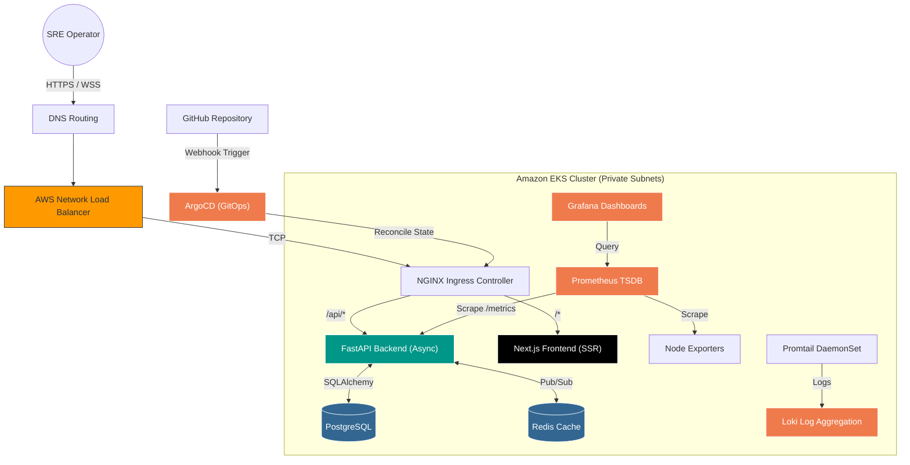
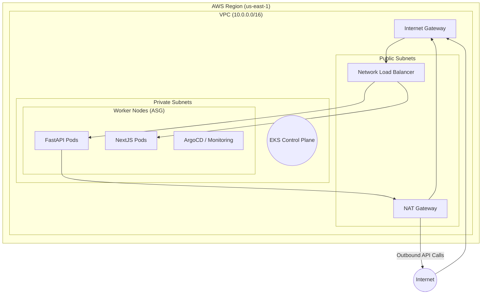
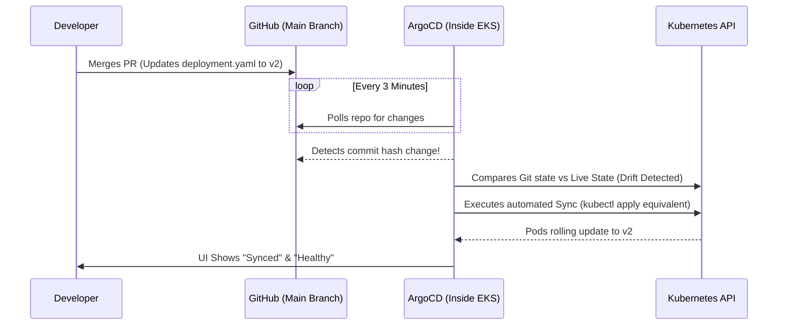

<p align="center">
  
</p>

<p align="center">
  
  
  
  
</p>

---

# 1. 🌐 Executive Overview

**Cloud Sentinel** is a production-grade, full-stack cloud platform designed to demonstrate modern Site Reliability Engineering (SRE), GitOps, and Cloud-Native architecture. 

Built from the ground up, this platform solves a real-world industry problem: **Bridging the gap between software engineering and highly resilient infrastructure.** It provides a centralized, real-time telemetry dashboard that monitors microservices, injects controlled chaos for resilience testing, and automatically reconciles infrastructure state using GitOps methodologies.

**Target Use Cases:**
*   **Real-time Observability:** Streaming high-frequency telemetry via WebSockets.
*   **Infrastructure as Code (IaC):** Immutable AWS environments managed by Terraform.
*   **Continuous Deployment:** Zero-downtime, pull-based deployments via ArgoCD.
*   **Chaos Engineering:** Purpose-built endpoints to simulate CPU/Memory spikes and validate Kubernetes self-healing.

---

# 2. 🚨 Problem Statement

In traditional infrastructure setups, engineering teams face critical bottlenecks:
1.  **Lack of Real-Time Observability:** Incidents occur silently. By the time metrics are aggregated, the system has already degraded.
2.  **Configuration Drift:** Manual `kubectl apply` commands lead to cluster configurations that drift away from the source code, causing "snowflake" environments.
3.  **Deployment Friction:** Push-based CI/CD pipelines (like Jenkins directly modifying clusters) require giving external CI servers "God-mode" credentials to production environments.
4.  **Scaling Inefficiencies:** Workloads are often over-provisioned to handle spikes, leading to massive cloud waste, or under-provisioned, leading to outages.

---

# 3. 👁️ Platform Vision

Cloud Sentinel was architected with a strict **SRE and GitOps Philosophy**:
*   **Git is the Single Source of Truth:** If it's not in Git, it doesn't exist in production.
*   **Declarative Infrastructure:** Define the *desired state*, and let controllers (Terraform, ArgoCD) reconcile the *actual state*.
*   **Real-time Telemetry:** Metrics should flow instantly to operators, enabling proactive incident response.
*   **Resilience by Design:** The system must expect and gracefully handle node failures, pod evictions, and network latency.

---

# 4. 🗺️ Global Architecture & Data Flow



---

# 5. 🏗️ Full Project Journey Timeline

### Phase 1: The Core Backend (FastAPI & Async Architecture)
*   **Objective:** Build a high-performance, async API capable of streaming telemetry.
*   **Tools:** Python 3.11, FastAPI, Uvicorn, PostgreSQL, Redis.
*   **Implementation:** Developed a modular backend with JWT authentication, SQLAlchemy ORM models, and a Redis-backed WebSocket manager for real-time data streaming.
*   **Engineering Decision:** Chosen **FastAPI** over Django/Flask because its native `asyncio` support is perfect for handling thousands of concurrent WebSocket connections for live telemetry without blocking threads.

### Phase 2: The SRE Dashboard (Next.js & Real-time Visuals)
*   **Objective:** Create a premium, responsive dashboard for visualizing cluster health.
*   **Tools:** Next.js 14, React 19, TailwindCSS, Recharts.
*   **Implementation:** Built a dark-themed UI featuring live CPU/Memory graphs, anomaly detection alerts, and interactive "Chaos Injector" controls.
*   **Data Flow:** The frontend establishes a `ws://` connection. The backend pushes JSON payloads every second. React states update instantly, driving the Recharts animations.

### Phase 3: Containerization & Local Orchestration
*   **Objective:** Ensure "it works on my machine" translates to production.
*   **Tools:** Docker, Docker Compose, GNU Make.
*   **Implementation:** Wrote multi-stage Dockerfiles to optimize image sizes (e.g., stripping out build dependencies). Created a `docker-compose.yml` to spin up the API, DB, Cache, and Frontend interconnected via a local bridge network.

### Phase 4: CI/CD Pipeline & AWS Security (OIDC)
*   **Objective:** Automate testing and infrastructure delivery securely.
*   **Tools:** GitHub Actions, AWS IAM OIDC Provider.
*   **Implementation:** Configured pipelines to run PyTest, build Docker images, and plan Terraform changes.
*   **Security Architecture:** Implemented **OpenID Connect (OIDC)**. Instead of hardcoding AWS IAM long-lived access keys in GitHub Secrets (a massive security risk), GitHub actions cryptographically prove their identity to AWS and receive temporary, 1-hour STS tokens.

### Phase 5: Infrastructure as Code (Terraform on AWS)
*   **Objective:** Provision a production-ready cloud foundation.
*   **Tools:** Terraform, AWS VPC, EKS, NAT Gateways.
*   **Architecture Details:**
    *   **VPC:** Created a custom Virtual Private Cloud.
    *   **Subnets:** Public subnets (for NAT/Load Balancers) and Private subnets (for EKS Nodes and Databases).
    *   **Security:** EKS Nodes reside *only* in private subnets. They cannot be SSH'd into directly from the internet.

### Phase 6: EKS & Compute Provisioning
*   **Objective:** Launch the Kubernetes control plane and worker nodes.
*   **Engineering Challenge:** We initially used `t3.small` nodes to optimize FinOps (costs).
*   **The Bug:** We hit **Pod Density Exhaustion**. A `t3.small` has limited Elastic Network Interfaces (ENIs), capping it at 11 pods maximum.
*   **The Fix:** Scaled the EKS Managed Node Group `desired_size` to 2 and applied custom AWS VPC CNI prefix delegation settings to bypass the IP exhaustion limits.

### Phase 7: GitOps Transformation (ArgoCD)
*   **Objective:** Automate Kubernetes deployments without push-based pipelines.
*   **Tools:** ArgoCD, Helm, Kustomize.
*   **The "App of Apps" Pattern:** We created a single `root-app-of-apps.yaml`. ArgoCD watches this root file. The root file tells ArgoCD to deploy child apps (Monitoring, Ingress, Workloads).
*   **Why GitOps?:** If a developer manually deletes a deployment using `kubectl delete`, ArgoCD detects the *Drift* immediately and re-creates the deployment to match what is written in GitHub.

### Phase 8: Edge Routing (NGINX Ingress & NLB)
*   **Objective:** Route internet traffic into the private cluster.
*   **Implementation:** Deployed NGINX Ingress Controller. The Kubernetes AWS Cloud Provider intercepted this and automatically provisioned a physical **AWS Network Load Balancer (NLB)** in the public subnets.
*   **Routing Logic:** Traffic hits the NLB -> forwards to NGINX pods -> NGINX reads the host/path (`/api` vs `/`) -> forwards to FastAPI or Next.js internal ClusterIP services.

### Phase 9: Full Observability Stack
*   **Objective:** Total visibility into cluster health.
*   **Components:**
    *   **Prometheus:** Scrapes `/metrics` endpoints.
    *   **Grafana:** Connects to Prometheus for visual dashboards.
    *   **Loki & Promtail:** Promtail runs as a DaemonSet (one on every node) capturing stdout logs and shipping them to Loki.
*   **Debugging Story:** PVCs (Persistent Volume Claims) for Grafana and Loki were stuck in `Pending`.
*   **The Fix:** EKS 1.28 requires the `aws-ebs-csi-driver` Add-On to provision gp3 volumes. I manually installed the addon, attached the `AmazonEBSCSIDriverPolicy` to the worker node IAM role, and restarted the CSI controller. Volumes bound instantly!

---

# 6. 🌩️ AWS Cloud Architecture Deep Dive



**Cloud Engineering Decisions:**
1.  **VPC Architecture:** A standard 3-tier architecture. High availability across multiple Availability Zones (AZs).
2.  **NAT Gateways:** Essential for private nodes. They allow our FastAPI pods to pull Docker images or reach external APIs while remaining completely hidden from inbound internet traffic.
3.  **IAM & KMS:** Uses IAM Roles for Service Accounts (IRSA) for least-privilege access. Kubernetes Secrets are envelope-encrypted at rest using AWS Key Management Service (KMS).

---

# 7. ☸️ GitOps & ArgoCD Synchronization Flow

Traditional CI/CD uses a "Push" model. Jenkins has AWS keys and runs `kubectl apply`. This is dangerous.
We implemented a **Pull Model (GitOps)**:



---

# 8. 💻 Terminal Execution & Live Demo Guide

To demonstrate the power of this platform, here are the actual commands used in the field.

### Provisioning the AWS Infrastructure
```bash
cd infrastructure/terraform/environments/prod
terraform init
terraform plan -out=tfplan
terraform apply "tfplan"
```
*Purpose:* Automates the creation of the entire AWS VPC, Subnets, IAM Roles, and the EKS Cluster itself.

### Authenticating & Accessing EKS
```bash
aws eks update-kubeconfig --region us-east-1 --name cloud-sentinel-prod
kubectl get nodes -o wide
```
*Purpose:* Updates the local `.kube/config` using AWS STS, granting access to the Kubernetes API.

### Deploying the GitOps Brain (ArgoCD)
```bash
kubectl create namespace argocd
kubectl apply -n argocd -f https://raw.githubusercontent.com/argoproj/argo-cd/stable/manifests/install.yaml
```

### Applying the "App of Apps" Root
```bash
kubectl apply -f infrastructure/kubernetes/gitops/apps/root-app-of-apps.yaml
```
*Purpose:* This single command deploys the entire platform. ArgoCD reads this file, connects to GitHub, and recursively deploys Ingress, Monitoring, Frontend, and Backend namespaces automatically.

### Live Telemetry Debugging (Port Forwarding)
```bash
# Safely access ArgoCD without SSL warnings
kubectl port-forward svc/argocd-server -n argocd 8899:80

# Access Grafana Dashboards
kubectl port-forward svc/grafana -n sentinel-monitoring 3002:80
```

---

# 9. 🧠 Engineering Storytelling: The Debugging Trenches

**Incident 1: The Port 8080 SSL Hijack**
*   **The Symptom:** Attempting to access ArgoCD on `localhost:9090` resulted in `ERR_SSL_PROTOCOL_ERROR`. Simultaneously, local Prometheus stopped working.
*   **The Root Cause:** ArgoCD forces HTTPS. Local Prometheus uses HTTP on port 9090. A stray port-forward command collided with the local Docker port, causing Chrome to reject the mismatched protocols.
*   **The Fix:** Killed orphaned `kubectl` processes using PowerShell (`Stop-Process`), moved ArgoCD to a clean HTTP port (`8899`), and freed `9090` for the local telemetry stack.

**Incident 2: The EKS Storage Deadlock**
*   **The Symptom:** Grafana and Loki pods were stuck in `Pending` state. `kubectl get pvc` showed `Pending`.
*   **The Root Cause:** AWS EKS 1.28 removed the in-tree EBS provisioner. Without the CSI driver, Kubernetes could not talk to AWS EC2 to request hard drives.
*   **The Fix:** Executed `aws eks create-addon` to inject the `aws-ebs-csi-driver`, mapped the proper IAM `AmazonEBSCSIDriverPolicy` to the worker nodes, and restarted the controller. The EBS volumes were instantly minted and attached.

---

# 10. 🚀 Future Roadmap & Scaling Strategy

As Cloud Sentinel evolves, the following Enterprise-grade features are planned for implementation:

1.  **Service Mesh (Istio):**
    *   *Why:* To enable strict mTLS (mutual TLS) between all internal pods, preventing lateral movement in case of a breach.
2.  **Horizontal Pod Autoscaling (HPA) & Karpenter:**
    *   *Why:* Transitioning from standard Cluster Autoscaler to Karpenter for "just-in-time" node provisioning. Karpenter can analyze pending pods and spin up exact-fit EC2 Spot Instances in seconds, reducing compute costs by up to 70%.
3.  **Distributed Tracing (OpenTelemetry + Jaeger):**
    *   *Why:* Metrics tell us *if* a system is slow. Traces tell us *where* it is slow. Implementing OpenTelemetry will inject trace IDs into every request header.
4.  **Blue-Green & Canary Deployments (Argo Rollouts):**
    *   *Why:* Currently, we use standard Kubernetes Rolling Updates. Argo Rollouts will allow us to shift 10% of live traffic to a new version, run automated PromQL tests against it, and automatically rollback if error rates spike.

<p align="center">
  
</p>
