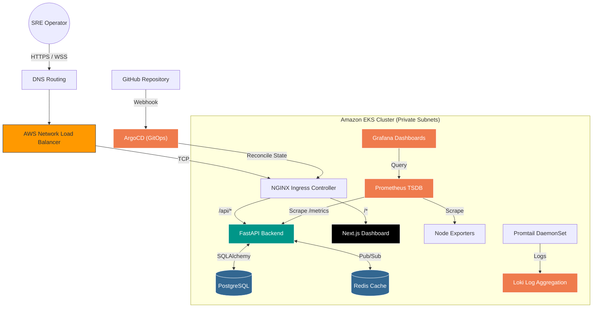
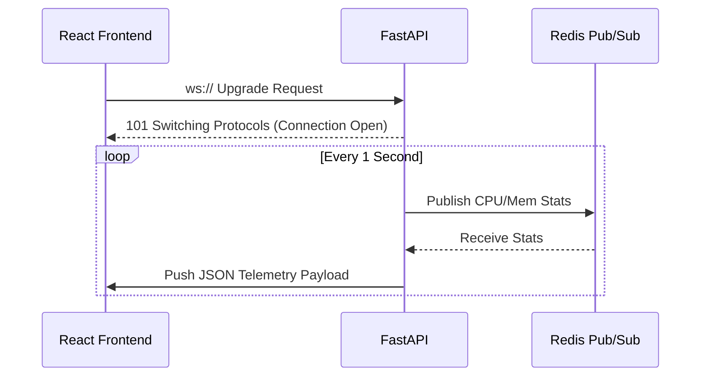
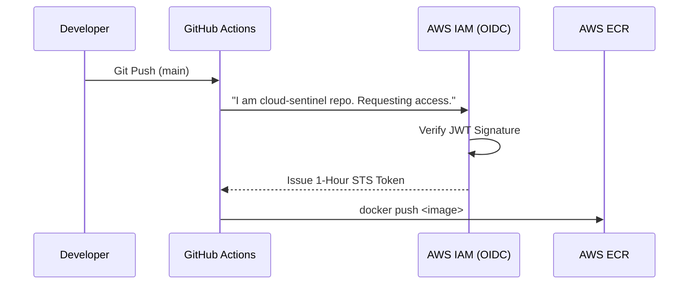
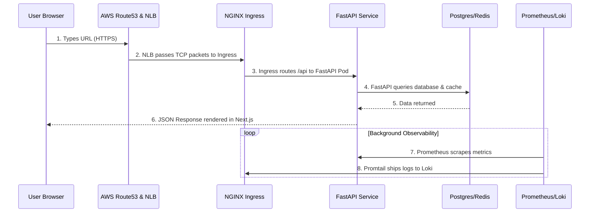

<p align="center">
  
</p>

<p align="center">
  
  
  
</p>

---

# 1. 🚀 Vision & Problem Statement

### Why Cloud Sentinel?
In modern software engineering, writing code is only 20% of the battle. The other 80% is running that code reliably in a hostile environment (the internet). 
Historically, engineering teams suffered from silent failures, manual deployments, and brittle infrastructure. **Cloud Sentinel was born out of a need for visibility and resilience.** We needed a platform that not only hosted microservices but actively monitored them, visualized their health, and automatically self-healed when things broke.

Before we dive into the chronological journey of how this platform evolved from an empty folder into an enterprise-grade cloud system, let's look at the **Final Complete System Architecture**:

### 🗺️ The Final Cloud System Architecture


> *"Now, let us understand how this architecture was built phase by phase from scratch."*

---

# 2. 📁 Phase 1 — Repository & Foundation Setup

**The Problem:** Unstructured codebases lead to "spaghetti code." As projects grow, finding where infrastructure configs end and frontend code begins becomes impossible.

**The Solution:** We started with a strict **Monorepo** philosophy. We separated concerns instantly:
*   `frontend/` — Where the UI lives.
*   `services/` — Where the backend brains live.
*   `infrastructure/` — Where cloud configurations live.
*   `docs/` — Docs-first engineering ensures knowledge isn't trapped in an engineer's head.

**Engineering Insight:** Modular architecture allowed our frontend engineers and cloud architects to work concurrently without merge conflicts.

---

# 3. 🧠 Phase 2 — Backend Engineering Begins

**The Problem:** We needed a "brain" to process data, handle authentication, and most importantly, stream real-time telemetry.

**Why FastAPI? (And not Flask/Django)**
Traditional frameworks like Django are *synchronous*. If 1,000 users open a WebSocket, Django requires 1,000 server threads. This crushes CPU. **FastAPI** uses `asyncio` (an asynchronous event loop). One single thread can handle thousands of concurrent WebSocket connections, switching tasks while waiting for network I/O.

### How the Backend Works Internally
1.  **Request Lifecycle:** A request hits the FastAPI router. Middlewares intercept it (CORS, Auth). Dependency Injection fetches the DB session.
2.  **JWT Authentication:** User sends username/password -> Backend hashes password -> verifies with DB -> issues a cryptographically signed JSON Web Token (JWT).
3.  **Telemetry Generation:** The backend measures its own CPU/Memory usage and packages it into JSON.
4.  **WebSocket Broadcasting:** Redis acts as a Pub/Sub broker. When telemetry is generated, Redis broadcasts it to all connected WebSocket clients instantly.

### 🔄 The WebSocket Lifecycle Flow


---

# 4. 🖥️ Phase 3 — Frontend Dashboard System

**The Problem:** A backend streaming data into the void is useless. SREs need a visual dashboard to instantly spot anomalies.

**Why Next.js & React?**
React is built for state-driven UI. As WebSocket data streams in, React updates its internal state and re-renders only the changed components. Next.js provides Server-Side Rendering (SSR) for initial load speed and SEO.

### How Metrics Appear on the Dashboard
1.  User opens browser. React mounts.
2.  `useEffect` hook opens a `ws://` connection to FastAPI.
3.  As JSON payloads arrive, React updates state (`setMetrics`).
4.  **Recharts** (a charting library) detects the state change and dynamically redraws the SVG graphs on the screen at 60fps.

---

# 5. 🐳 Phase 4 — Dockerization & Local Orchestration

**The Problem:** The classic *"It works on my machine!"* dilemma. A developer installs Python 3.11, another uses 3.9. The frontend dev uses Node 18, another Node 20. Code breaks locally.

**The Solution:** Docker containerization. We wrapped the backend, frontend, Postgres, and Redis into isolated Linux containers.

**Docker Compose Architecture:**
Instead of starting 4 different terminals, we introduced `docker-compose.yml` and a `Makefile`. Now, all services boot up and communicate over an isolated Docker Bridge Network using DNS resolution (e.g., the backend connects to `postgres:5432` instead of `localhost`).

**Command Used:**
```bash
make dev  # Wraps 'docker-compose up --build'
```

---

# 6. ⚙️ Phase 5 — CI/CD & GitHub Actions

**The Problem:** Manual deployment became unsustainable. An engineer ssh-ing into a server, pulling code, and restarting services causes human error, downtime, and massive security risks.

**Why GitHub Actions over Jenkins?**
*   **Jenkins Overhead:** Jenkins requires self-hosting. You must manage EC2 servers, JVM memory, and plugin updates. It's an operational nightmare.
*   **GitHub Actions:** SaaS-based. Zero infrastructure overhead. Workflows are defined as code (`.github/workflows/`) and live inside the repository.

### Deep Dive: OIDC (OpenID Connect) Security
We needed GitHub to push Docker images to AWS. Traditionally, you put an AWS Secret Key into GitHub Secrets. **This is dangerous.** If GitHub is breached, your AWS account is compromised indefinitely.
Instead, we used OIDC. GitHub mathematically proves its identity to AWS. AWS issues a temporary (1-hour) STS token. The pipeline deploys and the token evaporates.



---

# 7. ☁️ Phase 6 — Infrastructure as Code & AWS

**The Problem:** Manually clicking through the AWS Console to create servers is not reproducible. If a server dies, nobody remembers the exact settings used to build it.

**The Solution:** Terraform (Infrastructure as Code). We wrote declarative HCL code to build the AWS foundation.

### AWS Networking Architecture Flow
*   **VPC (Virtual Private Cloud):** An isolated network chunk (10.0.0.0/16).
*   **Public Subnets:** Connected to an Internet Gateway (IGW). Home to our NAT Gateways and Load Balancers.
*   **Private Subnets:** No direct internet access. Our EKS Worker Nodes live here.
*   **The Routing Flow:** If a Pod needs to download a package, the request goes from the Private Subnet -> NAT Gateway -> Internet Gateway -> Out. Hackers on the outside cannot reverse this route to reach the pods.

### FinOps: The Node Density Problem
To save startup budget, we chose `t3.small` EC2 instances. 
*   *The Crisis:* AWS limits Elastic Network Interfaces (ENIs). A `t3.small` maxes out at 11 pods. The cluster stalled.
*   *The Fix:* We enabled VPC CNI Prefix Delegation in Terraform and scaled node counts to ensure adequate pod density without overspending on massive EC2 instances.

---

# 8. ☸️ Phase 7 — Kubernetes Transformation

**The Problem:** Running Docker containers on raw EC2 instances means if an instance crashes in the middle of the night, the app is down until an engineer wakes up. We needed self-healing orchestration.

### Kubernetes Internals: How it actually works
1.  **kube-scheduler:** Analyzes CPU/RAM requirements and assigns Pods to the best EC2 node.
2.  **kubelet:** The agent on the EC2 node that actually tells Docker/containerd to start the container.
3.  **etcd:** The brain database. It stores the "Desired State."
4.  **Reconciliation Loop:** The `kube-controller-manager` constantly compares the Live State against etcd. If a pod crashes, the live state is 1, desired is 2. K8s automatically spawns a new pod.

**Command Used:**
```bash
# Connect local terminal to AWS EKS
aws eks update-kubeconfig --region us-east-1 --name cloud-sentinel-prod
```

---

# 9. 🐙 Phase 8 — GitOps & ArgoCD

**The Problem:** Traditional CI/CD (Push Model) gives GitHub admin access to our Kubernetes cluster. If GitHub is compromised, the cluster is compromised.

**The Solution:** GitOps (Pull Model). We installed ArgoCD *inside* the EKS cluster. ArgoCD reaches out to GitHub, reads the YAMLs, and applies them locally.

### ArgoCD Internals & The App of Apps
ArgoCD uses a "Reconciliation Loop." We point it to a single `root-app-of-apps.yaml`. ArgoCD reads this, discovers pointers to 4 other apps (Ingress, Monitoring, Web, API), and deploys the entire platform automatically.

### 🐛 The Debugging Journey: The Revision Issue
During deployment, ArgoCD was failing to sync the monitoring platform.
*   *The Issue:* The `infrastructure/kubernetes/monitoring` folder was missing a root `kustomization.yaml`. ArgoCD didn't know how to compile the directory.
*   *The Fix:* We created the `kustomization.yaml` referencing prometheus, grafana, and loki, pushed to Git, and forced ArgoCD to refresh. The drift was resolved, and monitoring pods booted up!

---

# 10. 📊 Phase 9 — Monitoring & Observability

**The Problem:** Now we had self-healing infrastructure, but it was a black box. We needed the 3 Pillars of Observability: Metrics, Logs, and Traces.

### How Metrics Travel Through the System
1.  **FastAPI** exposes a `/metrics` HTTP endpoint.
2.  **Prometheus (TSDB)** scrapes this endpoint every 15 seconds, storing data as time-series.
3.  **Grafana** sends PromQL queries to Prometheus and draws visual dashboards.
4.  **Promtail (DaemonSet)** runs on every node, capturing terminal logs and shipping them to **Loki**.

---

# 11. 🔄 Phase 10 — Complete System Design (End-to-End)

Now, let's trace a **Complete User Request Flow** through the mature system:



### The Engineering Conclusion
We transformed from a raw Python/React folder into an enterprise-grade, GitOps-driven AWS Kubernetes platform capable of self-healing, scaling, and deep observability.

---

# 12. 🔮 Future Roadmap

An enterprise platform is never truly "finished." Here is the roadmap for the next evolution:

1.  **Service Mesh (Istio):**
    *   *Why:* To enable strict mTLS (mutual TLS) between all internal pods. If a hacker breaches a frontend pod, they cannot reach the database without a valid certificate.
2.  **Karpenter (Just-in-Time Auto Scaling):**
    *   *Why:* Replacing Cluster Autoscaler. Karpenter analyzes pending pods and provisions exact-fit EC2 Spot instances in milliseconds, slashing AWS bills by up to 70%.
3.  **Distributed Tracing (OpenTelemetry):**
    *   *Why:* Metrics tell us *if* it's slow. Traces tell us *where* it's slow. Tracing injects a unique ID across microservices to map bottlenecks.
4.  **Argo Rollouts (Canary Deployments):**
    *   *Why:* Instead of swapping all pods at once, Canary deployments shift 5% of traffic to a new version, measure PromQL error rates, and rollback automatically if the new code is failing.

<p align="center">
  
</p>
