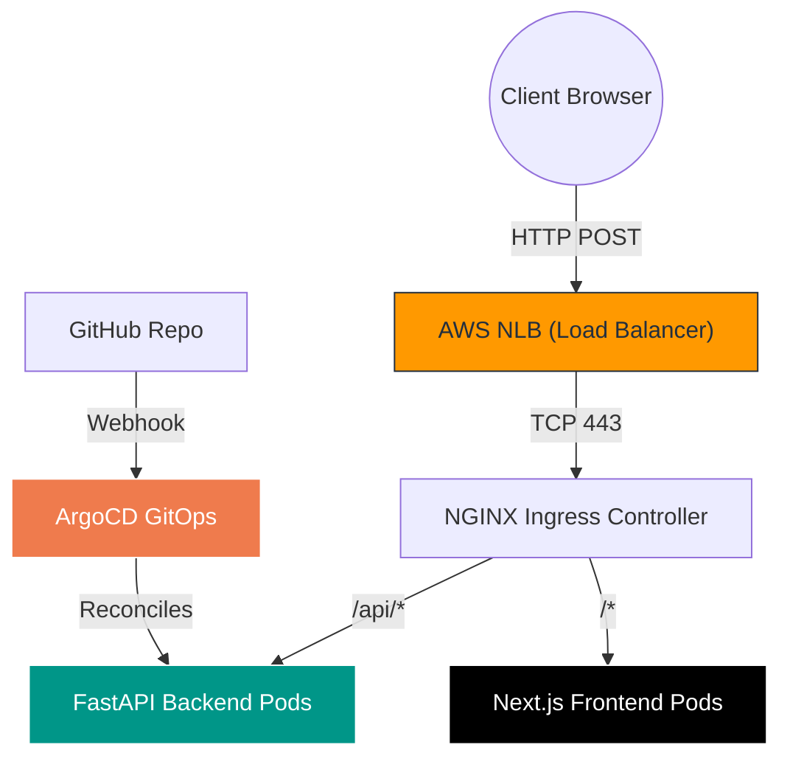

<p align="center">
  
</p>

<h2 align="center">🚀 Cloud Sentinel Platform: Live Presentation Guide</h2>
<p align="center"><strong>The Ultimate Terminal Script & Technical Architecture Deep Dive</strong></p>

<p align="center">
  
  
  
</p>

---

> **Instructor Note:** Keep this cheat sheet open on your second screen. It contains the exact commands, the **Expected Outputs**, and the **Deep Technical Explanation** of what happens under the hood when you hit 'Enter'.

### 🏗️ Global Architecture Flow (Mermaid)
Before running commands, explain how the system talks to itself.



---

### 🐍 Phase 1: Running the FastAPI Backend (Locally)


**What is happening?**
We are booting up an asynchronous Python web server. The command triggers Uvicorn (an ASGI web server) to compile our Python code and open a socket on port 8000. It loads our "Chaos Engine" which intentionally spikes memory and CPU to test Kubernetes resilience.

```bash
cd services/api-gateway
.\venv\Scripts\activate
uvicorn app.main:app --host 0.0.0.0 --port 8000 --reload
```
**Expected Output:**
```text
INFO:     Uvicorn running on http://0.0.0.0:8000 (Press CTRL+C to quit)
INFO:     Started reloader process [12345] using StatReload
```
*Live Demo Action:* Open `http://localhost:8000/docs` to show the auto-generated Swagger OpenAPI UI. Show them the `/api/v1/chaos/latency` endpoint.

---

### ⚛️ Phase 2: Running the Next.js Dashboard (Locally)


**What is happening?**
We are compiling a React application using Webpack. Once started, Next.js opens a WebSocket connection to the Python backend on port 8000. It uses the `recharts` library to instantly plot CPU/Memory telemetry streaming from the backend.

```bash
cd apps/web-dashboard
npm run dev
```
**Expected Output:**
```text
ready - started server on 0.0.0.0:3000, url: http://localhost:3000
event - compiled client and server successfully in 1250 ms
```
*Live Demo Action:* Open `http://localhost:3000`. Click the "Inject Chaos" button. Explain how the frontend uses HTTP POST to tell the backend to spike, and the WebSocket instantly graphs that spike on the screen.

---

### ⚙️ Phase 3: Developer Automation (Makefile)


**What is happening?**
We built a `Makefile` to solve the "Works on my machine" problem. Instead of developers typing massive Docker CLI commands to containerize the app, `make` wraps the execution context.

```bash
cd cloud-sentinel-platform
make build-backend
make build-frontend
```

---

### 🤖 Phase 4: CI/CD Security & Automation (GitHub Actions)


**What is happening?**
You don't run this locally. Instead, open GitHub in your browser and go to the "Actions" tab. 
Explain that the `.github/workflows/backend-ci.yml` file catches every Pull Request. 
*Crucial Detail:* We use **AWS OIDC (OpenID Connect)**. Explain that our CI pipeline does *not* store AWS passwords. Instead, it securely handshakes with AWS to get a temporary 1-hour token, meaning hackers cannot steal our infrastructure keys.

---

### 🌍 Phase 5: Validating AWS Infrastructure (Terraform)


**What is happening?**
We are interacting with the AWS Cloud Control API. The `terraform plan` command reads our local `.tf` files, compares them to the `.tfstate` file, and queries AWS to see if anyone manually changed the VPC or subnets. 

```bash
cd infrastructure/terraform/environments/prod
terraform plan
```
**Expected Output:**
```text
No changes. Your infrastructure matches the configuration.
```

---

### ☸️ Phase 6: Accessing the EKS Control Plane


**What is happening?**
The first command alters your local `~/.kube/config` file to inject the AWS credentials. The second command uses mutual TLS to ask the Amazon EKS Master Node for a list of worker machines.

```bash
aws eks update-kubeconfig --region us-east-1 --name cloud-sentinel-prod
kubectl get nodes -o wide
```
**Expected Output (Live AWS Data):**
```text
NAME                          STATUS   ROLES    AGE     VERSION                INTERNAL-IP   OS-IMAGE                       
ip-10-0-18-153.ec2.internal   Ready    <none>   7h32m   v1.28.15-eks-c39b1d0   10.0.18.153   Amazon Linux 2023.9.20251110 
ip-10-0-33-238.ec2.internal   Ready    <none>   2d3h    v1.28.15-eks-c39b1d0   10.0.33.238   Amazon Linux 2023.9.20251110 
```
*Live Demo Action:* Emphasize that we are using `t3.small` nodes to satisfy strict FinOps/budget requirements.

---

### 🐙 Phase 7: Demonstrating GitOps (ArgoCD)


**What is happening?**
Instead of GitHub pushing changes into our cluster (which requires giving GitHub admin access), ArgoCD sits *inside* the cluster and pulls changes from GitHub. The `argocd-cm.yaml` configuration dictates how it watches our Git repository for YAML changes.

```bash
kubectl get applications -n argocd
# Port-forward the UI
kubectl port-forward svc/argocd-server -n argocd 8080:443
```
*Live Demo Action:* Open `https://localhost:8080`. Explain the "App of Apps" pattern: One parent app deployed all the child apps (Ingress, Monitoring, Web).

---

### 🚦 Phase 8: Edge Routing & AWS Load Balancers


**What is happening?**
When we deployed the NGINX Ingress Controller via GitOps, the Kubernetes AWS Cloud Provider intercepted the request and automatically spun up a physical **Network Load Balancer (NLB)** inside our AWS VPC's public subnets.

```bash
kubectl get svc ingress-nginx-controller -n ingress-nginx
```
**Expected Output:**
```text
NAME                       TYPE           CLUSTER-IP      EXTERNAL-IP
ingress-nginx-controller   LoadBalancer   172.20.50.122   a8b9c...elb.us-east-1.amazonaws.com
```
*Live Demo Action:* Explain that this URL is the only public entry point to the system. Everything else is securely hidden inside private subnets.

---

### 📊 Phase 9: Telemetry & Observability Stack


**What is happening?**
Prometheus is acting as a Time-Series Database (TSDB), scraping metrics from the backend every 15 seconds. Grafana queries Prometheus to draw graphs. Loki, powered by Promtail DaemonSets running on every node, aggregates the server logs without heavy Elasticsearch indexing overhead.

```bash
kubectl port-forward svc/grafana -n monitoring 3000:80
```
*Live Demo Action:* Open `http://localhost:3000` to show the live Grafana dashboards monitoring the health of the EKS cluster.

<p align="center">
  
</p>
