# 🛡️ Enterprise Production Readiness & Chaos Engineering Architecture (Phase 10)

## 1. Executive Summary
This document serves as the formal **Site Reliability Engineering (SRE) Master Specification** outlining the **Phase 10 Production Readiness** hardening of the Cloud Sentinel Observability Platform. The distributed framework has been systematically instrumented with controllable Chaos Injection planes, high-fidelity execution latency profiling Histograms, and adaptive connection readiness capacity mapping.

---

## 2. Distributed Operational Topology

```mermaid
graph TD
    subgraph "Chaos Control Plane (Phase 10A)"
        CHAOS_REQ[POST /api/v1/chaos/inject] -->|Auth Scope Validation| ROUTER[Chaos Controller Router]
        ROUTER -->|Target: websocket_disconnect| GATEWAY_SOCKS[Iterate Active Channel Sets]
        ROUTER -->|Target: database_latency| SLEEP[Simulate Connection Starvation]
        ROUTER -->|Target: packet_loss| DROP[Simulate 50% Broadcaster Drops]
        GATEWAY_SOCKS -->|Close code: 1001| CLIENT_DOWN[Force Client Reconnect Arrays]
    end

    subgraph "Transport Latency Profiling (Phase 10B)"
        FANOUT[Internal Broadcast Fanout] -->|Time Execution| HIST[Histogram: websocket_broadcast_latency_seconds]
        HIST -->|Buckets: 1ms to 1000ms| PROM_REG[Prometheus Metric Registry]
    end

    subgraph "Infrastructure Health Probes (Phase 10D)"
        PROBE[GET /health] -->|Read Runtime Capacity| MANAGER[ConnectionManager Internal States]
        MANAGER -->|Return Live Sets| JSON[Liveness Mapping DTO]
        JSON -->|Key: transport_capacity| K8S[K8S Ingress / ALB Ready Status]
    end
```



---

## 3. Core Reliability Engineering Components

### A. Dedicated Chaos Controller API (`chaos.py`)
To prevent configuration drift and simulate actual high-load cloud outages, the platform mounts an administrative simulation engine directly under `/api/v1/chaos/inject`.
*   **Deterministic Socket Traversal**: Automatically loops through all registered `WebSocket` references in real time, issuing mock shutdown signatures (`status.WS_1001_GOING_AWAY`) to validate downstream client transport degradation buffers.
*   **Automated Impact Auditing**: Generates instant resilience scores based on reconnection recovery speed, validating that our automated `5000ms` fallback REST polling loops restore UI continuity seamlessly.

### B. High-Fidelity Transport Latency Profiling
The internal asynchronous broadcast engine utilizes standard multi-bucket `prometheus_client` Histograms to baseline event fanout execution performance:
```python
ws_broadcast_latency = Histogram(
    "websocket_broadcast_latency_seconds",
    "Histogram profiling the execution duration of real-time multi-socket fanout sequences",
    ["channel"],
    buckets=[0.001, 0.005, 0.01, 0.05, 0.1, 0.5, 1.0],
)
```
*   **Zero-Overhead Profiling**: Encapsulates iterative gathering loops inside a contextual execution block (`with ws_broadcast_latency.labels(channel=channel).time():`), guaranteeing accurate multi-tenant telemetry distribution.

### C. Enriched Liveness/Readiness Probes (`health.py`)
Standard binary `{"status": "healthy"}` indicators are insufficient for horizontal autoscaling decisions. The platform exposes rich internal transport state arrays directly to upstream routing monitors:
```json
{
  "status": "healthy",
  "service": "api-gateway",
  "version": "1.0.0-prod",
  "transport_capacity": {
    "incidents": 42,
    "telemetry": 105,
    "system-events": 12
  },
  "timestamp": "2026-05-14T08:15:36+00:00"
}
```

---

## 4. Operational Playbook & Chaos Validation Runbook

### Scenario 1: Reconnect Storm Simulation
1.  **Objective**: Trigger dynamic failovers to test how fast your active operator UI clients restore connectivity under load.
2.  **Execution**: Blast an authenticated trigger directly into the chaos control plane using PowerShell:
    ```powershell
    Invoke-RestMethod -Uri "http://localhost:8000/api/v1/chaos/inject" -Method Post -ContentType "application/json" -Body '{
        "target_fault": "websocket_disconnect",
        "channel": "incidents",
        "intensity_ms": 3000
    }'
    ```
3.  **Expected Output**: 
    *   Your live UI client badges smoothly transition to **`🟡 RECONNECTING...`**.
    *   The backend replies with a concrete operational audit response confirming impact:
        ```json
        {
          "status": "chaos_injected",
          "fault_type": "websocket_disconnect",
          "impacted_subscribers": 1,
          "resilience_score": 98.5,
          "analytics": {
            "recovery_time_objective_ms": 3000,
            "automated_downgrade_state": "verified",
            "transport_restoration_guarantee": "active"
          }
        }
        ```

### Scenario 2: Latency Starvation Benchmarking
1.  **Objective**: Inject simulated heavy compute wait times to test background thread backpressure metrics.
2.  **Execution**:
    ```powershell
    Invoke-RestMethod -Uri "http://localhost:8000/api/v1/chaos/inject" -Method Post -ContentType "application/json" -Body '{
        "target_fault": "database_latency",
        "intensity_ms": 1500
    }'
    ```
3.  **Expected Output**: The control plane gracefully pauses internal loop processing for exactly `1500ms`, recalculates the cluster resilience degradation score, and returns an updated metrics tracking payload.

---

## 5. Security & Isolation Matrix
*   **Transport Boundaries**: Secured via absolute token handshake verification mapped to internal Pydantic security domains.
*   **Abuse Hardening**: Unauthenticated user domains are isolated securely inside read-only non-blocking `"anonymous_viewer"` connection fallback boundaries.
*   **Observability Transparency**: Directly exposes runtime variables to automated Prometheus scraper tasks, guaranteeing single-pane-of-glass administrative operational awareness.
