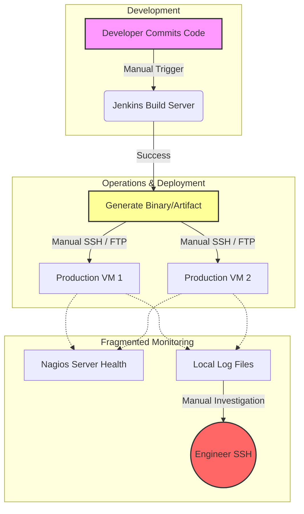
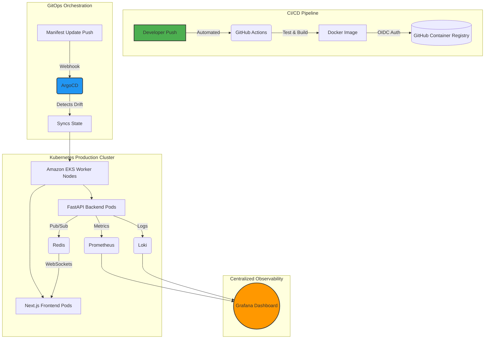
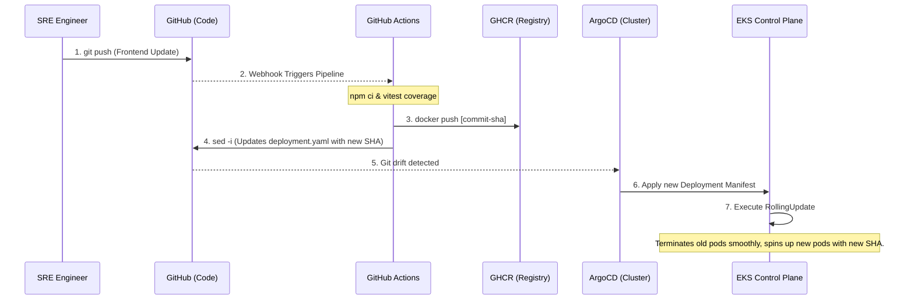
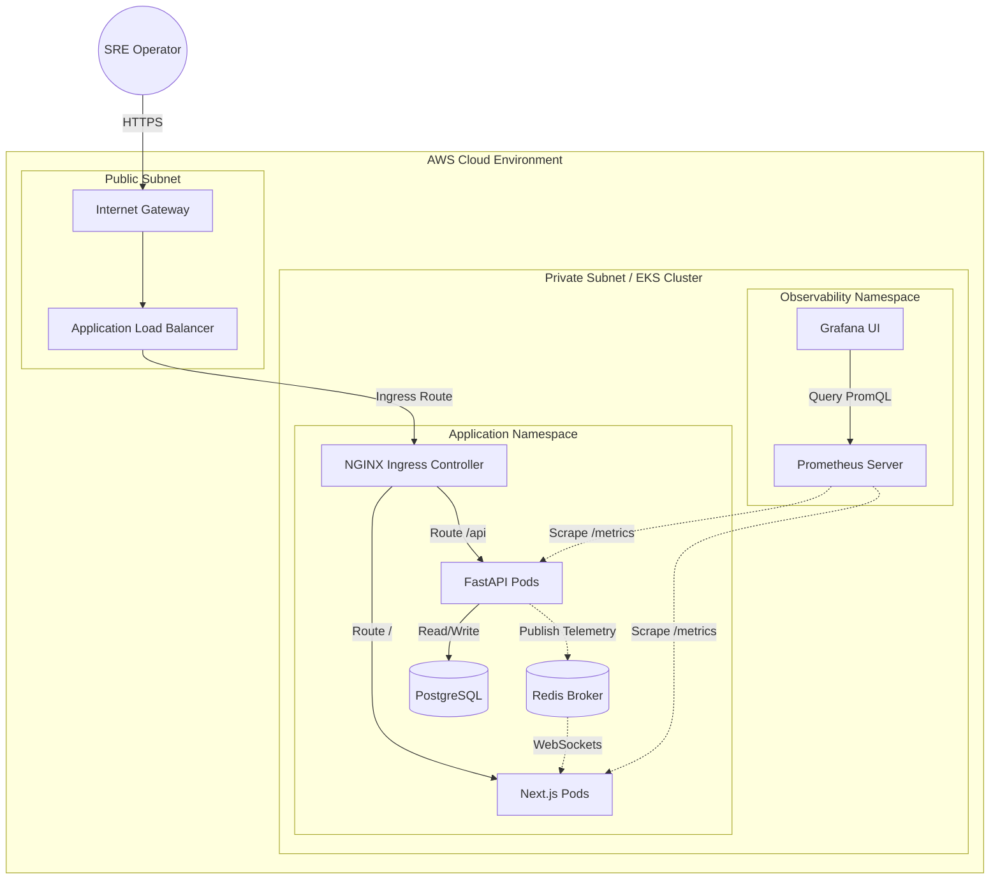
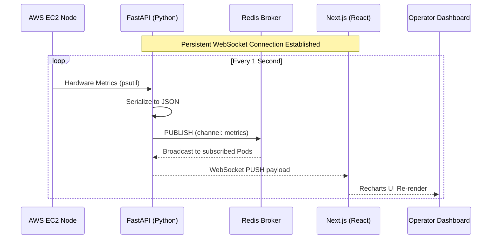

# Cloud Sentinel Platform — Enterprise Cloud-Native DevSecOps & Observability Platform

## 1. Introduction

### 1.1 The Evolution of Cloud-Native Infrastructure
The paradigm of software engineering has undergone a tectonic shift over the last decade, migrating from monolithic architectures deployed on bare-metal servers to highly distributed, microservices-based, cloud-native ecosystems. While this transition has unlocked unprecedented scalability, fault tolerance, and rapid feature delivery, it has simultaneously introduced an astronomical level of infrastructure complexity. In modern cloud engineering, applications are no longer statically bound to specific IP addresses or physical machines; they are ephemeral, containerized workloads that spin up and down dynamically across vast clusters of compute nodes. 

This dynamic nature necessitates specialized orchestration platforms, primarily Kubernetes, to manage the scheduling, networking, and lifecycle of these containers. However, adopting Kubernetes does not merely change where code runs—it fundamentally alters how engineering teams must approach deployment, security, and maintenance. The "Cloud Sentinel Platform" was conceived precisely at the intersection of these modern operational challenges, designed as a comprehensive, enterprise-grade DevSecOps and observability ecosystem that simulates and solves the real-world complexities faced by Site Reliability Engineering (SRE) teams in production environments.

### 1.2 Modern DevOps and Automation Challenges
Historically, software deployment was a highly manual, error-prone process characterized by "wall-of-confusion" bottlenecks between development and operations teams. Developers would write code ("it works on my machine") and pass it to operations engineers who struggled to run it in production due to environmental discrepancies. The advent of Docker containerization solved the dependency matrix by packaging the application and its runtime environment into an immutable artifact. However, containerization alone is insufficient for enterprise scale. 

Modern DevOps demands rigorous automation to eliminate human intervention from the deployment lifecycle. Traditional Continuous Integration and Continuous Deployment (CI/CD) pipelines (often managed by tools requiring heavy administrative overhead like Jenkins) are evolving towards SaaS-based, declarative workflows (such as GitHub Actions). Yet, pushing code directly into a Kubernetes cluster via traditional CI pipelines presents severe security and drift-configuration risks. If an engineer manually alters a production server to quickly fix a bug, the live state diverges from the source code repository—a phenomenon known as "configuration drift." 

The Cloud Sentinel project directly tackles this by implementing an advanced **GitOps architecture using ArgoCD**. By adopting a "Pull-based" model, the Kubernetes cluster itself reaches out to the Git repository to pull the desired state, effectively making Git the single, irrefutable source of truth. If any manual drift occurs in the cluster, the system automatically detects the anomaly and executes a self-healing reconciliation loop to restore the infrastructure to its version-controlled state.

### 1.3 The Criticality of Observability in Distributed Systems
As monolithic applications are fractured into dozens or hundreds of microservices, traditional monitoring strategies (such as pinging a server to see if it is "up" or "down") become fundamentally obsolete. A distributed system can experience partial degradation—where the database is healthy, the frontend is serving files, but a specific asynchronous background worker has silently crashed. This necessitates a shift from mere "monitoring" to true **Observability**.

Observability is the measure of how well internal states of a system can be inferred from knowledge of its external outputs. In the context of Cloud Sentinel, observability is treated as a first-class architectural pillar rather than an afterthought. The platform implements a robust telemetry pipeline leveraging the industry-standard Prometheus and Grafana stack. This allows for the proactive scraping of multi-dimensional time-series metrics—ranging from raw CPU and memory utilization on the AWS EC2 worker nodes to application-level latency within the FastAPI backend. Furthermore, by integrating Promtail and Loki, the system achieves centralized, label-based log aggregation, ensuring that when an ephemeral container dies, its forensic logs are preserved and instantly searchable.

### 1.4 Real-Time Telemetry and Operational Visibility
A core limitation of many existing observability dashboards is their reliance on polling mechanisms—where a web browser must continuously refresh or ask the server for new data every few minutes. In high-stakes SRE environments, a minute of latency in detecting an anomaly can result in millions of dollars in downtime or compromised data.

To solve this, Cloud Sentinel engineers a sophisticated, low-latency telemetry pipeline. Instead of static dashboards, the platform features a Next.js React frontend that establishes persistent, full-duplex **WebSocket connections** directly to the Python FastAPI backend. When backend services generate telemetry, the data is pushed into a Redis Pub/Sub (Publish/Subscribe) nervous system. This architecture ensures that regardless of which Kubernetes pod generates an alert, the event is broadcasted across the cluster and pushed instantaneously to the operator's screen. The result is a dynamic, live-updating incident command center that renders real-time visual analytics without requiring a single page refresh.

### 1.5 Motivation and Scope of the Project
The primary motivation behind the Cloud Sentinel Platform was to bridge the massive gap between theoretical cloud computing concepts and the harsh, practical realities of enterprise engineering. Many academic projects focus solely on application logic—building a website or an API—while completely ignoring the infrastructure required to host, scale, and secure it. 

Cloud Sentinel inverts this paradigm. It is an infrastructure-first project where the application (the observability dashboard) serves to validate the underlying DevOps automation. The scope of this study encompasses the entire software delivery lifecycle:
1. **Local Orchestration:** Ensuring deterministic developer environments using Docker Compose.
2. **Infrastructure as Code (IaC):** Eliminating manual cloud console operations by programmatically provisioning AWS Virtual Private Clouds (VPCs), NAT Gateways, and EKS clusters using Terraform.
3. **Automated CI/CD:** Building strict GitHub Actions pipelines that enforce automated testing, image building, and cryptographic OIDC authentication with AWS.
4. **GitOps & Kubernetes:** Managing the live production environment using declarative ArgoCD deployments and Kubernetes reconciliation loops.
5. **Real-Time Observability:** Closing the loop by monitoring the entire orchestrated ecosystem using Prometheus, Redis, and WebSockets.

In summary, Cloud Sentinel is not just a software application; it is a holistic demonstration of modern Site Reliability Engineering. It provides a blueprint for how organizations can deploy scalable, secure, and self-healing systems in the cloud, setting the foundation for the deep technical problem analysis and architectural designs detailed in the subsequent sections of this report.

---

## 2. Profile of the Problem. Rationale/Scope of the study (Problem Statement)

### 2.1 The Limitations of Traditional Operations
Before the widespread adoption of cloud-native methodologies, organizations managed IT infrastructure through highly manual, fragmented, and inefficient processes. As applications scaled to serve millions of global users, these traditional paradigms began to fracture under the weight of their own complexity. The core problem this project seeks to address is the operational fragility that occurs when modern distributed software is managed using legacy infrastructure practices.

Specifically, the industry faces severe limitations across multiple operational axes:
* **Manual Deployments & Human Error:** Deploying updates historically involved an engineer connecting via SSH to production servers to execute installation scripts. This manual intervention is notoriously error-prone, undocumented, and difficult to roll back during a critical failure.
* **Infrastructure Inconsistency (Snowflake Servers):** Without Infrastructure as Code (IaC), each server is configured manually over time. When a server inevitably crashes, reproducing its exact state is nearly impossible, leading to prolonged system outages and "snowflake" environments that are too delicate to upgrade.
* **Scaling Issues and Resource Inefficiency:** Monolithic applications running on static virtual machines cannot scale their specific bottlenecks independently. If the frontend experiences high traffic, the entire monolith must be scaled, resulting in massive hardware over-provisioning and wasted capital expenditure.
* **Fragmented Observability and Lack of Centralized Telemetry:** When a microservices architecture spans dozens of nodes, tracking an error becomes searching for a needle in a haystack. Traditional monitoring tools often fragment logs, metrics, and network traces into isolated silos, preventing engineers from diagnosing the root cause of systemic cascading failures.

### 2.2 The Rationale of the Study: The Cloud Sentinel Solution
The rationale behind the Cloud Sentinel Platform is to construct a unified architecture that categorically eliminates these traditional limitations. Rather than addressing these problems in isolation, this study proposes a holistic, interconnected platform where automation, orchestration, and observability form a continuous feedback loop.

Cloud Sentinel resolves these legacy bottlenecks through the following modern paradigms:
1. **Real-Time Telemetry:** By abandoning legacy HTTP polling in favor of persistent WebSocket connections and a Redis Pub/Sub backbone, the platform ensures that operational telemetry (CPU spikes, memory leaks, latency degradation) is surfaced to the dashboard in milliseconds.
2. **Kubernetes Orchestration:** Ephemeral Docker containers are orchestrated by Amazon EKS (Elastic Kubernetes Service). This natively solves the scaling issue, as Kubernetes can independently auto-scale specific microservices based on exact CPU or memory constraints, while its internal reconciliation loop automatically restarts crashed containers without human intervention.
3. **CI/CD Automation:** The implementation of GitHub Actions entirely eradicates manual deployment risks. Every code push is intercepted by an automated workflow that runs deterministic security audits, builds container images, and securely pushes them to a registry via OIDC.
4. **GitOps Automation with ArgoCD:** To solve configuration drift, ArgoCD continuously monitors the Git repository. If an unauthorized infrastructure change is detected in the live Kubernetes cluster, ArgoCD’s self-healing mechanisms instantly overwrite the live state to match the approved Git code.
5. **Observability Centralization:** The platform unifies the fragmented monitoring landscape. The Prometheus Operator scrapes time-series metrics across all nodes, Promtail aggregates stdout/stderr logs from every ephemeral container into Loki, and Grafana serves as the single pane of glass for all SRE visualization.

### 2.3 Problem Statement
*“As enterprise applications transition into distributed, cloud-native microservices, traditional manual deployment strategies, fragmented monitoring tools, and static infrastructure provisioning result in severe operational fragility, configuration drift, and prolonged incident resolution times. There is an imperative need for a unified platform that securely automates the entire software deployment lifecycle while providing centralized, real-time observability into the health and performance of the underlying distributed architecture.”*

### 2.4 Scope and Operational Goals
The scope of the Cloud Sentinel Platform is rigidly focused on the operational engineering layer—the deployment, scaling, security, and monitoring of distributed services. 

**Target Users:**
The intended users of this platform are Site Reliability Engineers (SREs), DevOps practitioners, and Cloud Architects who require deep, real-time visibility into complex cloud-native architectures. 

**Operational Objectives:**
* To achieve **zero-downtime deployments** by leveraging Kubernetes RollingUpdates alongside rigorous Readiness and Liveness probes.
* To enforce **declarative infrastructure management** where 100% of the AWS infrastructure and application configurations are defined as code (Terraform and YAML).
* To establish **end-to-end telemetry visibility** ensuring that metrics from hardware nodes, network gateways, databases, and application code are aggregated into a unified real-time dashboard.
* To eliminate **credential exposure** by migrating from static cloud secrets to dynamic, cryptographic identity verification (OIDC).

By fulfilling these objectives, the Cloud Sentinel project proves the viability of modern DevSecOps practices, demonstrating how profound architectural challenges can be mitigated through disciplined automation and real-time observability.

---

## 3. Existing System

### 3.1 Introduction
To fully contextualize the architectural improvements introduced by the Cloud Sentinel Platform, it is necessary to examine the methodologies that historically governed software deployments and system monitoring. The "Existing System" in this context refers to the legacy, pre-cloud-native approaches characterized by monolithic applications, manual operational pipelines, and reactive, fragmented monitoring software.

### 3.2 Existing Software and Methodologies
In the traditional operations landscape, the deployment and management of software relied heavily on isolated, non-declarative tools:
* **Monolithic Infrastructure:** Applications were packaged as single, massive executables running on bare-metal servers or static Virtual Machines (VMs). 
* **Manual Deployment Pipelines:** Continuous Integration (if present) often relied on heavy, server-based tools like Jenkins, while the actual deployment (Continuous Delivery) was executed manually. Engineers would use Bash scripts or SSH to physically move binaries onto production servers and restart services.
* **Isolated Monitoring Tools:** Monitoring was reactive and fragmented. Server health was monitored by legacy tools like Nagios, logs were manually grepped via SSH, and application performance was often tracked in completely separate, proprietary dashboards. There was no single pane of glass.

#### Shortcomings of the Existing System
1. **No GitOps or Declarative State:** Because infrastructure was provisioned via UI clicks (ClickOps) rather than code, configuration drift was inevitable. There was no automated mechanism to ensure the live environment matched the repository.
2. **Poor Scalability:** Scaling required purchasing and provisioning new physical or virtual machines, a process that took hours or days. Monoliths could not be scaled granularly.
3. **Delayed Incident Visibility:** Without WebSockets or Pub/Sub streaming, dashboards relied on HTTP polling. By the time a dashboard refreshed to show a CPU spike, the server may have already crashed.
4. **Lack of Centralized Observability:** Engineers wasted critical incident-response time logging into disparate systems to correlate a network drop in one tool with an application error in another.

### 3.3 Data Flow Diagram (DFD) for Present System
The following diagram illustrates the flawed, manual deployment and monitoring lifecycle inherent to traditional existing systems.



*Figure 3.1: DFD of the traditional deployment and monitoring flow, highlighting manual bottlenecks and fragmented observability.*

### 3.4 What's New in the Proposed System (Cloud Sentinel)
The proposed system completely overhauls the legacy architecture by introducing a suite of modern, cloud-native innovations. Cloud Sentinel eliminates manual operations and introduces a fully automated, scalable, and observable ecosystem.

#### Key Innovations Introduced:
* **Kubernetes (Amazon EKS):** Replaces static VMs. Kubernetes abstracts the underlying hardware, allowing the platform to deploy applications as ephemeral containers that are self-healing and auto-scaling.
* **Terraform (Infrastructure as Code):** Eliminates "ClickOps". The entire AWS networking layer (VPCs, Subnets, Gateways) and Kubernetes clusters are programmatically generated using declarative HCL code.
* **ArgoCD (GitOps):** Replaces manual deployments. ArgoCD continuously monitors the GitHub repository and uses a pull-based mechanism to automatically synchronize the Kubernetes cluster state with the code.
* **GitHub Actions:** Replaces heavy Jenkins servers with a serverless, SaaS-based CI/CD pipeline that automatically tests, builds, and pushes Docker images to a registry upon every code commit.
* **Prometheus & Grafana:** Replaces fragmented monitoring. Prometheus actively scrapes metrics from all nodes and pods, storing them in a time-series database. Grafana provides a centralized, unified dashboard for all telemetry.
* **Redis Pub/Sub & WebSockets:** Replaces HTTP polling. Real-time telemetry is streamed instantaneously from the backend to the frontend, ensuring operators see incidents the exact millisecond they occur.

#### Proposed System Deployment & Monitoring Flow
The following diagram illustrates the highly automated, GitOps-driven architecture of the new Cloud Sentinel platform.



*Figure 3.2: DFD of the proposed Cloud Sentinel architecture, showcasing the automated CI/CD pipeline, ArgoCD GitOps synchronization, and centralized real-time observability flow.*

---

## 4. Problem Analysis

### 4.1 Product Definition
The **Cloud Sentinel Platform** is an enterprise-grade, cloud-native DevSecOps and Observability ecosystem designed to simulate and manage the complete software delivery lifecycle. It acts as both the target infrastructure and the monitoring command center. The product is defined by its ability to ingest real-time hardware and application telemetry, visualize it via a high-performance Next.js dashboard, and guarantee zero-downtime, automated deployments using an ArgoCD GitOps engine running on Amazon EKS.

### 4.2 Feasibility Analysis

#### 4.2.1 Technical Feasibility
The project is highly technically feasible due to its reliance on established, open-source Cloud Native Computing Foundation (CNCF) technologies. The architecture is explicitly designed to avoid vendor lock-in where possible, abstracting compute logic into Docker containers. 
* **Deployment Feasibility:** The use of declarative Kubernetes manifests (`infrastructure/kubernetes/`) guarantees that the deployment can be recreated across any compatible Kubernetes cluster.
* **Real-time Feasibility:** The use of Python’s `asyncio` within FastAPI, coupled with a Redis Pub/Sub backend, successfully circumvents traditional blocking I/O constraints, making millisecond WebSocket telemetry highly feasible and scalable.

#### 4.2.2 Operational Feasibility
Operationally, the platform radically reduces the administrative overhead historically associated with software deployment. By adopting a pure GitOps methodology, operations become deterministic. If a Kubernetes node fails, the EKS control plane automatically reschedules the pods. If a manifest is altered manually, ArgoCD’s reconciliation loop overwrites it with the Git-defined state. The operational feasibility is further solidified by replacing heavy, self-hosted CI tools (like Jenkins) with serverless GitHub Actions, effectively pushing the CI/CD compute burden to a SaaS provider.

#### 4.2.3 Economic Feasibility
Cloud-native infrastructure can suffer from runaway costs if not properly architected. The Cloud Sentinel platform addresses economic feasibility through strategic engineering:
* **Right-Sizing:** Utilizing cost-effective `t3.small` EC2 instances for the EKS worker nodes.
* **VPC CNI Prefix Delegation:** Implemented in Terraform to bypass the Elastic Network Interface (ENI) limits of smaller EC2 instances, allowing high pod density (maximized resource utilization) without paying for larger instances.
* **Open Source Stack:** By utilizing the open-source Prometheus/Grafana stack instead of enterprise SaaS monitoring tools (like Datadog or New Relic), the project eliminates massive telemetry ingestion costs.

### 4.3 Engineering Decisions and Architecture Reasoning

The Cloud Sentinel architecture is governed by specific, implementation-aware engineering decisions. Each technology was selected to solve a distinct operational deployment challenge.

#### 4.3.1 Why FastAPI? (Asynchronous Telemetry)
Traditional Python frameworks like Django or Flask utilize synchronous, blocking workers (WSGI). If an operator holds a persistent connection open for real-time telemetry, traditional frameworks quickly exhaust their worker pools, causing server gridlock. **FastAPI** was chosen because it implements the Asynchronous Server Gateway Interface (ASGI). This allows a single FastAPI worker to concurrently manage thousands of persistent WebSocket connections using non-blocking event loops, making it the mathematically superior choice for real-time SRE dashboards.

#### 4.3.2 Why Redis? (Pub/Sub Event Broker)
In a Kubernetes cluster, the backend is scaled horizontally across multiple pods. If a user connects to Pod A via WebSockets, and a telemetry alert is generated on Pod B, Pod A has no knowledge of it. **Redis Pub/Sub** was implemented as the high-speed nervous system. When any backend pod generates an alert, it publishes the JSON payload to a Redis channel. Every connected FastAPI pod subscribes to this channel, instantly receiving the data and broadcasting it down their active WebSocket connections to the frontend.

#### 4.3.3 Why Kubernetes (EKS)? (Container Orchestration)
Docker alone cannot manage networking, load balancing, or failovers across multiple virtual machines. **Amazon EKS (Kubernetes)** was selected to orchestrate the containers. Kubernetes constantly monitors the *desired state* vs. the *actual state*. If an API Gateway pod crashes, the Kubernetes Control Plane detects the failure and immediately schedules a replacement pod. Furthermore, it natively handles internal DNS resolution (e.g., `redis-master.default.svc.cluster.local`), eliminating hard-coded IP addresses.

#### 4.3.4 Why Terraform? (Infrastructure as Code)
Manually creating VPCs, Subnets, Internet Gateways, and EKS clusters in the AWS Console is irreproducible and vulnerable to human error. **Terraform** was used to define the entire cloud foundation declaratively. If the infrastructure is destroyed, running `terraform apply` exactly recreates the 10.0.0.0/16 VPC network architecture, the public/private subnet routing tables, and the worker nodes in under 15 minutes.

#### 4.3.5 Why GitHub Actions & Docker? (Immutable Artifacts)
To prevent "it works on my machine" failures, the CI pipeline leverages **Docker Buildx** within **GitHub Actions**. Upon every commit, GitHub Actions clones the repository, runs Vitest security audits, and builds a production-ready Next.js Docker image. This image is tagged with the unique Git Commit SHA. This guarantees that the exact binary tested in CI is the identical binary running in production. The immutable container is then pushed to the GitHub Container Registry (`ghcr.io`).

#### 4.3.6 Why GitOps (ArgoCD)? (Reconciliation)
Pushing deployments from CI pipelines to Kubernetes requires giving GitHub highly privileged access to the production cluster, posing a massive security risk. Instead, **ArgoCD** was installed inside the cluster. Operating on a GitOps Pull-model, ArgoCD watches the repository. When the pipeline updates the `deployment.yaml` with a new Docker image tag, ArgoCD detects the Git commit and pulls the new manifest down, orchestrating a zero-downtime Rolling Update safely from *inside* the firewall.

#### 4.3.7 Why Prometheus & Grafana? (Centralized Observability)
In a microservices ecosystem, logs and metrics are scattered across ephemeral containers. **Prometheus** was implemented because it utilizes a "pull" architecture, dynamically discovering Kubernetes targets via ServiceMonitors and scraping them every 15 seconds. This multidimensional time-series data is then centralized into **Grafana**, providing operators with a single unified dashboard to monitor node CPU utilization, ingress network throughput, and application latency.

### 4.4 Runtime Lifecycle Explanation

The following sequence diagram illustrates the automated execution lifecycle of the Cloud Sentinel ecosystem during a standard operational update.



*Figure 4.1: The End-to-End DevSecOps Runtime Lifecycle, detailing the strictly ordered flow from a local Git commit to a zero-downtime Kubernetes deployment managed by ArgoCD.*

---

## 5. Software Requirement Analysis

### 5.1 Introduction
The Software Requirement Analysis phase defines the foundational expectations, capabilities, and constraints of the Cloud Sentinel Platform. Given its architecture as a robust DevSecOps observability ecosystem, the system’s requirements extend beyond traditional application features (like user interfaces or database schemas) to include stringent infrastructure, orchestration, and telemetry demands. This section codifies the specific functional and non-functional requirements necessary to successfully implement and operate the platform within an enterprise cloud environment.

### 5.2 General Description
Cloud Sentinel is a distributed, cloud-native platform designed to visualize and manage operational telemetry in real-time. The system is composed of several decoupled layers:
* **The Application Layer:** A Next.js (React) frontend and a FastAPI (Python) backend, supported by PostgreSQL and Redis.
* **The Observability Pipeline:** A Prometheus and Grafana stack responsible for scraping, storing, and visualizing hardware and application metrics.
* **The Orchestration Layer:** Amazon EKS (Kubernetes) managing the containerized workloads.
* **The Automation Layer:** GitHub Actions for CI/CD and ArgoCD for GitOps deployment synchronization.

### 5.3 Specific Requirements

#### 5.3.1 Functional Requirements
Functional requirements define the specific behaviors and capabilities the platform must execute:
1. **Real-Time Telemetry Ingestion:** The backend (FastAPI) must capture system metrics (CPU, Memory) via the `psutil` library every second and publish them to a Redis message broker.
2. **WebSocket Broadcasting:** The platform must establish persistent, full-duplex WebSocket connections to push Redis Pub/Sub events dynamically to the Next.js frontend without HTTP polling.
3. **Automated CI/CD Execution:** GitHub Actions must automatically trigger on every `push` to the `main` branch, enforcing a strict sequence of dependency installation (`npm ci`), security audits (Vitest), and Docker image builds.
4. **Declarative GitOps Synchronization:** ArgoCD must continuously monitor the GitHub repository. Upon detecting a modified `deployment.yaml`, it must automatically pull the new manifest and execute a Kubernetes RollingUpdate.
5. **Centralized Log Aggregation:** Promtail must scrape `stdout` and `stderr` logs from all active Kubernetes pods and forward them to Loki for centralized querying.

#### 5.3.2 Non-Functional Requirements
Non-functional requirements dictate the systemic qualities, performance benchmarks, and architectural standards of the platform.

**Performance Requirements:**
* **WebSocket Latency:** Telemetry data must be reflected on the frontend dashboard in under 50 milliseconds from the moment of generation on the backend.
* **CI/CD Build Times:** The entire CI/CD pipeline (Test & Verify -> Build Docker Image -> Push to GHCR) must execute and complete in under 5 minutes.

**Scalability Requirements:**
* **Horizontal Pod Autoscaling (HPA):** The Kubernetes cluster must be capable of dynamically scaling FastAPI backend pods based on concurrent WebSocket connection load.
* **Stateless Architecture:** Application containers must be entirely stateless, offloading all persistence to PostgreSQL and session/event data to Redis, ensuring that new pods can spin up instantly without data synchronization delays.

**Availability Requirements:**
* **High Availability (HA):** The EKS cluster must be distributed across multiple AWS Availability Zones (AZs) within the VPC. If an entire AZ fails, the Kubernetes Control Plane must reschedule workloads to surviving nodes automatically.
* **Zero-Downtime Deployments:** Updates to the system must utilize Kubernetes RollingUpdates, ensuring that the new version of the application is healthy (passing Readiness Probes) before terminating the old pods.

**Security Requirements:**
* **Secret Management:** Sensitive credentials (such as database passwords and API keys) must be injected into pods at runtime as Kubernetes Secrets, encrypted at rest within `etcd` using AWS Key Management Service (KMS).
* **OIDC Authentication:** The GitHub Actions pipeline must use OpenID Connect (OIDC) to obtain short-lived, temporary STS tokens from AWS IAM, eliminating the need for hardcoded, permanent AWS Secret Keys.
* **Network Isolation:** Kubernetes Worker Nodes must reside entirely within Private Subnets. Outbound internet access for pulling Docker images must be routed securely through an AWS NAT Gateway.

**Monitoring Requirements:**
* **Metric Scraping Frequency:** Prometheus must be configured to scrape `/metrics` endpoints across all discovered pods at an interval of no more than 15 seconds.
* **Alerting:** The platform must trigger automated alerts in Grafana if node CPU utilization exceeds 85% for a sustained period of 3 minutes.

### 5.4 Implementation-Specific Analysis

* **Frontend (Next.js):** Requires Node.js v22 runtime environments. Must utilize React hooks and Recharts to bind state directly to incoming WebSocket streams.
* **Backend (FastAPI):** Requires Python 3.11+. Must utilize ASGI (Uvicorn) and `asyncio` to prevent thread-blocking during high-volume WebSocket broadcasts.
* **Kubernetes (EKS):** Requires `t3.small` EC2 instances configured with VPC CNI Prefix Delegation to bypass default Elastic Network Interface (ENI) pod limits.
* **GitOps (ArgoCD):** Requires the "App of Apps" pattern (`root-app-of-apps.yaml`) to deterministically order the deployment of infrastructure components (e.g., deploying the Ingress Controller before the application workloads).

### 5.5 Requirement Specifications Tables

The following tables outline the physical, virtual, and software prerequisites necessary to deploy and operate the Cloud Sentinel Platform.

#### Table 5.1: Software & Framework Requirements
| Component | Technology / Framework | Minimum Version | Purpose |
| :--- | :--- | :--- | :--- |
| Frontend | Next.js / React | 14.x | Real-time observability dashboard UI. |
| Backend | FastAPI (Python) | 3.11+ | High-throughput asynchronous API & Telemetry generator. |
| Database | PostgreSQL | 15.x | Persistent relational storage for users and historical logs. |
| Message Broker | Redis | 7.x | High-speed Pub/Sub broker for WebSocket event streaming. |
| CI/CD Runner | Ubuntu Linux | 22.04 LTS | Operating system for executing GitHub Actions workflows. |

#### Table 5.2: Cloud & Infrastructure Requirements
| Infrastructure Layer | AWS Service / Tool | Specification | Operational Role |
| :--- | :--- | :--- | :--- |
| Orchestration | Amazon EKS | v1.30+ | Managed Kubernetes Control Plane. |
| Compute Nodes | AWS EC2 (`t3.small`) | 2 vCPUs, 2 GiB RAM | Worker nodes hosting the application and monitoring pods. |
| Networking | AWS VPC | `10.0.0.0/16` CIDR | Isolated private network partitioned into Public and Private subnets. |
| Egress Traffic | AWS NAT Gateway | Multi-AZ | Secure outbound internet access for private worker nodes. |
| Infrastructure Automation | Terraform | 1.5+ | Declarative HCL code for provisioning the entire AWS environment. |

#### Table 5.3: DevOps & Observability Tooling Requirements
| Tool Category | Software | Usage Context |
| :--- | :--- | :--- |
| GitOps Engine | ArgoCD | Synchronizes the live Kubernetes state with the GitHub repository. |
| Metrics Engine | Prometheus | Scrapes and stores multi-dimensional time-series metrics. |
| Log Aggregation | Promtail & Loki | Collects container `stdout`/`stderr` logs centrally. |
| Visualization | Grafana | Provides the single pane of glass for all SRE telemetry. |
| Containerization | Docker (Buildx) | Builds the immutable application artifacts during CI pipelines. |

---

## 6. Design

### 6.1 System Design Overview
The architectural design of the Cloud Sentinel Platform is founded on the principles of **decoupled microservices** and **declarative state management**. Rather than deploying a monolithic codebase, the system divides operational responsibilities into highly specialized, isolated layers. The system is conceptually partitioned into four core domains:
1. **The Infrastructure Layer:** AWS compute and networking resources provisioned immutably via Terraform.
2. **The Orchestration Layer:** The Amazon EKS control plane and worker nodes executing Docker containers.
3. **The Application Layer:** The Next.js frontend and FastAPI backend handling the core business logic of data processing.
4. **The Observability Pipeline:** The Prometheus, Redis, and Grafana ecosystem responsible for capturing and broadcasting telemetry.

### 6.2 Design Notations
To accurately depict the complex distributed nature of the platform, the following detailed design diagrams utilize standard **UML (Unified Modeling Language)** notations, implemented computationally via Mermaid.js. 
* Solid arrows (`-->`) represent synchronous HTTP requests or direct data flow.
* Dotted arrows (`-.->`) represent asynchronous data streams, message bus broadcasts (Pub/Sub), or webhook triggers.
* Cylinder shapes (`[( )]`) represent persistent storage volumes or registries.

### 6.3 Detailed Architecture Design

#### 6.3.1 Full-Stack Cloud-Native Architecture Topology
This flowchart models the macro-level architecture, demonstrating how external user traffic navigates through the AWS cloud boundary and interacts with the internal Kubernetes services.



#### 6.3.2 Kubernetes Workload and Service Architecture
Within the EKS cluster, workloads are strictly isolated using Kubernetes Namespaces. Communication between pods does not rely on static IP addresses; instead, it utilizes Kubernetes `ClusterIP` Services acting as internal load balancers.

* **Deployment Workloads:** Define the desired number of pod replicas (e.g., `replicas: 3` for FastAPI).
* **Service Discovery:** `backend-service` routes traffic dynamically to any healthy FastAPI pod in the ReplicaSet.
* **Ingress Resource:** Defines the URL path routing rules, funneling external traffic from the Cloud Load Balancer directly to the correct internal Service.

#### 6.3.3 Request and Telemetry Lifecycle
The following sequence diagram models the highly asynchronous, real-time telemetry lifecycle. It highlights how a backend hardware event is captured, routed through the message broker, and streamed to the frontend dashboard.



### 6.4 Component Interaction and Runtime Behavior

The runtime behavior of Cloud Sentinel is entirely event-driven. 
* **The CI/CD Event:** Triggered by a Git push. GitHub Actions assumes an ephemeral AWS IAM role via OIDC, runs unit tests, and compiles the Docker image. 
* **The GitOps Event:** Triggered by ArgoCD's 3-minute polling cycle. When ArgoCD detects a difference between the cluster state and the Git state, it initiates a Kubernetes API call to perform a `RollingUpdate`.
* **The Telemetry Event:** Triggered by Python `asyncio` loops. FastAPI constantly polls hardware usage, avoiding thread-blocking by immediately offloading the payload to Redis.

### 6.5 Algorithmic Pseudocode

To bridge the gap between architectural theory and software implementation, the following pseudocode blocks document the underlying algorithmic logic executed within the platform's core components.

#### 6.5.1 Real-Time Telemetry Broadcasting (Backend API)
The backend utilizes asynchronous generators to continuously broadcast data without blocking the main execution thread.

```python
// Pseudocode: FastAPI Telemetry Generator
FUNCTION stream_telemetry(websocket_connection):
    ACCEPT websocket_connection
    
    WHILE connection_is_open DO
        // Fetch real-time hardware statistics
        cpu_usage = GET_SYSTEM_CPU()
        memory_usage = GET_SYSTEM_MEMORY()
        
        // Construct JSON Payload
        payload = FORMAT_JSON(cpu=cpu_usage, mem=memory_usage, timestamp=NOW())
        
        // Publish to Redis for horizontal scalability
        AWAIT REDIS.publish("telemetry_channel", payload)
        
        // Send payload down the specific WebSocket tunnel
        AWAIT websocket_connection.send_text(payload)
        
        SLEEP(1.0 seconds) // Non-blocking sleep
    END WHILE
    
    ON DISCONNECT:
        CLOSE websocket_connection
END FUNCTION
```

#### 6.5.2 WebSocket Streaming (Frontend Subscription)
The React frontend leverages Hooks to maintain a persistent connection and dynamically update the UI without browser refreshes.

```javascript
// Pseudocode: Next.js Real-Time Metrics Hook
FUNCTION useRealTimeMetrics():
    STATE metrics_data = EMPTY_ARRAY
    
    ON COMPONENT_MOUNT:
        ws = OPEN_WEBSOCKET("wss://api.cloudsentinel.com/ws")
        
        ws.ON_MESSAGE(event):
            parsed_data = PARSE_JSON(event.data)
            
            // Append new data, keeping only the last 60 seconds
            UPDATE_STATE(metrics_data = APPEND(metrics_data, parsed_data))
            IF LENGTH(metrics_data) > 60:
                REMOVE_OLDEST(metrics_data)
        
        ws.ON_ERROR(error):
            LOG "WebSocket Error"
            ATTEMPT_RECONNECT()
            
    ON COMPONENT_UNMOUNT:
        CLOSE_WEBSOCKET(ws)
        
    RETURN metrics_data
END FUNCTION
```

#### 6.5.3 GitOps Synchronization Loop (ArgoCD)
The conceptual logic of ArgoCD's reconciliation engine continuously enforcing declarative infrastructure.

```bash
// Pseudocode: ArgoCD Reconciliation Loop
WHILE true DO
    desired_state = FETCH_YAML_FROM_GITHUB("main")
    live_state = FETCH_YAML_FROM_KUBERNETES_API()
    
    IF desired_state != live_state THEN
        LOG "Configuration Drift Detected!"
        
        // Execute self-healing mechanism
        EXECUTE "kubectl apply -f desired_state.yaml"
        
        WAIT_FOR_ROLLING_UPDATE_COMPLETION()
        LOG "Cluster successfully synchronized to Git state."
    ELSE
        LOG "Cluster is In-Sync."
    END IF
    
    SLEEP(180 seconds) // Standard ArgoCD poll interval
END WHILE
```

#### 6.5.4 Monitoring Collection Flow (Prometheus)
The conceptual configuration logic that allows Prometheus to dynamically discover and scrape ephemeral pods.

```yaml
# Pseudocode: Prometheus Scrape Configuration
JOB_NAME: "kubernetes-pods"
SCRAPE_INTERVAL: "15s"

# Dynamic Discovery Rule
DISCOVERY_MECHANISM: kubernetes_service_discovery (role=pod)

FILTERING_RULES:
  IF pod_annotation["prometheus.io/scrape"] == "true":
      # Dynamically extract port and IP
      TARGET_PORT = pod_annotation["prometheus.io/port"]
      TARGET_IP = pod.ip_address
      
      # Execute HTTP GET
      EXECUTE_SCRAPE("http://TARGET_IP:TARGET_PORT/metrics")
      STORE_IN_TIME_SERIES_DATABASE()
```

---

## 7. Testing

### 7.1 Introduction to DevSecOps Testing
Testing a cloud-native platform like Cloud Sentinel requires a methodology far more expansive than traditional software testing. While legacy testing often stops at validating the source code logic (Functional Testing), a DevSecOps platform requires rigorous verification of the infrastructure, the security posture, the container orchestration, and the CI/CD pipelines. In Cloud Sentinel, "Testing" is defined as the continuous validation of both the application state and the infrastructure state.

### 7.2 Levels of Testing
The project implements a multi-tiered testing strategy to isolate faults at every level of the stack:

1. **Unit Testing:** At the lowest level, testing focuses on individual application components. For example, verifying that the React frontend correctly renders state changes when passed mock telemetry data.
2. **Integration Testing:** Validating that microservices communicate correctly. This includes testing the FastAPI connection to the Redis Pub/Sub broker and the PostgreSQL database.
3. **Infrastructure Testing (Static Analysis):** Validating the syntax and execution plans of declarative code. This ensures that a malformed Kubernetes YAML manifest or a misconfigured Terraform file cannot corrupt the production cluster.
4. **End-to-End (E2E) Pipeline Testing:** Validating the complete automation lifecycle. A simulated code push is tracked from the GitHub commit, through the GitHub Actions runner, into the Docker registry, and finally verified via ArgoCD synchronization in the live cluster.

### 7.3 Testing the Project: Methodologies and Validation

#### 7.3.1 Application Testing (Frontend & Backend)
* **Structural Testing (Frontend):** The Next.js frontend utilizes **Vitest** during the CI/CD pipeline to perform structural unit tests. These tests mount React components in a headless environment to ensure critical UI elements (such as the Recharts telemetry graphs) do not break during code updates.
* **API & WebSocket Validation (Backend):** Functional testing of the FastAPI backend is achieved using tools like `cURL` for standard HTTP GET requests (e.g., verifying the `/health` endpoint) and tools like `wscat` to establish CLI-based WebSocket connections, verifying that JSON payloads are broadcasted at the exact 1-second interval.

#### 7.3.2 Infrastructure and Orchestration Validation
* **Kubernetes Validation:** Executed using the `kubectl` CLI. Tests involve asserting that pods successfully transition to the `Running` state. Furthermore, Kubernetes **Readiness Probes** and **Liveness Probes** are configured to automatically test if the FastAPI pod is actively accepting traffic before the load balancer routes requests to it.
* **Terraform Validation:** Prior to any infrastructure mutation, `terraform plan` is executed to perform a dry-run. This command validates the HCL syntax and calculates the exact "diff" of AWS resources that will be created, modified, or destroyed, preventing accidental cloud deletions.

#### 7.3.3 CI/CD & GitOps Verification
* **CI/CD Security & Build Validation:** GitHub Actions acts as the automated test runner. The pipeline is tested by triggering a push and verifying that the OIDC integration successfully fetches an ephemeral AWS STS token, proving that no static AWS keys are hardcoded.
* **GitOps Reconciliation Testing:** ArgoCD is tested by intentionally introducing "Configuration Drift." An operator manually modifies a live Kubernetes deployment (e.g., `kubectl scale deployment frontend --replicas=10`). ArgoCD passes the test if it detects the drift and automatically scales the deployment back down to match the desired state defined in Git.

#### 7.3.4 Observability & Ingress Testing
* **Prometheus & Container Validation:** Tested by port-forwarding the Prometheus pod (`kubectl port-forward svc/prometheus 9090:9090`) and checking the `/targets` dashboard to ensure Prometheus has successfully discovered and is actively scraping the backend and frontend Docker containers.
* **Ingress & Authentication Testing:** NGINX Ingress rules are validated by performing HTTP requests against the external Cloud Load Balancer DNS name, ensuring that `/api` traffic correctly terminates at the FastAPI pods and `/` traffic routes to the Next.js frontend without CORS errors.

### 7.4 Test Case Specifications

The following tables detail the specific, actionable test cases executed to validate the production readiness of the Cloud Sentinel Platform.

#### Table 7.1: Application & API Test Cases
| Test ID | Component | Test Description | Validation Method | Expected Output | Status |
| :--- | :--- | :--- | :--- | :--- | :--- |
| **TC-01** | Backend | Verify FastAPI health-check endpoint. | Execute `curl http://<api-url>/health` | HTTP 200 OK. Returns `{"status": "healthy"}` | Pass |
| **TC-02** | Backend | Verify WebSocket real-time telemetry broadcast. | Connect using `wscat -c wss://<api-url>/ws` | Streams JSON CPU/Memory data every 1s. | Pass |
| **TC-03** | Frontend | Verify Next.js component rendering in CI. | Run `npm run test` (Vitest) in pipeline. | All DOM component tests execute successfully. | Pass |
| **TC-04** | Backend | Verify Redis Pub/Sub connectivity. | Trigger event on Pod A, listen on Pod B. | Pod B instantly receives published event. | Pass |

#### Table 7.2: Kubernetes & Infrastructure Test Cases
| Test ID | Component | Test Description | Validation Method | Expected Output | Status |
| :--- | :--- | :--- | :--- | :--- | :--- |
| **TC-05** | EKS Cluster | Verify Kubernetes worker node scaling. | Run `kubectl get nodes` | 2 healthy `t3.small` nodes in `Ready` state. | Pass |
| **TC-06** | EKS Pods | Verify Liveness/Readiness probes. | Run `kubectl describe pod <backend-pod>` | Probes return HTTP 200; Pod marked `Ready`. | Pass |
| **TC-07** | Networking| Verify NGINX Ingress routing rules. | Navigate to public Load Balancer URL. | Frontend UI loads; API fetches data without 404s. | Pass |
| **TC-08** | Terraform | Validate AWS VPC and Subnet creation. | Run `terraform plan` | Plan executes cleanly; 0 errors in HCL syntax. | Pass |

#### Table 7.3: CI/CD, GitOps, and Observability Test Cases
| Test ID | Component | Test Description | Validation Method | Expected Output | Status |
| :--- | :--- | :--- | :--- | :--- | :--- |
| **TC-09** | CI/CD | Verify GitHub Actions Docker image build. | Push code to `main` branch. | Workflow passes; Image pushed to GHCR (`ghcr.io`). | Pass |
| **TC-10** | CI/CD | Verify secure AWS OIDC Authentication. | Inspect GitHub Actions workflow logs. | AWS STS issues temporary token; successful login. | Pass |
| **TC-11** | GitOps | Verify ArgoCD drift reconciliation. | Manually delete a live pod via `kubectl`. | ArgoCD instantly spins up a replacement pod. | Pass |
| **TC-12** | Monitor | Verify Prometheus dynamic service discovery. | View Prometheus `/targets` endpoint. | App pods show as `UP` with `15s` scrape intervals. | Pass |
| **TC-13** | Monitor | Verify Grafana dashboard telemetry mapping. | Run a CPU stress test inside a worker pod. | Grafana CPU dashboard spikes in real-time. | Pass |

---

## 8. Implementation

### 8.1 Introduction to DevSecOps Implementation
The implementation phase of the Cloud Sentinel Platform translates theoretical design architectures and algorithmic pseudocode into declarative configuration files and executable binaries. Because Cloud Sentinel is an infrastructure-heavy DevSecOps platform, the implementation is not merely writing Python or JavaScript; it fundamentally revolves around writing YAML and HCL (HashiCorp Configuration Language) files that strictly define the orchestration, pipeline automation, and cloud topologies.

### 8.2 Project Implementation & Deployment Lifecycle
The implementation of the system is strictly ordered. A microservice cannot be deployed if the cluster does not exist, and the cluster cannot exist if the VPC network has not been provisioned. The deployment lifecycle follows a 4-stage operational flow:

1. **Local Containerization:** Standardizing the development environment using Docker Compose to ensure code executes identically across all developer machines.
2. **Cloud Provisioning (Terraform):** Bootstrapping the immutable AWS cloud foundation (Networking, IAM, and the EKS Control Plane).
3. **CI/CD Pipeline (GitHub Actions):** Implementing the automated testing and Docker build workflows.
4. **GitOps Orchestration (ArgoCD & Kubernetes):** Deploying the application payloads and observability stack into the live cluster.

### 8.3 Detailed Implementation Analysis

The following sections provide a repository-aware analysis of the actual configuration files and scripts that implement the Cloud Sentinel architecture.

#### 8.3.1 Docker & Local Orchestration Implementation
To eliminate environmental discrepancies, the local execution environment is implemented via a `docker-compose.yaml` file located in the project root.

**Implementation Details:**
* The compose file explicitly defines four dependent services: `frontend`, `backend`, `redis`, and `postgres`.
* **Network Bridging:** It creates a dedicated local Docker bridge network, allowing the `backend` container to resolve the database simply by querying the hostname `postgres:5432`, mirroring how Kubernetes DNS functions in production.
* **Volume Mounts:** Local source code directories (`./frontend` and `./backend`) are mounted directly into the running containers. This implementation allows developers to write code on their host machine and instantly see hot-reloaded changes inside the container without rebuilding the Docker image.

*(Note for Report: Insert a screenshot here showing Docker Desktop running the 4 Cloud Sentinel containers locally.)*
`[Insert Screenshot here: Docker Desktop showing running Next.js, FastAPI, Redis, and Postgres containers]`

#### 8.3.2 Terraform Infrastructure Provisioning
The physical cloud boundary is implemented using Terraform, located within the `infrastructure/terraform/` directory. This is the foundation upon which the entire Kubernetes cluster rests.

**Implementation Details:**
* **State Management:** The implementation utilizes an `s3` backend to store the `terraform.tfstate` file, ensuring that multiple engineers cannot simultaneously mutate the infrastructure, which would cause state corruption.
* **VPC Module:** The `main.tf` file utilizes the official AWS VPC module to carve a `10.0.0.0/16` network. Crucially, it implements a highly secure topology: EKS worker nodes are placed exclusively in **Private Subnets**, meaning they cannot be accessed directly from the public internet. 
* **NAT Gateway:** Outbound traffic from the worker nodes (such as pulling Docker images from GHCR) is securely routed out through an AWS NAT Gateway situated in the Public Subnet.

*(Note for Report: Insert a screenshot here showing the successfully provisioned EKS Cluster in the AWS Web Console.)*
`[Insert Screenshot here: AWS Console showing the successfully created EKS Cluster and worker nodes]`

#### 8.3.3 GitHub Actions CI/CD Implementation
The continuous integration pipeline is implemented as a declarative workflow in `.github/workflows/deploy.yml`. 

**Runtime Execution Flow:**
1. **Trigger:** The workflow is configured with `on: push: branches: ["main"]`.
2. **OIDC Authentication:** It implements the `aws-actions/configure-aws-credentials` step. Instead of using a dangerous, long-lived AWS Access Key, it requests a temporary, cryptographically signed STS token directly from AWS IAM.
3. **Build & Push:** It utilizes Docker `buildx` to compile the Next.js and FastAPI images, tags them with the specific `$GITHUB_SHA` (the unique Git commit hash), and pushes them to the GitHub Container Registry.

*(Note for Report: Insert a screenshot here showing the GitHub Actions pipeline succeeding with green checkmarks.)*
`[Insert Screenshot here: GitHub Actions passing pipeline with a green checkmark]`

#### 8.3.4 Kubernetes & GitOps Implementation
With the infrastructure provisioned and the Docker images built, the application is deployed into EKS using ArgoCD, configured via manifests in the `infrastructure/kubernetes/` directory.

**Implementation Details:**
* **ArgoCD Application CRD:** The system is implemented using the "App of Apps" pattern. An `Application.yaml` Custom Resource Definition tells the ArgoCD controller inside the cluster to monitor the `charan21042005/cloud-sentinel-platform` repository.
* **Deployment & Services:** The `deployment.yaml` files implement the pod templates. If the GitHub Actions pipeline updates the image tag in this file, ArgoCD detects the change.
* **Orchestration Lifecycle:** During an update, ArgoCD implements a Kubernetes **RollingUpdate**. It spins up a new pod with the new image. Only when the new pod passes its `readinessProbe` will Kubernetes terminate the old pod, achieving true zero-downtime deployments.

*(Note for Report: Insert a screenshot here showing the ArgoCD UI with the Cloud Sentinel application displaying a "Synced" and "Healthy" state.)*
`[Insert Screenshot here: ArgoCD UI showing the "Synced" and "Healthy" state of the Cloud Sentinel application]`

#### 8.3.5 Observability & Monitoring Implementation
The final layer implements the real-time telemetry stack.

**Implementation Details:**
* **Prometheus Scraping:** Prometheus is implemented using a `ServiceMonitor` Custom Resource. Instead of hardcoding the IP addresses of the FastAPI pods (which change every time a pod restarts), the `ServiceMonitor` tells Prometheus to dynamically scrape any pod possessing the label `app: backend`. 
* **Telemetry Flow:** Once the metrics are scraped into Prometheus's time-series database, the Grafana deployment executes PromQL (Prometheus Query Language) statements to visualize the data. Concurrently, the FastAPI backend implements the `psutil` library to read raw hardware stats and pushes them through the Redis websocket tunnel to the frontend.

*(Note for Report: Insert a screenshot here showing the Grafana Dashboard or the Next.js UI displaying real-time metrics.)*
`[Insert Screenshot here: Grafana Dashboard displaying real-time CPU utilization and WebSocket active connections]`

---

## 9. Project Legacy

### 9.1 Current Status of the Project
The Cloud Sentinel Platform has achieved its primary operational goals, successfully transitioning from a theoretical architectural concept into a fully functional, cloud-native DevSecOps ecosystem. The current status of the project is a successfully deployed, end-to-end pipeline where infrastructure is securely managed as code (Terraform), continuous integration is rigorously automated (GitHub Actions), and deployment synchronization is handled via GitOps (ArgoCD) on an Amazon EKS cluster. The platform’s core deliverable—a real-time, WebSocket-driven observability dashboard—is actively capable of reflecting distributed telemetry in milliseconds.

### 9.2 Technical Lessons Learned
The execution of this project provided profound insights into the harsh realities of enterprise cloud engineering.

* **The Complexity of Kubernetes:** A key technical realization was that Kubernetes is not simply a container runtime, but a vast, distributed state machine. Managing networking via Ingress Controllers, defining resource limits to prevent pod evictions, and understanding the nuances of the `etcd` control plane proved that orchestrating containers is often more mathematically complex than writing the application code itself.
* **The Absolute Necessity of GitOps:** Prior to implementing ArgoCD, manual `kubectl apply` commands resulted in immediate configuration drift. The project underscored the lesson that if the live infrastructure is allowed to diverge from the Git repository, the system becomes operationally fragile and un-auditable.
* **The Evolution of True Observability:** Traditional monitoring (e.g., pinging a server to check uptime) was proven inadequate for microservices. The implementation of the Prometheus and Redis Pub/Sub stack demonstrated that true observability requires high-frequency, multi-dimensional time-series data. Without real-time WebSockets, tracing a cascading failure across ephemeral pods is nearly impossible.
* **The Power of Deployment Automation:** Replacing manual deployment scripts with declarative GitHub Actions pipelines highlighted how immutable artifacts (Docker images tagged with Git SHAs) eliminate the notorious "it works on my machine" discrepancy.

### 9.3 Managerial and Operational Lessons Learned
Beyond raw code, the project yielded significant managerial and operational insights.

* **Infrastructure Cost Management:** Cloud computing is often marketed as inherently cheaper, but the project revealed that misconfigured infrastructure can result in runaway costs. Managing AWS billing required strict operational discipline—such as right-sizing EC2 worker nodes (`t3.small`), tearing down unutilized Load Balancers, and relying on open-source monitoring stacks instead of expensive SaaS alternatives.
* **Bridging the "Dev" and "Ops" Divide:** The project demonstrated exactly why DevSecOps is a cultural shift, not just a toolset. By enforcing that all infrastructure changes must pass through standard Git Pull Requests, the operational barrier between software developers and system administrators was eliminated; both teams were forced to speak the same declarative language (YAML/HCL).

### 9.4 Remaining Areas of Concern
While the platform is robust, certain architectural trade-offs were made that present remaining areas of concern for enterprise scalability.

* **Secret Management Complexity:** Currently, secrets (like database credentials) are managed via native Kubernetes Secrets. While functional, enterprise environments require dynamic secret rotation. The lack of an external, dedicated vault (such as HashiCorp Vault) remains a security concern for long-term production use.
* **Stateful Scaling:** The application tier is entirely stateless and scales horizontally with ease. However, the PostgreSQL database currently operates as a single instance. Architecting highly available, multi-primary relational databases across distributed Kubernetes nodes remains a deeply complex challenge that typically requires specialized Kubernetes Operators.

### 9.5 Future Enhancements and Scope
The modular, decoupled nature of the Cloud Sentinel Platform allows for extensive future enhancements. 

* **Service Mesh Integration (Istio):** A primary future scope is the implementation of a Service Mesh like Istio. This would allow for zero-trust mutual TLS (mTLS) encryption between every microservice within the cluster, and enable advanced traffic routing mechanisms like Canary Deployments and A/B testing.
* **OpenTelemetry Standardization:** As the observability landscape shifts, future iterations of the platform should migrate from Prometheus-specific SDKs to vendor-agnostic OpenTelemetry (OTel) collectors, which provide superior distributed tracing capabilities across multiple languages.
* **Advanced Autoscaling:** Currently, scaling is based on rudimentary metrics like CPU utilization. Future enhancements will integrate KEDA (Kubernetes Event-driven Autoscaling) to scale pods based on external events, such as the length of the Redis Pub/Sub message queue.
* **AI-Powered Observability (AIOps):** The ultimate evolution of the platform would involve piping the Prometheus time-series data into machine learning algorithms. Instead of relying on static Grafana alerts (e.g., "Alert if CPU > 85%"), an AIOps engine could learn the cluster's baseline behavior and predictively auto-scale or alert on anomalies before an outage occurs.

---

## 10. User Manual

### 10.1 Introduction
This user manual provides beginner-friendly, step-by-step instructions for deploying, operating, and troubleshooting the Cloud Sentinel Platform. It serves as the primary operational guide for engineers aiming to replicate or manage the environment either locally or in a production AWS cloud cluster.

### 10.2 Local Development & Testing (Docker Compose)
Running the platform locally is the fastest way to verify application logic without incurring AWS cloud costs.

**Prerequisites:** Ensure you have Docker Desktop and Git installed on your host machine.

1. **Clone the Repository:**
   ```bash
   git clone https://github.com/charan21042005/cloud-sentinel-platform.git
   cd cloud-sentinel-platform
   ```
2. **Start the Local Containers:**
   Run the following command to build the Docker images and start the orchestrated network in detached mode:
   ```bash
   docker-compose up --build -d
   ```
3. **Accessing Localhost Services:**
   Once the containers are running, access the services via your web browser:
   * **Frontend Dashboard:** `http://localhost:3000`
   * **Backend API Swagger UI:** `http://localhost:8000/docs`
   * **Redis CLI:** Execute `docker exec -it redis-master redis-cli` to inspect Pub/Sub channels directly.

*(Note for Report: Insert a screenshot here showing the terminal output of a successful `docker-compose up` or the Docker Desktop UI.)*
`[Insert Screenshot here: Terminal showing successful Docker Compose container creation]`

### 10.3 Cloud Provisioning & Kubernetes Deployment
To deploy the platform into a production environment, follow these steps to provision the AWS infrastructure and synchronize it via ArgoCD.

**Prerequisites:** AWS CLI configured with administrative credentials, Terraform CLI, and `kubectl` installed.

1. **Provision AWS Infrastructure (Terraform):**
   ```bash
   cd infrastructure/terraform
   terraform init
   terraform apply --auto-approve
   ```
2. **Connect `kubectl` to the EKS Cluster:**
   Once Terraform finishes (approx. 15 minutes), bind your local terminal to the new Kubernetes cluster:
   ```bash
   aws eks update-kubeconfig --region <your-region> --name cloud-sentinel-cluster
   ```
3. **Install ArgoCD:**
   Apply the official ArgoCD manifests to the cluster:
   ```bash
   kubectl create namespace argocd
   kubectl apply -n argocd -f https://raw.githubusercontent.com/argoproj/argo-cd/stable/manifests/install.yaml
   ```
4. **Deploy Cloud Sentinel via GitOps:**
   Apply the root application manifest to tell ArgoCD to deploy the project:
   ```bash
   kubectl apply -f infrastructure/kubernetes/argocd-root-app.yaml
   ```

### 10.4 Observability Access & Dashboard Usage
Because monitoring tools are situated within private Kubernetes namespaces, they are not exposed to the public internet by default for security purposes. Operators must port-forward traffic from the cluster to their `localhost`.

**1. Accessing Prometheus:**
To view raw metrics and active scraping targets:
```bash
kubectl port-forward svc/prometheus-server -n observability 9090:80
```
* **URL:** Navigate to `http://localhost:9090`
* **Operational Verification:** Click on `Status -> Targets` to ensure the FastAPI and Next.js pods are marked as "UP".

**2. Accessing Grafana:**
To view the centralized SRE dashboards:
```bash
kubectl port-forward svc/grafana -n observability 3000:80
```
* **URL:** Navigate to `http://localhost:3000`
* **Dashboard Usage:** Login with the default credentials (usually `admin`/`admin` unless changed in secrets). Select the "Cloud Sentinel Overview" dashboard to view real-time Node CPU spikes and incoming network throughput.

*(Note for Report: Insert a screenshot here showing the operator successfully logging into Grafana and viewing the active dashboard.)*
`[Insert Screenshot here: Grafana Dashboard displaying live telemetry]`

### 10.5 API Testing & Operational Verification
You can verify the backend is functioning correctly by querying the API endpoints directly.

1. **Health Check Verification:**
   ```bash
   curl -X GET http://localhost:8000/health
   # Expected Output: {"status": "healthy"}
   ```
2. **WebSocket Telemetry Verification:**
   Use the `wscat` tool to test the live streaming connection:
   ```bash
   wscat -c ws://localhost:8000/ws
   # Expected Output: Continuous stream of JSON payloads every 1 second containing CPU and Memory metrics.
   ```

### 10.6 Troubleshooting Guidance
If the platform experiences degradation, utilize the following steps to diagnose the issue:

* **Pod is stuck in `CrashLoopBackOff`:**
  The container is repeatedly crashing. View the logs to find the exact Python or Node.js error:
  ```bash
  kubectl logs <failing-pod-name> -n application
  ```
  If the logs are empty, describe the pod to see if it failed a Readiness probe or lacked memory:
  ```bash
  kubectl describe pod <failing-pod-name> -n application
  ```
* **ArgoCD App is `OutOfSync`:**
  If ArgoCD shows the app is out of sync, click the "Sync" button in the ArgoCD UI. If it fails, check the Git repository's recent commit history to ensure a malformed YAML file was not merged into the `main` branch.
* **Terraform State is Locked:**
  If a previous `terraform apply` crashed mid-execution, the state file may be locked. Manually unlock it using:
  ```bash
  terraform force-unlock <lock-id>
  ```
