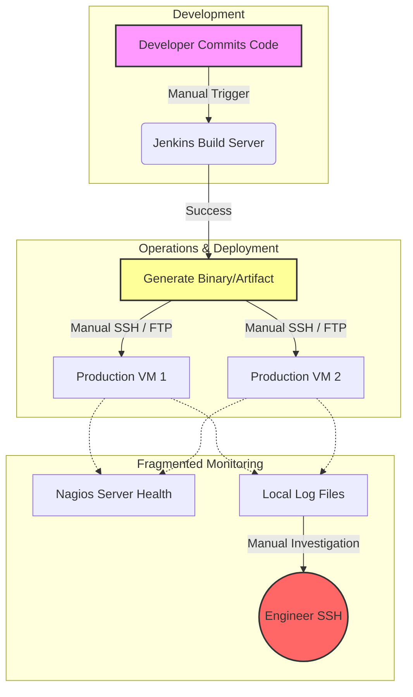
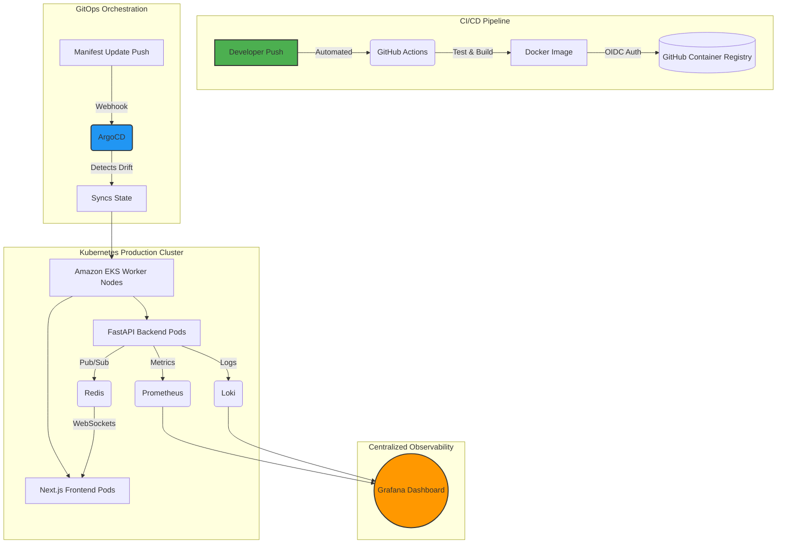
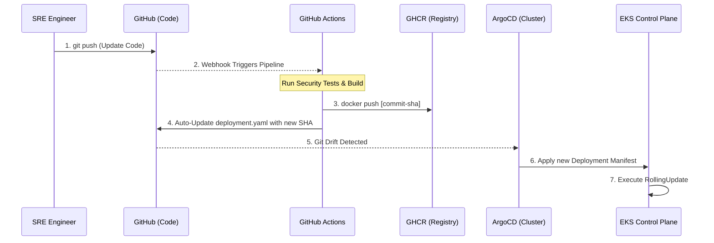
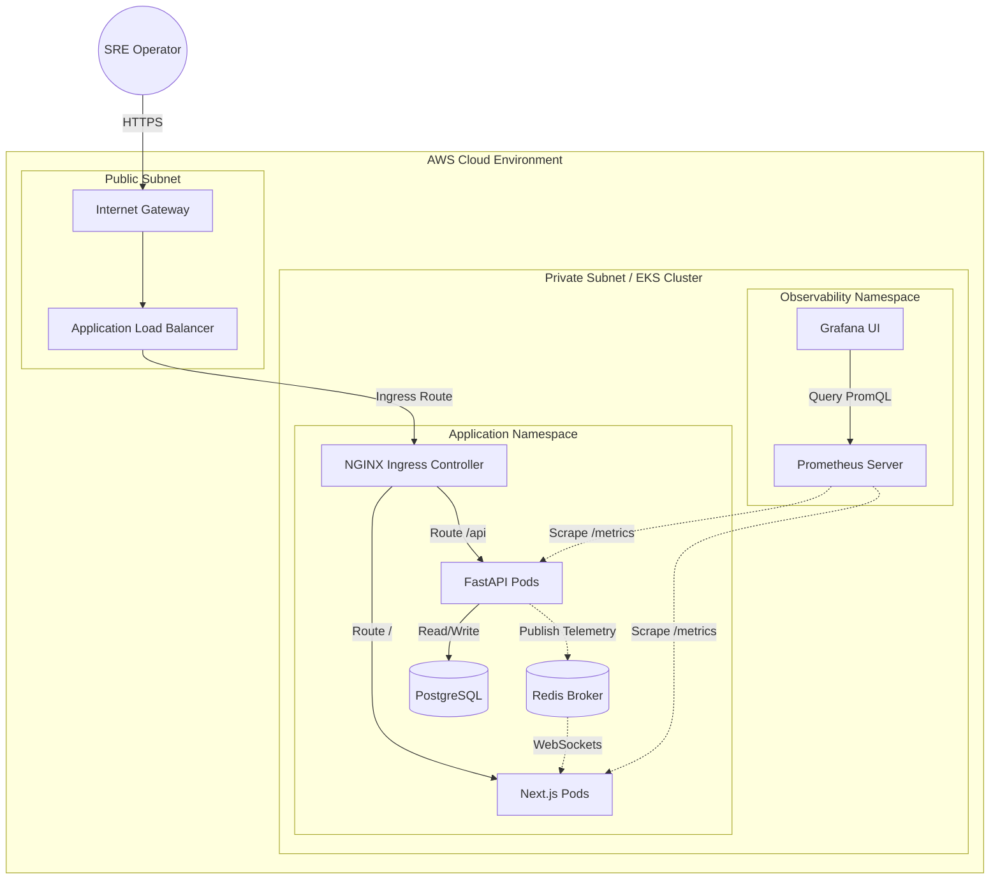

# Cloud Sentinel Platform — Enterprise Cloud-Native DevSecOps & Observability Platform

## 1. Introduction

### 1.1 The Evolution of Cloud-Native Infrastructure

The paradigm of software engineering has undergone a tectonic shift over the last decade, migrating from monolithic architectures deployed on bare-metal servers to highly distributed, microservices-based, cloud-native ecosystems. While this transition has unlocked unprecedented scalability, fault tolerance, and rapid feature delivery, it has simultaneously introduced an astronomical level of infrastructure complexity. In modern cloud engineering, applications are no longer statically bound to specific IP addresses or physical machines; they are ephemeral, containerized workloads that spin up and down dynamically across vast clusters of compute nodes.

This dynamic nature necessitates specialized orchestration platforms, primarily Kubernetes, to manage the scheduling, networking, and lifecycle of these containers. However, adopting Kubernetes does not merely change where code runs—it fundamentally alters how engineering teams must approach deployment, security, and maintenance. The Cloud Sentinel Platform was conceived precisely at the intersection of these modern operational challenges, designed as a comprehensive, enterprise-grade DevSecOps and observability ecosystem that simulates and solves the real-world complexities faced by Site Reliability Engineering (SRE) teams in production environments.

### 1.2 Modern DevOps and Automation Challenges

Historically, software deployment was a highly manual, error-prone process characterized by "wall-of-confusion" bottlenecks between development and operations teams. Developers would write code locally and pass it to operations engineers, who frequently struggled to run it in production due to environmental discrepancies. The advent of Docker containerization resolved the dependency matrix by packaging the application and its runtime environment into an immutable artifact. However, containerization alone is insufficient for enterprise-scale deployments.

Modern DevOps demands rigorous automation to eliminate human intervention from the deployment lifecycle. Traditional Continuous Integration and Continuous Deployment (CI/CD) pipelines are evolving towards SaaS-based, declarative workflows (such as GitHub Actions). Yet, pushing code directly into a Kubernetes cluster via traditional CI pipelines presents severe security and configuration-drift risks. If an engineer manually alters a production server to quickly fix a bug, the live state diverges from the source code repository.

The Cloud Sentinel project directly tackles this challenge by implementing an advanced GitOps architecture utilizing ArgoCD. By adopting a pull-based model, the Kubernetes cluster autonomously reaches out to the Git repository to pull the desired state, effectively making Git the single, irrefutable source of truth. If any manual drift occurs in the cluster, the system automatically detects the anomaly and executes a self-healing reconciliation loop to restore the infrastructure to its version-controlled state.

### 1.3 The Criticality of Observability in Distributed Systems

As monolithic applications fracture into hundreds of microservices, traditional monitoring strategies become fundamentally obsolete. A distributed system can experience partial degradation—where the database is healthy, the frontend is serving files, but a specific asynchronous background worker has silently crashed. This necessitates a paradigm shift from mere monitoring to true observability.

Observability is the measure of how well internal states of a system can be inferred from knowledge of its external outputs. In the context of Cloud Sentinel, observability is treated as a primary architectural pillar. The platform implements a robust telemetry pipeline leveraging the industry-standard Prometheus and Grafana stack. This architecture allows for the proactive scraping of multi-dimensional time-series metrics—ranging from raw CPU and memory utilization on the AWS EC2 worker nodes to application-level latency within the FastAPI backend. Furthermore, by integrating Promtail and Loki, the system achieves centralized, label-based log aggregation, ensuring that when an ephemeral container terminates, its forensic logs are preserved and instantly searchable.

### 1.4 Real-Time Telemetry and Operational Visibility

A core limitation of many existing observability dashboards is their reliance on HTTP polling mechanisms, where a web browser must continuously refresh to request new data. In high-stakes SRE environments, latency in detecting an anomaly can result in severe system degradation.

To resolve this latency, Cloud Sentinel features a sophisticated telemetry pipeline. Instead of static dashboards, the platform implements a Next.js React frontend that establishes persistent, full-duplex WebSocket connections directly to the Python FastAPI backend. When backend services generate telemetry, the data is pushed into a Redis Pub/Sub (Publish/Subscribe) broker. This architecture ensures that regardless of which Kubernetes pod generates an alert, the event is broadcasted across the cluster and pushed instantaneously to the operator's interface, resulting in a dynamic, live-updating incident command center.

### 1.5 Motivation and Scope of the Project

The primary motivation behind the Cloud Sentinel Platform is to bridge the gap between theoretical cloud computing concepts and the practical realities of enterprise engineering. While many academic projects focus solely on application logic, Cloud Sentinel is an infrastructure-first project where the application (the observability dashboard) serves to validate the underlying DevOps automation.

The scope of this study encompasses the entire software delivery lifecycle:

1. **Local Orchestration:** Ensuring deterministic developer environments using Docker Compose.
2. **Infrastructure as Code (IaC):** Eliminating manual cloud console operations by programmatically provisioning AWS Virtual Private Clouds (VPCs), NAT Gateways, and EKS clusters using Terraform.
3. **Automated CI/CD:** Building strict GitHub Actions pipelines that enforce automated testing, image building, and cryptographic OIDC authentication with AWS.
4. **GitOps & Kubernetes:** Managing the live production environment using declarative ArgoCD deployments and Kubernetes reconciliation loops.
5. **Real-Time Observability:** Closing the operational loop by monitoring the orchestrated ecosystem using Prometheus, Redis, and WebSockets.

In summary, Cloud Sentinel serves as a holistic demonstration of modern Site Reliability Engineering, providing a blueprint for deploying scalable, secure, and self-healing systems in the cloud.

---

## 2. Profile of the Problem, Rationale, and Scope of the Study

### 2.1 The Limitations of Traditional Operations

Before the widespread adoption of cloud-native methodologies, organizations managed IT infrastructure through highly manual, fragmented, and inefficient processes. As applications scale to serve global user bases, traditional paradigms fracture under the weight of operational complexity. The core problem this project seeks to address is the operational fragility that occurs when modern distributed software is managed using legacy infrastructure practices.

The industry faces severe limitations across multiple operational axes:

* **Manual Deployments & Human Error:** Deploying updates historically involved an engineer connecting via SSH to production servers to execute installation scripts. This intervention is notoriously error-prone, undocumented, and difficult to roll back during a critical failure.
* **Infrastructure Inconsistency:** Without Infrastructure as Code (IaC), each server is configured manually over time. When a server crashes, reproducing its exact state is nearly impossible, leading to prolonged outages and "snowflake" environments that are too delicate to upgrade.
* **Resource Inefficiency:** Monolithic applications running on static virtual machines cannot scale their specific bottlenecks independently, resulting in massive hardware over-provisioning and wasted capital expenditure.
* **Fragmented Observability:** When a microservices architecture spans dozens of nodes, tracking an error requires searching through isolated silos. Traditional monitoring tools fragment logs, metrics, and network traces, preventing engineers from diagnosing systemic cascading failures efficiently.

### 2.2 Rationale of the Study: The Cloud Sentinel Solution

The rationale behind the Cloud Sentinel Platform is to construct a unified architecture that categorically eliminates these traditional limitations. This study proposes an interconnected platform where automation, orchestration, and observability form a continuous feedback loop.

Cloud Sentinel resolves legacy bottlenecks through the following paradigms:

1. **Real-Time Telemetry:** By abandoning legacy HTTP polling in favor of persistent WebSocket connections and a Redis Pub/Sub backbone, operational telemetry is surfaced to the dashboard in milliseconds.
2. **Kubernetes Orchestration:** Ephemeral Docker containers are orchestrated by Amazon EKS (Elastic Kubernetes Service), which inherently solves scaling issues. Kubernetes can independently auto-scale specific microservices based on exact CPU or memory constraints, while its reconciliation loop automatically restarts crashed containers.
3. **CI/CD Automation:** The implementation of GitHub Actions eradicates manual deployment risks. Every code push is intercepted by an automated workflow that runs deterministic security audits, builds container images, and securely pushes them to a registry via OIDC.
4. **GitOps Automation:** To solve configuration drift, ArgoCD continuously monitors the GitHub repository. If an unauthorized infrastructure change is detected in the live Kubernetes cluster, ArgoCD’s self-healing mechanisms instantly overwrite the live state to match the approved Git configuration.
5. **Observability Centralization:** The Prometheus Operator scrapes time-series metrics across all nodes, Promtail aggregates logs from ephemeral containers into Loki, and Grafana serves as the single pane of glass for all SRE visualization.

### 2.3 Problem Statement

*As enterprise applications transition into distributed, cloud-native microservices, traditional manual deployment strategies, fragmented monitoring tools, and static infrastructure provisioning result in severe operational fragility, configuration drift, and prolonged incident resolution times. There is an imperative need for a unified platform that securely automates the entire software deployment lifecycle while providing centralized, real-time observability into the health and performance of the underlying distributed architecture.*

### 2.4 Project Scope and Operational Goals

The scope of the Cloud Sentinel Platform focuses strictly on the operational engineering layer—the deployment, scaling, security, and monitoring of distributed services.

**Target Users:**
Site Reliability Engineers (SREs), DevOps practitioners, and Cloud Architects who require deep, real-time visibility into complex cloud-native architectures.

**Operational Objectives:**

* To achieve **zero-downtime deployments** by leveraging Kubernetes RollingUpdates alongside rigorous Readiness and Liveness probes.
* To enforce **declarative infrastructure management** where 100% of the AWS infrastructure and application configurations are defined as code.
* To establish **end-to-end telemetry visibility**, ensuring metrics from hardware nodes, network gateways, databases, and application code are aggregated into a unified real-time dashboard.
* To eliminate **credential exposure** by migrating from static cloud secrets to dynamic, cryptographic identity verification (OIDC).

By fulfilling these objectives, the Cloud Sentinel project proves the viability of modern DevSecOps practices and demonstrates how architectural challenges can be mitigated through disciplined automation.

---

## 3. Existing System vs. Proposed Architecture

### 3.1 Introduction to the Existing System

To fully contextualize the architectural improvements introduced by the Cloud Sentinel Platform, it is necessary to examine the methodologies that historically governed software deployments. The "Existing System" refers to legacy, pre-cloud-native approaches characterized by monolithic applications, manual operational pipelines, and reactive monitoring.

### 3.2 Shortcomings of Existing Methodologies

In the traditional landscape, the deployment of software relied heavily on isolated, non-declarative tools:

* **Monolithic Infrastructure:** Applications were packaged as single executables running on bare-metal servers or static Virtual Machines (VMs).
* **Manual Deployment Pipelines:** Continuous Delivery was executed manually via Bash scripts or SSH, lacking automated rollback capabilities.
* **Isolated Monitoring Tools:** Server health was monitored by legacy tools (e.g., Nagios), logs were manually aggregated via SSH, and application performance was tracked in separate dashboards.

**Primary Limitations:**

1. **No GitOps or Declarative State:** Infrastructure provisioned via UI clicks (ClickOps) led to inevitable configuration drift.
2. **Poor Scalability:** Scaling required provisioning new physical or virtual machines, taking hours or days.
3. **Delayed Incident Visibility:** Dashboards relied on HTTP polling, resulting in delayed incident response times.

### 3.3 Data Flow Diagram (DFD) for the Present System

The following diagram illustrates the manual deployment and monitoring lifecycle inherent to traditional systems.



*Figure 3.1: DFD of the traditional deployment and monitoring flow, highlighting manual bottlenecks.*

### 3.4 Innovations in the Proposed System (Cloud Sentinel)

The proposed Cloud Sentinel system overhauls the legacy architecture by introducing a suite of modern, cloud-native innovations, completely eliminating manual operations.

**Key Innovations Introduced:**

* **Kubernetes (Amazon EKS):** Abstracts the underlying hardware, allowing the platform to deploy applications as ephemeral, self-healing containers.
* **Terraform (Infrastructure as Code):** The entire AWS networking layer and Kubernetes clusters are programmatically generated using declarative HCL code.
* **ArgoCD (GitOps):** Continuously monitors the GitHub repository and uses a pull-based mechanism to automatically synchronize the Kubernetes cluster state with the code.
* **GitHub Actions:** A serverless CI/CD pipeline that automatically tests, builds, and pushes Docker images to a registry upon every code commit.
* **Prometheus & Grafana:** Prometheus actively scrapes metrics from all nodes and pods, storing them in a time-series database for centralized visualization in Grafana.
* **Redis Pub/Sub & WebSockets:** Real-time telemetry is streamed instantaneously from the backend to the frontend.

##### 3.5 Proposed System Architecture Flow



*Figure 3.2: DFD of the proposed Cloud Sentinel architecture, showcasing the automated GitOps lifecycle.*

---

## 4. Problem Analysis & Feasibility Study

### 4.1 Product Definition

The Cloud Sentinel Platform is an enterprise-grade DevSecOps and Observability ecosystem designed to simulate and manage the complete software delivery lifecycle. It acts as both the target infrastructure and the monitoring command center. The product is defined by its ability to ingest real-time hardware telemetry and guarantee zero-downtime, automated deployments using an ArgoCD GitOps engine running on Amazon EKS.

### 4.2 Feasibility Analysis

#### 4.2.1 Technical Feasibility

The project is highly technically feasible due to its reliance on established Cloud Native Computing Foundation (CNCF) technologies. The use of declarative Kubernetes manifests guarantees that the deployment can be recreated across any compatible cluster. Furthermore, the use of Python’s `asyncio` within FastAPI, coupled with a Redis Pub/Sub backend, successfully circumvents traditional blocking I/O constraints, making millisecond WebSocket telemetry highly scalable.

#### 4.2.2 Operational Feasibility

Operationally, the platform radically reduces administrative overhead. By adopting a pure GitOps methodology, operations become deterministic. If a Kubernetes node fails, the EKS control plane automatically reschedules the pods. Replacing heavy, self-hosted CI tools with serverless GitHub Actions effectively pushes the CI/CD compute burden to a reliable SaaS provider.

#### 4.2.3 Economic Feasibility

Cloud-native infrastructure can suffer from runaway costs if not properly architected. The Cloud Sentinel platform addresses economic feasibility by utilizing cost-effective `t3.small` EC2 instances and implementing VPC CNI Prefix Delegation in Terraform to maximize pod density per node. Furthermore, utilizing the open-source Prometheus/Grafana stack eliminates enterprise telemetry ingestion costs.

### 4.3 Engineering Decisions and Architecture Reasoning

Each technology within Cloud Sentinel was selected to solve a distinct operational deployment challenge.

* **Why FastAPI (Asynchronous Telemetry):** Traditional Python frameworks utilize synchronous, blocking workers. FastAPI implements the Asynchronous Server Gateway Interface (ASGI), allowing a single worker to concurrently manage thousands of persistent WebSocket connections using non-blocking event loops.
* **Why Redis (Pub/Sub Broker):** In a distributed Kubernetes cluster, backend pods have no awareness of each other's state. Redis Pub/Sub acts as the high-speed nervous system, ensuring that an alert generated on Pod A is broadcasted to all connected clients across the ReplicaSet.
* **Why Amazon EKS (Container Orchestration):** Kubernetes constantly monitors the desired state versus the actual state, providing self-healing orchestration and internal DNS resolution, thereby abstracting the underlying physical hardware.
* **Why Terraform (Infrastructure as Code):** Manually creating VPCs and Subnets in the AWS Console is irreproducible. Terraform defines the entire cloud foundation declaratively, ensuring deterministic infrastructure deployments.
* **Why GitHub Actions & Docker (Immutable Artifacts):** The CI pipeline leverages Docker Buildx within GitHub Actions to compile immutable images tagged with a Git Commit SHA, guaranteeing environmental consistency between testing and production.
* **Why ArgoCD (GitOps Reconciliation):** Pushing deployments directly from CI pipelines poses massive security risks. ArgoCD operates on a pull-model from inside the cluster, watching the repository and orchestrating zero-downtime Rolling Updates safely from behind the firewall.

### 4.4 Runtime Lifecycle Sequence

The following sequence diagram illustrates the automated execution lifecycle during a standard operational update.



*Figure 4.1: The End-to-End DevSecOps Runtime Lifecycle.*

---

## 5. Software Requirement Analysis

### 5.1 Introduction

The Software Requirement Analysis phase defines the foundational capabilities and constraints of the Cloud Sentinel Platform. This section codifies the specific functional and non-functional requirements necessary to successfully implement and operate the platform within an enterprise cloud environment.

### 5.2 Specific Requirements

#### 5.2.1 Functional Requirements

1. **Real-Time Telemetry Ingestion:** The backend must capture system metrics via the `psutil` library every second and publish them to a Redis message broker.
2. **WebSocket Broadcasting:** The platform must establish persistent WebSocket connections to push Redis Pub/Sub events dynamically to the Next.js frontend without HTTP polling.
3. **Automated CI/CD Execution:** GitHub Actions must automatically trigger on every `push` to the `main` branch, enforcing dependency installation, security audits, and Docker builds.
4. **Declarative GitOps Synchronization:** ArgoCD must continuously monitor the GitHub repository and execute a Kubernetes RollingUpdate upon detecting a modified `deployment.yaml`.
5. **Centralized Log Aggregation:** Promtail must scrape `stdout` and `stderr` logs from all active Kubernetes pods and forward them to Loki.

#### 5.2.2 Non-Functional Requirements

* **Performance:** Telemetry data must be reflected on the frontend dashboard in under 50 milliseconds. The CI/CD pipeline must execute completely in under 5 minutes.
* **Scalability:** Application containers must be entirely stateless, offloading persistence to PostgreSQL and session data to Redis, ensuring rapid horizontal scaling.
* **Availability:** Updates must utilize Kubernetes RollingUpdates, ensuring the new application version is healthy (passing Readiness Probes) before terminating old pods.
* **Security:** Sensitive credentials must be injected into pods at runtime as Kubernetes Secrets. The CI pipeline must use OpenID Connect (OIDC) for temporary AWS STS tokens, eliminating hardcoded keys.

#### 5.3 Requirement Specifications Tables

**Table 5.1: Software & Framework Requirements**

| Component      | Technology / Framework | Minimum Version | Operational Role                          |
| :------------- | :--------------------- | :-------------- | :---------------------------------------- |
| Backend        | FastAPI (Python)       | 3.11+           | High-throughput asynchronous API.         |
| Database       | PostgreSQL             | 15.x            | Persistent relational storage.            |
| Message Broker | Redis                  | 7.x             | High-speed Pub/Sub broker for WebSockets. |
| CI/CD Runner   | Ubuntu Linux           | 22.04 LTS       | GitHub Actions workflow execution.        |

**Table 5.2: Cloud & Infrastructure Requirements**

| Infrastructure Layer   | AWS Service / Tool     | Specification        | Operational Role                       |
| :--------------------- | :--------------------- | :------------------- | :------------------------------------- |
| Orchestration          | Amazon EKS             | v1.30+               | Managed Kubernetes Control Plane.      |
| Compute Nodes          | AWS EC2 (`t3.small`) | 2 vCPUs, 2 GiB RAM   | Worker nodes hosting application pods. |
| Networking             | AWS VPC                | `10.0.0.0/16` CIDR | Isolated private network topology.     |
| Infrastructure as Code | Terraform              | 1.5+                 | Declarative HCL code for provisioning. |

**Table 5.3: DevOps & Observability Tooling Requirements**

| Tool Category    | Software        | Usage Context                                   |
| :--------------- | :-------------- | :---------------------------------------------- |
| GitOps Engine    | ArgoCD          | Synchronizes Kubernetes state with GitHub.      |
| Metrics Engine   | Prometheus      | Scrapes multi-dimensional time-series metrics.  |
| Visualization    | Grafana         | Single pane of glass for all SRE telemetry.     |
| Containerization | Docker (Buildx) | Builds immutable artifacts during CI pipelines. |

---

## 6. System Design Architecture

### 6.1 System Design Overview

The architectural design of the Cloud Sentinel Platform is founded on the principles of decoupled microservices and declarative state management. The system is conceptually partitioned into four core domains:

1. **The Infrastructure Layer:** AWS compute and networking resources provisioned immutably via Terraform.
2. **The Orchestration Layer:** The Amazon EKS control plane and worker nodes executing Docker containers.
3. **The Application Layer:** The Next.js frontend and FastAPI backend handling data processing.
4. **The Observability Pipeline:** The Prometheus, Redis, and Grafana ecosystem responsible for broadcasting telemetry.

### 6.2 Detailed Architecture Design

#### 6.2.1 Full-Stack Topology



*Figure 6.1: Cloud Sentinel architecture topology detailing ingress routing and namespace isolation.*

### 6.3 Algorithmic Pseudocode

To bridge the gap between architectural theory and software implementation, the following pseudocode blocks document the underlying algorithmic logic executed within the platform.

**6.3.1 Real-Time Telemetry Broadcasting (Backend API)**

```python
FUNCTION stream_telemetry(websocket_connection):
    ACCEPT websocket_connection
    WHILE connection_is_open DO
        cpu_usage = GET_SYSTEM_CPU()
        memory_usage = GET_SYSTEM_MEMORY()
      
        payload = FORMAT_JSON(cpu=cpu_usage, mem=memory_usage, timestamp=NOW())
        AWAIT REDIS.publish("telemetry_channel", payload)
      
        AWAIT websocket_connection.send_text(payload)
        SLEEP(1.0 seconds) 
    END WHILE
END FUNCTION
```

**6.3.2 GitOps Synchronization Loop (ArgoCD)**

```bash
WHILE true DO
    desired_state = FETCH_YAML_FROM_GITHUB("main")
    live_state = FETCH_YAML_FROM_KUBERNETES_API()
  
    IF desired_state != live_state THEN
        LOG "Configuration Drift Detected!"
        EXECUTE "kubectl apply -f desired_state.yaml"
        WAIT_FOR_ROLLING_UPDATE_COMPLETION()
    END IF
    SLEEP(180 seconds)
END WHILE
```

---

## 7. Testing and Validation

### 7.1 Introduction to DevSecOps Testing

In Cloud Sentinel, "Testing" is defined as the continuous validation of both the application state and the infrastructure state. The project implements a multi-tiered testing strategy to isolate faults:

1. **Unit/Integration Testing:** Validating that microservices communicate correctly via Vitest and API assertions.
2. **Infrastructure Testing:** Validating the syntax and execution plans of declarative code (HCL and YAML).
3. **End-to-End Pipeline Testing:** Validating the automation lifecycle from GitHub commit to ArgoCD cluster synchronization.

### 7.2 Testing Methodologies

* **Infrastructure and Orchestration Validation:** Executed using the `kubectl` CLI. Tests involve asserting that pods successfully transition to the `Running` state, and that Readiness Probes return HTTP 200 responses. Terraform validation utilizes `terraform plan` to perform dry-runs prior to infrastructure mutation.
* **CI/CD & GitOps Verification:** GitHub Actions acts as the automated test runner, verifying OIDC integration. ArgoCD is tested by intentionally introducing "Configuration Drift" (e.g., manually deleting a pod) to verify that the self-healing reconciliation loop spins up a replacement pod instantaneously.

### 7.3 Test Case Specifications

**Table 7.1: Application & Infrastructure Test Cases**

| Test ID         | Component   | Test Description                    | Validation Method            | Expected Output                         | Status |
| :-------------- | :---------- | :---------------------------------- | :--------------------------- | :-------------------------------------- | :----- |
| **TC-01** | Backend     | Verify FastAPI health-check.        | `curl http://<api>/health` | HTTP 200 OK                             | Pass   |
| **TC-02** | Backend     | Verify WebSocket broadcast.         | `wscat -c wss://<api>/ws`  | Streams JSON every 1s.                  | Pass   |
| **TC-03** | EKS Cluster | Verify worker node scaling.         | `kubectl get nodes`        | 2 `t3.small` nodes Ready.             | Pass   |
| **TC-04** | Terraform   | Validate AWS VPC creation.          | `terraform plan`           | 0 errors in HCL syntax.                 | Pass   |
| **TC-05** | CI/CD       | Verify GitHub Actions build.        | Push code to `main`.       | Workflow passes; Image pushed to GHCR.  | Pass   |
| **TC-06** | GitOps      | Verify ArgoCD drift reconciliation. | Delete a live pod.           | ArgoCD spins up a replacement pod.      | Pass   |
| **TC-07** | Monitor     | Verify Prometheus discovery.        | View `/targets` endpoint.  | App pods show as `UP` (15s interval). | Pass   |

---

## 8. Implementation Details

### 8.1 Introduction to DevSecOps Implementation

The implementation phase translates theoretical design architectures into declarative configuration files and executable binaries. The deployment lifecycle follows a strict 4-stage operational flow:

1. **Local Containerization:** Standardizing the development environment via Docker Compose.
2. **Cloud Provisioning:** Bootstrapping the immutable AWS cloud foundation via Terraform.
3. **CI/CD Pipeline:** Implementing automated testing and build workflows via GitHub Actions.
4. **GitOps Orchestration:** Deploying the application workloads into EKS via ArgoCD.

### 8.2 Detailed Implementation Analysis

**8.2.1 Terraform Infrastructure Provisioning**
The physical cloud boundary is implemented using Terraform, located within `infrastructure/terraform/`. The `main.tf` file utilizes the AWS VPC module to carve a `10.0.0.0/16` network. It enforces a secure topology by placing EKS worker nodes exclusively in Private Subnets, routing outbound traffic through an AWS NAT Gateway.

**8.2.2 GitHub Actions CI/CD Implementation**
The continuous integration pipeline is implemented as a declarative workflow in `.github/workflows/deploy.yml`. It implements the `aws-actions/configure-aws-credentials` step to request a temporary STS token directly from AWS IAM (OIDC), compiles the Next.js and FastAPI images, tags them with the specific `$GITHUB_SHA`, and pushes them to the GitHub Container Registry.

**8.2.3 Kubernetes & GitOps Implementation**
The system uses the "App of Apps" pattern. An `Application.yaml` Custom Resource Definition instructs the in-cluster ArgoCD controller to monitor the GitHub repository. During an update, ArgoCD executes a Kubernetes RollingUpdate, spinning up new pods and verifying `readinessProbes` before terminating old workloads to achieve zero-downtime deployments.

**8.2.4 Observability & Monitoring Implementation**
Prometheus is implemented using a `ServiceMonitor` Custom Resource, allowing it to dynamically scrape any pod possessing the label `app: backend` rather than relying on hardcoded IP addresses.

---

## 9. Project Legacy & Future Scope

### 9.1 Current Status of the Project

The Cloud Sentinel Platform has achieved its primary operational goals, successfully transitioning from a theoretical architectural concept into a fully functional DevSecOps ecosystem. Infrastructure is securely managed as code, continuous integration is automated, and deployment synchronization is handled via GitOps on Amazon EKS. The core deliverable—a real-time observability dashboard—actively reflects distributed telemetry in milliseconds.

### 9.2 Technical & Managerial Lessons Learned

* **The Complexity of Kubernetes:** The project underscored that Kubernetes is a vast, distributed state machine. Managing Ingress Controllers and `etcd` consensus proved that orchestrating containers is highly complex.
* **The Absolute Necessity of GitOps:** Manual `kubectl apply` commands resulted in immediate configuration drift. Enforcing that all infrastructure changes pass through Git Pull Requests eliminated the operational barrier between developers and system administrators.
* **Infrastructure Cost Management:** Misconfigured infrastructure can result in runaway costs. Managing AWS billing required strict operational discipline, such as right-sizing EC2 worker nodes (`t3.small`) and utilizing open-source monitoring stacks instead of expensive SaaS alternatives.

### 9.3 Remaining Areas of Concern and Future Scope

* **Secret Management Complexity:** Currently, secrets are managed via native Kubernetes Secrets. Enterprise environments require dynamic secret rotation via external vaults (e.g., HashiCorp Vault).
* **Stateful Scaling:** Architecting highly available, multi-primary relational databases across distributed Kubernetes nodes remains a complex challenge requiring specialized Operators.
* **Service Mesh Integration (Istio):** Future iterations will implement a Service Mesh to enable zero-trust mutual TLS (mTLS) encryption between microservices and advanced traffic routing (Canary Deployments).
* **AI-Powered Observability (AIOps):** The ultimate evolution involves piping Prometheus time-series data into machine learning algorithms to predictively auto-scale or alert on anomalies before outages occur.

---

## 10. User Manual

### 10.1 Local Orchestration & Containerization (Docker Compose)
To rapidly test the application logic and observability pipelines without incurring cloud compute costs, the platform can be executed locally via Docker Compose.

**1. Initialize the Container Stack:**
Navigate to the project root and execute the following commands to build and start the core application and monitoring infrastructure:
```bash
cd cloud-sentinel-platform
docker compose -f infrastructure/docker/docker-compose.yml up -d --build
docker compose -f infrastructure/docker/docker-compose.yml -f infrastructure/docker/docker-compose.monitoring.yml up -d --build
```

**2. Verify Container Health:**
Ensure all critical components are running via `docker ps`. The stack includes:
*   **sentinel-api-gateway:** FastAPI backend on port `8000`.
*   **sentinel-frontend:** Next.js dashboard on port `3001`.
*   **sentinel-postgres:** Relational database on port `5432`.
*   **sentinel-redis:** Message broker on port `6379`.
*   **sentinel-prometheus & grafana:** Observability stack on ports `9090` and `3002`.

### 10.2 Kubernetes Provisioning & GitOps Synchronization
For production-grade simulation, the platform utilizes Minikube to emulate an Amazon EKS environment locally, avoiding unnecessary AWS infrastructure billing during demonstrations.

**1. Initialize Kubernetes Cluster:**
```bash
minikube start --driver=docker
```

**2. Deploy ArgoCD (GitOps Engine):**
```bash
kubectl apply -k infrastructure/kubernetes/gitops/argocd
kubectl -n argocd wait --for=condition=available deployment/argocd-server --timeout=180s
```

**3. Apply the App-of-Apps Architecture:**
```bash
kubectl apply -k infrastructure/kubernetes/gitops/apps
```

**4. Access the GitOps Dashboard:**
```bash
kubectl -n argocd port-forward svc/argocd-server 8099:80
```
*(Default Credentials — Username: `admin` | Password: `XytX-1XbQ2tcbIbX`)*

### 10.3 Observability Access & Operational Verification
Once the DevSecOps pipeline is running, the following endpoints provide comprehensive visibility into the system's state:

**Application Endpoints:**
*   **Frontend Dashboard:** `http://localhost:3001/dashboard`
*   **API Swagger Documentation:** `http://localhost:8000/docs`

**Telemetry Endpoints:**
*   **Prometheus Targets:** `http://localhost:9090/targets`
*   **Grafana Dashboards:** `http://localhost:3002` *(Credentials: `admin` / `sentinel_admin`)*
*   **Database Browser (Adminer):** `http://localhost:8888`

**System Health Checks:**
*   **API Health:** `curl http://localhost:8000/health`
*   **Database Health:** `curl http://localhost:8000/health/database`
*   **Redis Broker Health:** `curl http://localhost:8000/health/redis`

### 10.4 Troubleshooting Guidance
*   **Container Failures:** Utilize `docker logs <container-name>` to debug runtime exceptions in the local stack.
*   **ArgoCD OutOfSync State:** Ensure the local Kubernetes cluster has outbound internet access to pull the latest YAML manifests from the GitHub repository.
*   **AWS Infrastructure Conflicts:** To prevent runaway cloud costs, ensure `terraform apply` is not executed unless explicitly testing the cloud boundary. The local Minikube cluster serves as a cost-effective replica of the EKS production environment.

---

## 11. Source Code & Snapshots

*(Note to Author: Please upload and attach the actual screenshot images below the bracketed placeholders prior to final report submission.)*

### 11.1 Infrastructure Source Code (Terraform)

The following snippet demonstrates the declarative provisioning of the AWS Elastic Kubernetes Service (EKS) cluster utilizing HashiCorp Configuration Language (HCL).

```hcl
module "eks" {
  source  = "terraform-aws-modules/eks/aws"
  version = "~> 20.0"
  cluster_name    = "cloud-sentinel-cluster"
  cluster_version = "1.30"
  vpc_id     = module.vpc.vpc_id
  subnet_ids = module.vpc.private_subnets
  eks_managed_node_groups = {
    general = {
      instance_types = ["t3.small"]
      min_size       = 2
      max_size       = 4
    }
  }
}
```

### 11.2 System Snapshots & Architecture Diagrams

**Macro Architecture Diagram**
`[Insert Image Here: Figure 6.1 Full-Stack Cloud-Native Architecture Topology Diagram]`
*Figure 11.1: The full-stack topology demonstrating the flow from the AWS Cloud boundary into the Kubernetes internal Service network.*

**Local Development Verification**
`[Insert Image Here: Docker Desktop UI showing the 4 running containers]`
*Figure 11.2: Local orchestration validation utilizing Docker Compose for deterministic development.*

**CI/CD Pipeline Verification**
`[Insert Image Here: GitHub Actions workflow UI showing a successful build and push to GHCR]`
*Figure 11.3: The automated DevSecOps pipeline compiling immutable Docker artifacts.*

**GitOps Synchronization Verification**
`[Insert Image Here: ArgoCD Dashboard showing the Cloud Sentinel app as "Synced" and "Healthy"]`
*Figure 11.4: ArgoCD resolving the desired Git state with the live Kubernetes cluster state.*

**Real-Time Observability Dashboards**
`[Insert Image Here: Grafana Dashboard displaying real-time CPU spikes or WebSocket telemetry]`
*Figure 11.5: Centralized telemetry visualization powered by Prometheus and Grafana.*

---

## 12. Bibliography

1. **Kubernetes Architecture & Best Practices:** Cloud Native Computing Foundation (CNCF). (2024). *Kubernetes Documentation*. Available at: https://kubernetes.io/docs/home/
2. **Containerization & Immutable Infrastructure:** Docker, Inc. (2024). *Docker Overview and Architecture*. Available at: https://docs.docker.com/get-started/overview/
3. **Infrastructure as Code (IaC):** HashiCorp. (2024). *Terraform AWS Provider Documentation*. Available at: https://registry.terraform.io/providers/hashicorp/aws/latest/docs
4. **GitOps Methodology & Implementation:** Argo Project. (2024). *Argo CD - Declarative GitOps CD for Kubernetes*. Available at: https://argo-cd.readthedocs.io/
5. **High-Performance Asynchronous Python APIs:** Ramírez, S. (2024). *FastAPI Documentation*. Available at: https://fastapi.tiangolo.com/
6. **Time-Series Observability:** Prometheus Authors. (2024). *Prometheus - Monitoring system & time series database*. Available at: https://prometheus.io/docs/introduction/overview/
7. **Telemetry Visualization:** Grafana Labs. (2024). *Grafana Open Source Documentation*. Available at: https://grafana.com/docs/grafana/latest/
8. **In-Memory Message Brokering (Pub/Sub):** Redis Ltd. (2024). *Redis Pub/Sub Documentation*. Available at: https://redis.io/docs/interact/pubsub/
9. **Cloud Networking and Orchestration Engine:** Amazon Web Services. (2024). *Amazon Elastic Kubernetes Service (EKS) User Guide*. Available at: https://docs.aws.amazon.com/eks/latest/userguide/what-is-eks.html
10. **Automated DevSecOps Pipelines:** GitHub, Inc. (2024). *Understanding GitHub Actions*. Available at: https://docs.github.com/en/actions/learn-github-actions/understanding-github-actions
