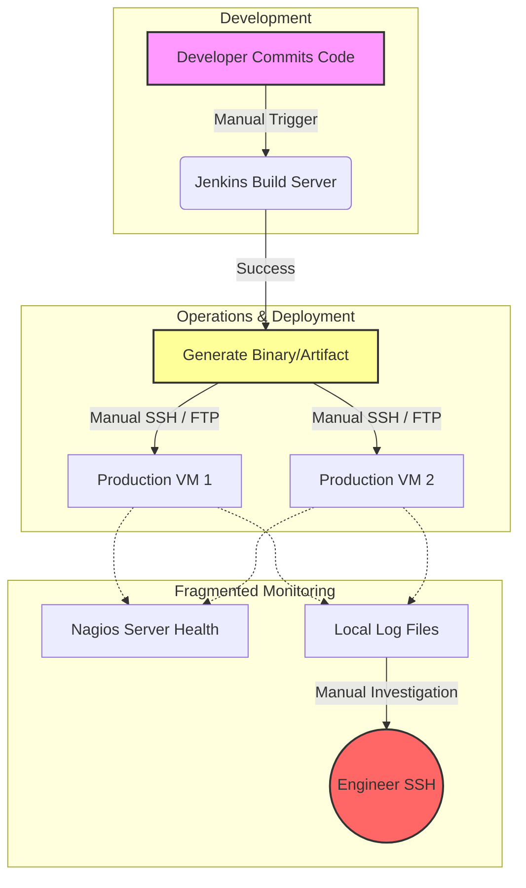
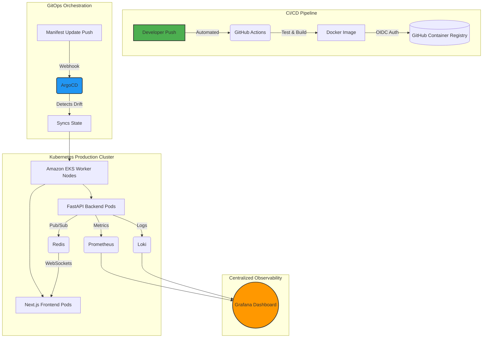

# Cloud Sentinel Platform — Enterprise Cloud-Native DevSecOps & Observability Platform

## 1. Introduction

### 1.1 The Evolution of Cloud-Native Infrastructure
The paradigm of software engineering has undergone a tectonic shift over the last decade, migrating from monolithic architectures deployed on bare-metal servers to highly distributed, microservices-based, cloud-native ecosystems. While this transition has unlocked unprecedented scalability, fault tolerance, and rapid feature delivery, it has simultaneously introduced an astronomical level of infrastructure complexity. In modern cloud engineering, applications are no longer statically bound to specific IP addresses or physical machines; they are ephemeral, containerized workloads that spin up and down dynamically across vast clusters of compute nodes. 

This dynamic nature necessitates specialized orchestration platforms, primarily Kubernetes, to manage the scheduling, networking, and lifecycle of these containers. However, adopting Kubernetes does not merely change where code runs—it fundamentally alters how engineering teams must approach deployment, security, and maintenance. The "Cloud Sentinel Platform" was conceived precisely at the intersection of these modern operational challenges, designed as a comprehensive, enterprise-grade DevSecOps and observability ecosystem that simulates and solves the real-world complexities faced by Site Reliability Engineering (SRE) teams in production environments.

### 1.2 Modern DevOps and Automation Challenges
Historically, software deployment was a highly manual, error-prone process characterized by "wall-of-confusion" bottlenecks between development and operations teams. Developers would write code ("it works on my machine") and pass it to operations engineers who struggled to run it in production due to environmental discrepancies. The advent of Docker containerization solved the dependency matrix by packaging the application and its runtime environment into an immutable artifact. However, containerization alone is insufficient for enterprise scale. 

Modern DevOps demands rigorous automation to eliminate human intervention from the deployment lifecycle. Traditional Continuous Integration and Continuous Deployment (CI/CD) pipelines (often managed by tools requiring heavy administrative overhead like Jenkins) are evolving towards SaaS-based, declarative workflows (such as GitHub Actions). Yet, pushing code directly into a Kubernetes cluster via traditional CI pipelines presents severe security and drift-configuration risks. If an engineer manually alters a production server to quickly fix a bug, the live state diverges from the source code repository—a phenomenon known as "configuration drift." 

The Cloud Sentinel project directly tackles this by implementing an advanced **GitOps architecture using ArgoCD**. By adopting a "Pull-based" model, the Kubernetes cluster itself reaches out to the Git repository to pull the desired state, effectively making Git the single, irrefutable source of truth. If any manual drift occurs in the cluster, the system automatically detects the anomaly and executes a self-healing reconciliation loop to restore the infrastructure to its version-controlled state.

### 1.3 The Criticality of Observability in Distributed Systems
As monolithic applications are fractured into dozens or hundreds of microservices, traditional monitoring strategies (such as pinging a server to see if it is "up" or "down") become fundamentally obsolete. A distributed system can experience partial degradation—where the database is healthy, the frontend is serving files, but a specific asynchronous background worker has silently crashed. This necessitates a shift from mere "monitoring" to true **Observability**.

Observability is the measure of how well internal states of a system can be inferred from knowledge of its external outputs. In the context of Cloud Sentinel, observability is treated as a first-class architectural pillar rather than an afterthought. The platform implements a robust telemetry pipeline leveraging the industry-standard Prometheus and Grafana stack. This allows for the proactive scraping of multi-dimensional time-series metrics—ranging from raw CPU and memory utilization on the AWS EC2 worker nodes to application-level latency within the FastAPI backend. Furthermore, by integrating Promtail and Loki, the system achieves centralized, label-based log aggregation, ensuring that when an ephemeral container dies, its forensic logs are preserved and instantly searchable.

### 1.4 Real-Time Telemetry and Operational Visibility
A core limitation of many existing observability dashboards is their reliance on polling mechanisms—where a web browser must continuously refresh or ask the server for new data every few minutes. In high-stakes SRE environments, a minute of latency in detecting an anomaly can result in millions of dollars in downtime or compromised data.

To solve this, Cloud Sentinel engineers a sophisticated, low-latency telemetry pipeline. Instead of static dashboards, the platform features a Next.js React frontend that establishes persistent, full-duplex **WebSocket connections** directly to the Python FastAPI backend. When backend services generate telemetry, the data is pushed into a Redis Pub/Sub (Publish/Subscribe) nervous system. This architecture ensures that regardless of which Kubernetes pod generates an alert, the event is broadcasted across the cluster and pushed instantaneously to the operator's screen. The result is a dynamic, live-updating incident command center that renders real-time visual analytics without requiring a single page refresh.

### 1.5 Motivation and Scope of the Project
The primary motivation behind the Cloud Sentinel Platform was to bridge the massive gap between theoretical cloud computing concepts and the harsh, practical realities of enterprise engineering. Many academic projects focus solely on application logic—building a website or an API—while completely ignoring the infrastructure required to host, scale, and secure it. 

Cloud Sentinel inverts this paradigm. It is an infrastructure-first project where the application (the observability dashboard) serves to validate the underlying DevOps automation. The scope of this study encompasses the entire software delivery lifecycle:
1. **Local Orchestration:** Ensuring deterministic developer environments using Docker Compose.
2. **Infrastructure as Code (IaC):** Eliminating manual cloud console operations by programmatically provisioning AWS Virtual Private Clouds (VPCs), NAT Gateways, and EKS clusters using Terraform.
3. **Automated CI/CD:** Building strict GitHub Actions pipelines that enforce automated testing, image building, and cryptographic OIDC authentication with AWS.
4. **GitOps & Kubernetes:** Managing the live production environment using declarative ArgoCD deployments and Kubernetes reconciliation loops.
5. **Real-Time Observability:** Closing the loop by monitoring the entire orchestrated ecosystem using Prometheus, Redis, and WebSockets.

In summary, Cloud Sentinel is not just a software application; it is a holistic demonstration of modern Site Reliability Engineering. It provides a blueprint for how organizations can deploy scalable, secure, and self-healing systems in the cloud, setting the foundation for the deep technical problem analysis and architectural designs detailed in the subsequent sections of this report.

---

## 2. Profile of the Problem. Rationale/Scope of the study (Problem Statement)

### 2.1 The Limitations of Traditional Operations
Before the widespread adoption of cloud-native methodologies, organizations managed IT infrastructure through highly manual, fragmented, and inefficient processes. As applications scaled to serve millions of global users, these traditional paradigms began to fracture under the weight of their own complexity. The core problem this project seeks to address is the operational fragility that occurs when modern distributed software is managed using legacy infrastructure practices.

Specifically, the industry faces severe limitations across multiple operational axes:
* **Manual Deployments & Human Error:** Deploying updates historically involved an engineer connecting via SSH to production servers to execute installation scripts. This manual intervention is notoriously error-prone, undocumented, and difficult to roll back during a critical failure.
* **Infrastructure Inconsistency (Snowflake Servers):** Without Infrastructure as Code (IaC), each server is configured manually over time. When a server inevitably crashes, reproducing its exact state is nearly impossible, leading to prolonged system outages and "snowflake" environments that are too delicate to upgrade.
* **Scaling Issues and Resource Inefficiency:** Monolithic applications running on static virtual machines cannot scale their specific bottlenecks independently. If the frontend experiences high traffic, the entire monolith must be scaled, resulting in massive hardware over-provisioning and wasted capital expenditure.
* **Fragmented Observability and Lack of Centralized Telemetry:** When a microservices architecture spans dozens of nodes, tracking an error becomes searching for a needle in a haystack. Traditional monitoring tools often fragment logs, metrics, and network traces into isolated silos, preventing engineers from diagnosing the root cause of systemic cascading failures.

### 2.2 The Rationale of the Study: The Cloud Sentinel Solution
The rationale behind the Cloud Sentinel Platform is to construct a unified architecture that categorically eliminates these traditional limitations. Rather than addressing these problems in isolation, this study proposes a holistic, interconnected platform where automation, orchestration, and observability form a continuous feedback loop.

Cloud Sentinel resolves these legacy bottlenecks through the following modern paradigms:
1. **Real-Time Telemetry:** By abandoning legacy HTTP polling in favor of persistent WebSocket connections and a Redis Pub/Sub backbone, the platform ensures that operational telemetry (CPU spikes, memory leaks, latency degradation) is surfaced to the dashboard in milliseconds.
2. **Kubernetes Orchestration:** Ephemeral Docker containers are orchestrated by Amazon EKS (Elastic Kubernetes Service). This natively solves the scaling issue, as Kubernetes can independently auto-scale specific microservices based on exact CPU or memory constraints, while its internal reconciliation loop automatically restarts crashed containers without human intervention.
3. **CI/CD Automation:** The implementation of GitHub Actions entirely eradicates manual deployment risks. Every code push is intercepted by an automated workflow that runs deterministic security audits, builds container images, and securely pushes them to a registry via OIDC.
4. **GitOps Automation with ArgoCD:** To solve configuration drift, ArgoCD continuously monitors the Git repository. If an unauthorized infrastructure change is detected in the live Kubernetes cluster, ArgoCD’s self-healing mechanisms instantly overwrite the live state to match the approved Git code.
5. **Observability Centralization:** The platform unifies the fragmented monitoring landscape. The Prometheus Operator scrapes time-series metrics across all nodes, Promtail aggregates stdout/stderr logs from every ephemeral container into Loki, and Grafana serves as the single pane of glass for all SRE visualization.

### 2.3 Problem Statement
*“As enterprise applications transition into distributed, cloud-native microservices, traditional manual deployment strategies, fragmented monitoring tools, and static infrastructure provisioning result in severe operational fragility, configuration drift, and prolonged incident resolution times. There is an imperative need for a unified platform that securely automates the entire software deployment lifecycle while providing centralized, real-time observability into the health and performance of the underlying distributed architecture.”*

### 2.4 Scope and Operational Goals
The scope of the Cloud Sentinel Platform is rigidly focused on the operational engineering layer—the deployment, scaling, security, and monitoring of distributed services. 

**Target Users:**
The intended users of this platform are Site Reliability Engineers (SREs), DevOps practitioners, and Cloud Architects who require deep, real-time visibility into complex cloud-native architectures. 

**Operational Objectives:**
* To achieve **zero-downtime deployments** by leveraging Kubernetes RollingUpdates alongside rigorous Readiness and Liveness probes.
* To enforce **declarative infrastructure management** where 100% of the AWS infrastructure and application configurations are defined as code (Terraform and YAML).
* To establish **end-to-end telemetry visibility** ensuring that metrics from hardware nodes, network gateways, databases, and application code are aggregated into a unified real-time dashboard.
* To eliminate **credential exposure** by migrating from static cloud secrets to dynamic, cryptographic identity verification (OIDC).

By fulfilling these objectives, the Cloud Sentinel project proves the viability of modern DevSecOps practices, demonstrating how profound architectural challenges can be mitigated through disciplined automation and real-time observability.

---

## 3. Existing System

### 3.1 Introduction
To fully contextualize the architectural improvements introduced by the Cloud Sentinel Platform, it is necessary to examine the methodologies that historically governed software deployments and system monitoring. The "Existing System" in this context refers to the legacy, pre-cloud-native approaches characterized by monolithic applications, manual operational pipelines, and reactive, fragmented monitoring software.

### 3.2 Existing Software and Methodologies
In the traditional operations landscape, the deployment and management of software relied heavily on isolated, non-declarative tools:
* **Monolithic Infrastructure:** Applications were packaged as single, massive executables running on bare-metal servers or static Virtual Machines (VMs). 
* **Manual Deployment Pipelines:** Continuous Integration (if present) often relied on heavy, server-based tools like Jenkins, while the actual deployment (Continuous Delivery) was executed manually. Engineers would use Bash scripts or SSH to physically move binaries onto production servers and restart services.
* **Isolated Monitoring Tools:** Monitoring was reactive and fragmented. Server health was monitored by legacy tools like Nagios, logs were manually grepped via SSH, and application performance was often tracked in completely separate, proprietary dashboards. There was no single pane of glass.

#### Shortcomings of the Existing System
1. **No GitOps or Declarative State:** Because infrastructure was provisioned via UI clicks (ClickOps) rather than code, configuration drift was inevitable. There was no automated mechanism to ensure the live environment matched the repository.
2. **Poor Scalability:** Scaling required purchasing and provisioning new physical or virtual machines, a process that took hours or days. Monoliths could not be scaled granularly.
3. **Delayed Incident Visibility:** Without WebSockets or Pub/Sub streaming, dashboards relied on HTTP polling. By the time a dashboard refreshed to show a CPU spike, the server may have already crashed.
4. **Lack of Centralized Observability:** Engineers wasted critical incident-response time logging into disparate systems to correlate a network drop in one tool with an application error in another.

### 3.3 Data Flow Diagram (DFD) for Present System
The following diagram illustrates the flawed, manual deployment and monitoring lifecycle inherent to traditional existing systems.

*Figure 3.1: DFD of the traditional deployment and monitoring flow, highlighting manual bottlenecks and fragmented observability.*

### 3.4 What's New in the Proposed System (Cloud Sentinel)
The proposed system completely overhauls the legacy architecture by introducing a suite of modern, cloud-native innovations. Cloud Sentinel eliminates manual operations and introduces a fully automated, scalable, and observable ecosystem.

#### Key Innovations Introduced:
* **Kubernetes (Amazon EKS):** Replaces static VMs. Kubernetes abstracts the underlying hardware, allowing the platform to deploy applications as ephemeral containers that are self-healing and auto-scaling.
* **Terraform (Infrastructure as Code):** Eliminates "ClickOps". The entire AWS networking layer (VPCs, Subnets, Gateways) and Kubernetes clusters are programmatically generated using declarative HCL code.
* **ArgoCD (GitOps):** Replaces manual deployments. ArgoCD continuously monitors the GitHub repository and uses a pull-based mechanism to automatically synchronize the Kubernetes cluster state with the code.
* **GitHub Actions:** Replaces heavy Jenkins servers with a serverless, SaaS-based CI/CD pipeline that automatically tests, builds, and pushes Docker images to a registry upon every code commit.
* **Prometheus & Grafana:** Replaces fragmented monitoring. Prometheus actively scrapes metrics from all nodes and pods, storing them in a time-series database. Grafana provides a centralized, unified dashboard for all telemetry.
* **Redis Pub/Sub & WebSockets:** Replaces HTTP polling. Real-time telemetry is streamed instantaneously from the backend to the frontend, ensuring operators see incidents the exact millisecond they occur.

#### Proposed System Deployment & Monitoring Flow
The following diagram illustrates the highly automated, GitOps-driven architecture of the new Cloud Sentinel platform.

*Figure 3.2: DFD of the proposed Cloud Sentinel architecture, showcasing the automated CI/CD pipeline, ArgoCD GitOps synchronization, and centralized real-time observability flow.*
