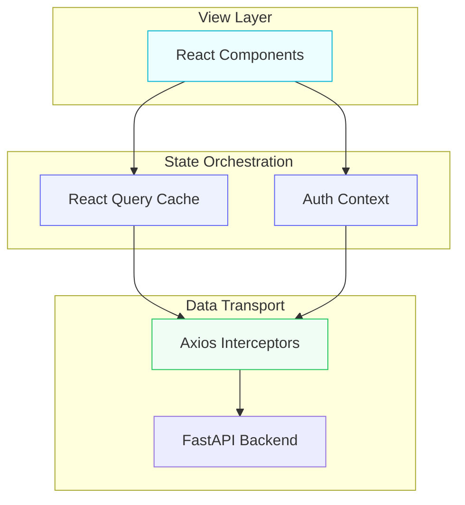

<p align="center">
  
</p>

<h3 align="center">🖥️ Sentinel Command & Control (CSI)</h3>
<p align="center"><strong>"Operational Visibility • Real-Time Alerting • Enterprise Incident Response"</strong></p>

<p align="center">
  
  
  
</p>

---

## 📌 1. Visual Intelligence

The **Sentinel Interface (CSI)** is the operational cockpit of the Cloud Sentinel Platform. Built on a **Domain-Driven Frontend Architecture**, it provides security analysts with a low-latency, high-fidelity environment to monitor cloud infrastructure and mitigate threats.

### 🏗️ Application Architecture



---

## 🚀 2. Operational Modules

| Domain | Feature | Technology | Action |
| :--- | :--- | :--- | :--- |
| **Identity** | Sentinel Access | JWT + Context | Authenticate and Hydrate Identity |
| **Observability** | Tactical Overview | React Query | Monitor System-Wide Health Metrics |
| **Response** | Incident Feed | Domain Hooks | Manage, Assign, and Mitigate Threats |
| **Security** | RBAC Guards | Protected Routes | Enforce Role-Based Access Control |

---

## 🛠️ 3. Development Operations (DX)

### Platform Initialization
```powershell
# Install enterprise dependencies
npm install

# Launch tactical development server
npm run dev
```

### Quality Gates
```powershell
# Validate formatting
npm run lint

# Build production artifact
npm run build
```

---

## 🏛️ 4. Project Blueprint
- **`src/features`**: Domain-specific logic (Auth, Incidents, Metrics).
- **`src/providers`**: Global orchestration layers (Query, Auth, Toast).
- **`src/lib`**: Hardened infrastructure clients (Axios/API).
- **`src/components`**: Reusable UI and Layout primitives.

---

<p align="center">
  
</p>
