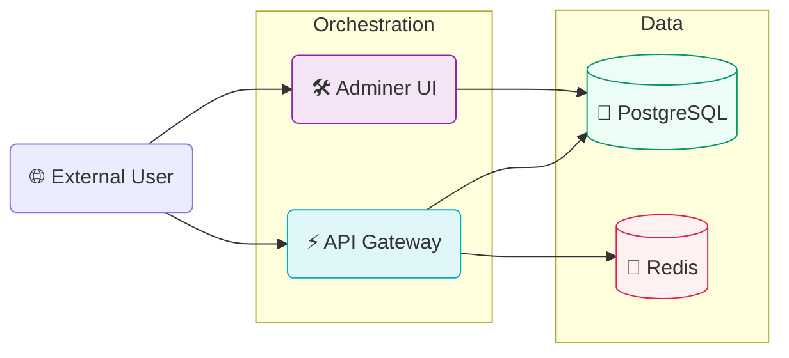

<p align="center">
  
</p>

<h3 align="center">🐳 Distributed Stack Orchestration</h3>
<p align="center"><strong>"Containerization • Infrastructure as Code • Local Development Cloud"</strong></p>

<p align="center">
  
  
  
</p>

---

## 📌 1. Infrastructure Overview

This module manages the lifecycle of the **Cloud Sentinel** distributed stack. We use **Docker Compose** to orchestrate a cluster of high-performance services that mirror a production cloud environment.

### 🌐 Network Topology



---

## 🚀 2. Service Catalog

| Service | Container Name | Internal Port | External Port | Role |
| :--- | :--- | :--- | :--- | :--- |
| **api-gateway** | `sentinel-api-gateway` | `8000` | `8000` | Platform Core Engine |
| **postgres** | `sentinel-postgres` | `5432` | `5432` | Relational Persistence |
| **redis** | `sentinel-redis` | `6379` | `6379` | Distributed Cache |
| **adminer** | `sentinel-adminer` | `8080` | `8888` | SQL Management UI |

---

## 🛠️ 3. Operations Guide

### Launching the Stack
```powershell
docker compose up -d
```

### Resource Management
```powershell
# Stop all services
docker compose stop

# Check Service Health
docker compose ps
```

---

<p align="center">
  
</p>
