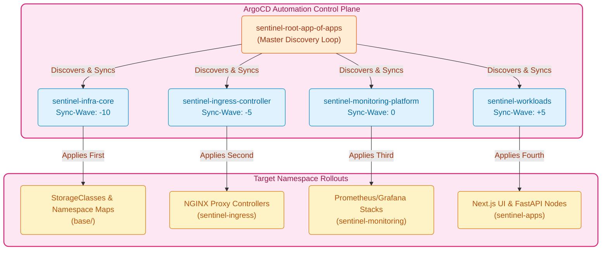

<p align="center">
  
</p>

<h3 align="center">⚙️ Continuous Deployment & GitOps Automation Architecture</h3>
<p align="center"><strong>"Self-Reconciling Delivery • Automated Wave Sequencing • Sealed Secrets Lifecycle"</strong></p>

<p align="center">
  <a href="https://argoproj.github.io/cd/"></a>
  <a href="https://github.com/features/actions"></a>
  <a href="https://external-secrets.io/"></a>
  <a href="https://kustomize.io"></a>
</p>

---

A resilient, **GitOps-native release engineering backbone** designed to enforce deterministic declarative environments, automatically drift-reconcile production runtime resources, and decouple secret encryption lifecycles from application runtime routes.

---

## 🌊 1. Application-of-Apps Sync Ordering (Phase 5A)
To guarantee that low-level networking and storage provisioners are verified and healthy before high-level UI/API workloads instantiate, the **Cloud Sentinel Platform** implements a deterministic sync-wave priority model managed via a root orchestration manifest (`root-app-of-apps.yaml`).



---

## 🔄 2. Environment Promotion Lifecycle (Phase 5D)
Our release engineering pipeline forbids manual hot-patching. Container tags progress deterministically through automated continuous integration gates:

```text
[ Feature Branch Push ]
         │
         ▼
[ CI Manifest Validations ] ──( kubeconform / dry-run lint )──► [ Auto-Reject on Failure ]
         │
         ▼
[ Dev Overlay Sync ] ────────► Commit SHA pinned to dev channel
         │
         ▼
[ Staging Verification ] ────► End-to-End Test Execution Loop
         │
         ▼
[ Production Release ] ──────► Merge to main triggers immutable production rollout
```

---

## 🔐 3. Secrets & Configuration Governance (Phase 5E)
To support both decentralized GitOps source repositories and strict enterprise cloud security perimeters, we combine two distinct key handling models:
1.  **SealedSecrets Architecture**: Uses asymmetric private-key controllers inside the cluster to safely store encrypted secret configuration values straight into Git repository trees without leaking access keys.
2.  **ExternalSecrets Framework**: Dynamically maps cross-account AWS Systems Manager ParameterStore references (`ClusterSecretStore`) to inject short-lived OAuth tokens and container connection credentials during live synchronization cycles.

---

## 🛡️ 4. Operational Deployment Reliability (Phase 5F)
The architecture embeds robust health checking configurations directly into application definitions:
*   **Progressive Rollout Safety**: Uses native ArgoCD resource state badges and out-of-sync indicators to instantly detect configuration drift.
*   **Pruning Failsafes**: Configures retry backoffs alongside dry-run checks to prevent destructive teardown sweeps if physical API node connectivity drops.

---

<p align="center">
  
</p>
