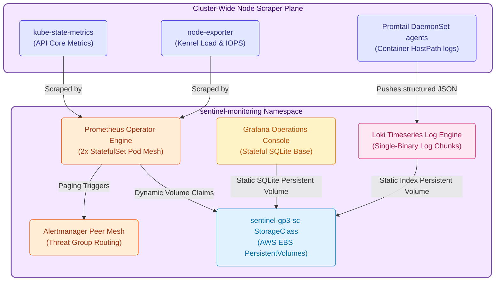

  

<h3 align="center">📊 Enterprise Observability & Stateful Infrastructure Stack</h3>

<strong>Production TSDB Storage, Log Scraping Engine & Centralized Operator Console</strong>

  
  
  
  
  

---

A high-concurrency, **stateful operations framework** engineered to securely aggregate continuous metrics, trace internal request telemetry, ingest structured threat logs, and display distributed stream health across a centralized analytical console.

---

## 💎 1. High-Availability Operational Layout
To guarantee perfect visibility into distributed WebSocket communication failures and threat anomaly spikes without risking timeseries data loss during cluster maintenance, the **Cloud Sentinel Platform** establishes a persistent **Observability Fabric** inside the `sentinel-monitoring` namespace.

> [!IMPORTANT]
> **Storage Decoupling Principle**: Stateful databases (Prometheus TSDB arrays, Grafana SQlite profiles, and Loki index chunks) bind strictly to dedicated AWS EBS GP3 PersistentVolumeClaims (`gp3`) to survive pod rolling updates without metadata corruption.

---

## 💾 2. Stateful Storage Sizing & Scheduling Guidelines (Phase 4E)
Because monitoring pipelines continuously ingest high-velocity streaming timeseries metrics, underlying storage boundaries must be configured dynamically to prevent disk exhaustion:

| Service | Target Persistence | Retention | Volume Strategy | IOPS Baseline |
| :--- | :--- | :--- | :--- | :--- |
| **Prometheus TSDB** | `50Gi` per node | `15d` | Dynamic volumeClaimTemplate | `3000` GP3 |
| **Loki Index/Chunks**| `50Gi` shared | `30d` | Static persistent storage claim | `3000` GP3 |
| **Grafana DB** | `10Gi` persistent | Infinite | Static persistent storage claim | `3000` GP3 |
| **Alertmanager State**| `2Gi` local cache| Ephemeral | Ephemeral local states | Default |

### 🛠️ Stateful Scheduling Rules
*   **Availability Zone Panning**: StatefulSets use pod anti-affinity rules to distribute persistent copies across distinct hardware nodes.
*   **Binding Interlocking**: Volumes utilize `WaitForFirstConsumer` binding modes to ensure persistent layers are instantiated close to scheduled compute capacity.

---

## 📡 3. Cluster Telemetry Integration (Phase 4F)
The architecture includes custom monitoring frameworks mapping edge metrics automatically:
*   **`kube-state-metrics`**: Collects running instance states, horizontal pod auto-scaler scaling thresholds, and pod crashloop delays.
*   **`node-exporter`**: Tracks physical server kernel load averages, network packet drops, and local storage utilization limits.

---

  

