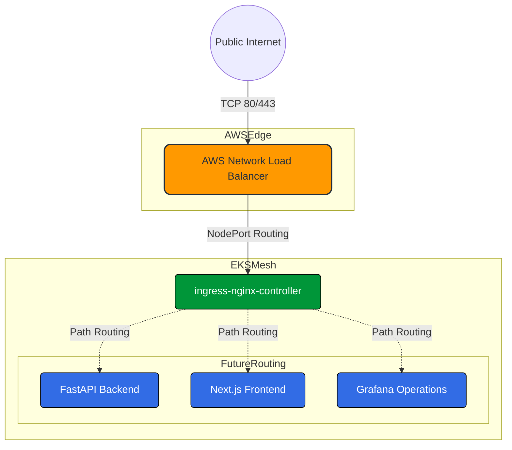

<p align="center">
  
</p>

<h3 align="center">🌐 NGINX Ingress Controller & Network Edge Architecture</h3>
<p align="center"><strong>"AWS Network Load Balancer Integration • Resource-Constrained GitOps Delivery"</strong></p>

<p align="center">
  <a href="https://kubernetes.github.io/ingress-nginx/"></a>
  <a href="https://aws.amazon.com/elasticloadbalancing/"></a>
  <a href="https://kustomize.io"></a>
  <a href="https://argoproj.github.io/cd/"></a>
</p>

---

A robust, enterprise-grade **L4/L7 routing foundation** engineered specifically to securely expose backend API services and frontend interfaces, while remaining strictly confined to AWS free-tier compute limitations via Kustomize patching.

---

## 🏗️ 1. Architecture & AWS Integration

The ingress controller serves as the single entry point for all external traffic entering the `cloud-sentinel-platform` EKS cluster. By utilizing the official AWS provider manifest, it automatically provisions a cloud-native **AWS Network Load Balancer (NLB)**.



---

## 💰 2. FinOps & Resource Constraints

To prevent compute starvation on our single `t3.small` managed node group (which only has ~2GB RAM), we implement strict GitOps boundary patching:

1.  **Remote Base Strategy**: Instead of downloading raw manifests, `kustomization.yaml` pulls directly from the `kubernetes/ingress-nginx` GitHub remote tree (`v1.10.0/deploy/static/provider/aws/deploy.yaml`).
2.  **Replica Restraint**: The Kustomize patch (`patch-resources.yaml`) forces `replicas: 1` to prevent high-availability scaling that would overrun our compute budget.
3.  **Memory Compression**: The controller limits are restricted to `250Mi` RAM and `250m` CPU.

---

## 🚀 3. GitOps Deployment Workflow

This ingress foundation is designed to be completely hands-off. It is managed exclusively via ArgoCD.

### 📁 Directory Structure
```text
infrastructure/kubernetes/
├── gitops/apps/
│   └── ingress-controller.yaml     <-- ArgoCD App definition linking the repo
└── networking/ingress-nginx/
    ├── kustomization.yaml          <-- Pulls AWS manifest and applies patches
    ├── namespace.yaml              <-- Dedicated network boundary
    └── patch-resources.yaml        <-- Overrides replicas and CPU/RAM boundaries
```

### ⚙️ Expected AWS Behavior & Billing

When ArgoCD syncs this application, the ingress controller `Service` of type `LoadBalancer` is instantiated.
*   **AWS Action**: AWS automatically provisions an **NLB** in your VPC.
*   **Billing Impact**: An AWS NLB incurs a small hourly cost (~$0.0225/hr) plus data processing fees. It is highly efficient but will consume a fraction of your AWS Student Credits while active.

---

## 🛠️ 4. Validation Commands

Once synced via Git, you can validate the deployment and retrieve your cloud endpoint using standard `kubectl` commands:

```bash
# 1. Verify the pod is running within memory limits
kubectl get pods -n ingress-nginx

# 2. Retrieve the AWS Load Balancer DNS Name
kubectl get svc ingress-nginx-controller -n ingress-nginx

# Expected Output Example:
# NAME                       TYPE           CLUSTER-IP     EXTERNAL-IP                               PORT(S)                      AGE
# ingress-nginx-controller   LoadBalancer   10.100.x.x     ad3fb...elb.us-east-1.amazonaws.com       80:30123/TCP,443:30456/TCP   1m
```

---

## 🔮 5. Future Roadmap Compatibility

This base architecture prepares the cluster for advanced edge integrations in upcoming phases:
*   **cert-manager**: Automated Let's Encrypt TLS certificate injection via `ClusterIssuer`.
*   **external-dns**: Automatic Route53 A-record mapping syncing with the NLB DNS.
*   **Ingress Objects**: Safe routing definitions for `/api`, `/chaos`, and `/` paths.

<p align="center">
  
</p>
