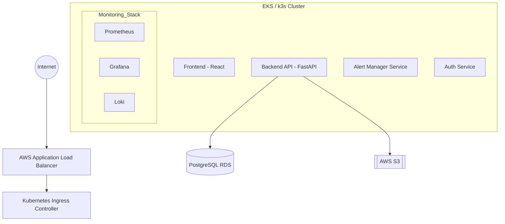

  

<h3 align="center">🗺️ Project Execution Roadmap & Architecture</h3>

<strong>Internal Strategy & Implementation Plan</strong>

  
  
  

---

## 🏛️ Production-Grade Architecture

---

## 📅 Implementation Phases

| Phase | Focus | Duration | Key Deliverables |
| :--- | :--- | :--- | :--- |
| **Phase 1** | **Planning** | 2-3 Days | Architecture diagrams, GitHub Org setup, service definitions. |
| **Phase 2** | **Backend** | 1-2 Weeks | Auth, Metrics API, Alerting system, Incident tracking. |
| **Phase 3** | **Frontend** | 1 Week | Monitoring dashboard, Live charts, Alerts panel. |
| **Phase 4** | **Docker** | 2-3 Days | Multi-stage Dockerfiles, Local Docker-Compose. |
| **Phase 5** | **Kubernetes** | 1 Week | Manifests (Deployments, Services, HPA, Secrets). |
| **Phase 6** | **CI/CD** | 4-5 Days | Jenkins Shared Libraries, Pipeline-as-code (Jenkinsfile). |
| **Phase 7** | **IaC** | 4-5 Days | Terraform modules for VPC, EKS/EC2, ECR, and RDS. |
| **Phase 8** | **Observability** | 3-4 Days | Helm charts for Prometheus, Grafana, and Loki. |
| **Phase 9** | **Security** | 2 Days | IAM Least Privilege, Trivy Scanning, K8s Network Policies. |

---

## 🚀 Advanced Features (Differentiators)

*   **Auto-Healing:** Self-correcting infrastructure using **Kubernetes Liveness and Readiness Probes** to ensure 100% uptime.
*   **Slack/Discord Integration:** Real-time **Webhook-based alerting** system that notifies the engineering team of critical infrastructure failures instantly.
*   **AI Log Summarizer:** Integrated **GPT-based insights** for automated incident root-cause analysis, translating complex logs into actionable summaries.
*   **Deployment Strategies:** Advanced implementation of **Blue-Green** or **Canary** deployment workflows to minimize release risk.
*   **Chaos Engineering:** Integrated **"Chaos Monkey"** scripts designed to intentionally inject faults and test the system's resilience under pressure.

---

## 🎙️ Demo & Viva Strategy

### ⚡ The "Killer" Demo Sequence
1.  **The Pipeline:** Show a real-time code commit triggering an automated **Jenkins build** and test suite.
2.  **The Deployment:** Demonstrate a **Rolling Update** in Kubernetes, showing zero-downtime transition between versions.
3.  **The Chaos:** Manually delete a production pod and watch Kubernetes perform **"Self-Healing"** in seconds.
4.  **The Alert:** Trigger a synthetic CPU spike to show the **Grafana alert** firing and hitting the Slack/Discord dashboard.

### 🧠 Key Viva Topics to Master
*   **Why Kubernetes?** Be ready to explain container orchestration, horizontal pod autoscaling (HPA), and high availability.
*   **Why CI/CD?** Focus on how automation reduces **MTTR** (Mean Time To Recovery) and eliminates deployment friction.
*   **Why Terraform?** Discuss the benefits of **Infrastructure as Code (IaC)**, specifically reproducibility and state management.

---

## 💰 AWS Cost Optimization

| Resource | Strategy for Students |
| :--- | :--- |
| **Compute** | Use **k3s** on a single `t3.medium` EC2 instead of a managed EKS cluster to save ~$70/month. |
| **Database** | Utilize **AWS RDS Free Tier** or run a PostgreSQL container inside the K8s cluster for **$0 cost**. |
| **Storage** | Implement **S3 Lifecycle Policies** to move older logs to Glacier, significantly reducing storage fees. |
| **Automation** | Use scripted **"Stop/Start" routines** to shut down EC2 instances during idle hours (overnight). |

---

  

