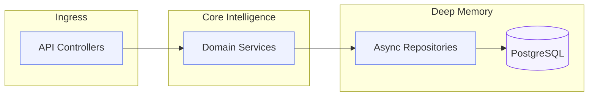

<p align="center">
  
</p>

<h3 align="center">🔮 Sentinel Core Command Center</h3>
<p align="center"><strong>"Distributed Intelligence • High-Concurrency Engine • Asynchronous Mastery"</strong></p>

<p align="center">
  
  
  
</p>

---

## 📌 1. Platform Intelligence

The **API Gateway** serves as the distributed brain of the Cloud Sentinel Platform. It orchestrates high-speed data flow between our observers and the persistence layer, using a sophisticated **Service-Repository** architecture to ensure zero-latency business logic processing.

### 🏗️ Domain Orchestration



---

## 🚀 2. Command Catalog (v1)

| Method | Endpoint | Logic Domain | Action |
| :--- | :--- | :--- | :--- |
| `POST` | `/api/v1/users/` | Identity | Register new platform sentinel |
| `POST` | `/api/v1/incidents/` | Observability | Ingest real-time platform incident |
| `GET` | `/api/v1/incidents/` | Observability | Stream historical incident logs |
| `GET` | `/health` | Liveness | Core platform heartbeat |

---

## 🛠️ 3. Operations & DX

### Schema Evolution
Managed via **Alembic** (Asyncpg).
```powershell
# Sync database to latest head
docker compose exec api-gateway alembic upgrade head

# Generate intelligence revision
docker compose exec api-gateway alembic revision --autogenerate -m "new_feature_schema"
```

### Integrated Testing
```powershell
# Run the sentinel validation suite
docker compose exec api-gateway pytest
```

---

<p align="center">
  
</p>
