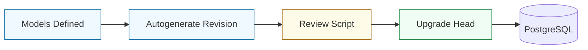

<p align="center">
  
</p>

<h3 align="center">🏛️ Immutable Schema Governance</h3>
<p align="center"><strong>"Version-Controlled Data • Asynchronous Migrations • SQLAlchemy 2.0"</strong></p>

<p align="center">
  
  
  
</p>

---

## 📌 1. Migration Overview

This directory contains the versioned history of the **Cloud Sentinel** database schema. We use **Alembic** configured for asynchronous operation to ensure that every change to our ORM models is tracked, reviewed, and reproducible across all environments.

### 🔄 Schema Evolution Workflow



---

## 🚀 2. Migration Guide

### Applying Changes
To sync your local database with the latest schema version:
```powershell
docker compose exec api-gateway alembic upgrade head
```

### Reverting Changes
To roll back the last applied migration:
```powershell
docker compose exec api-gateway alembic downgrade -1
```

### Creating New Revisions
After modifying any file in `app/db/models/`, generate a new migration script:
```powershell
docker compose exec api-gateway alembic revision --autogenerate -m "describe_your_changes"
```

---

## ⚠️ 3. Safety Standards
- **Always Review**: Never run an autogenerated migration without checking the script in `versions/`.
- **Atomic Operations**: Alembic runs migrations within transactions; if a step fails, the entire migration rolls back.

---

<p align="center">
  
</p>